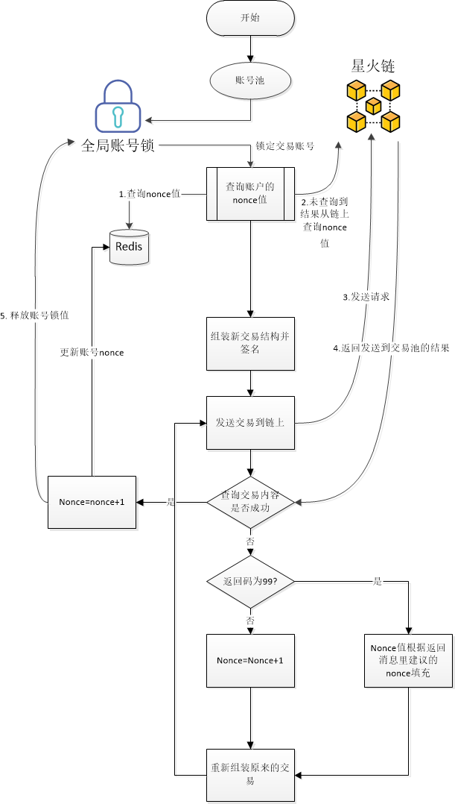

# 星火链进阶教程

## 1.nonce管理

星火链网底层区块链平台（下文简称星火链)作为“许可””公有“链，拥有一部分的公有属性，使用星火令（类似于以太坊的gas）作为智能合约执行的消耗，同时不同账户之间可以通过交易相互转移星火令，星火链的账户模型设计了连续递增的nonce值的方式来防止出现重放攻击。

同一账户的发送的交易需要保证nonce值的连续递增，否则交易会因为nonce值太小或者太大导致失败。我们推荐用户使用多个已激活的账号做为账号池，随机使用某一未被加锁账号进行交易，交易完成时释放该账号锁，这样可以保证上链交易的成功率和性能。

### 具体方案




### 分布式锁之Redisson

使用Redisson框架实现分布式锁。

#### 1.加入jar包依赖

```java
<dependency>
   <groupId>org.redisson</groupId>
   <artifactId>redisson</artifactId>
   <version>3.11.0</version>
</dependency>
```

#### 2.配置Redisson

```java
public class RedissonManager {
    private static Config config = new Config();
    //声明redisso对象
    private static Redisson redisson = null;
   //实例化redisson
 static{
     config.useSingleServer().setAddress("redis://127.0.0.1:6379");
          //得到redisson对象
        redisson = (Redisson) Redisson.create(config);

}

 //获取redisson对象的方法
    public static Redisson getRedisson(){
        return redisson;
    }
}
```

#### 3.锁的获取和释放

```java
public class RedissonLock {
    //从配置类中获取redisson对象
    private static Redisson redisson = RedissonManager.getRedisson();
    private static final String LOCK_TITLE = "redisLock_";
    //加锁
    public static boolean acquire(String lockName){
        //声明key对象
        String key = LOCK_TITLE + lockName;
        //获取锁对象
        RLock mylock = redisson.getLock(key);
        //加锁，并且设置锁过期时间，防止死锁的产生
        mylock.lock(2, TimeUnit.MINUTES);
        System.err.println("======lock======"+Thread.currentThread().getName());
        //加锁成功
        return  true;
    }
    //锁的释放
    public static void release(String lockName){
        //必须是和加锁时的同一个key
        String key = LOCK_TITLE + lockName;
        //获取所对象
        RLock mylock = redisson.getLock(key);
        //释放锁（解锁）
        mylock.unlock();
        System.err.println("======unlock======"+Thread.currentThread().getName());
    }
}
```

#### 4.模拟获取分布式锁

```java

/**
 * 获取分布式锁
 */
public class TransactionDemo {
    private static BIFSDK sdk = BIFSDK.getInstance(SampleConstant.SDK_INSTANCE_URL);
    private static Redisson redisson = RedissonManager.getRedisson();

    public static void main(String[] args) {
        int N = 4;
        //参数
        String senderAddress="did:bid:efnVUgqQFfYeu97ABf6sGm3WFtVXHZB2";
        String senderPrivateKey="priSPKkWVk418PKAS66q4bsiE2c4dKuSSafZvNWyGGp2sJVtXL";

        String senderAddress1="did:bid:efLrPu7LNR4YwA5M1Kfx6BYb1JP7aPKp";
        String senderPrivateKey1="priSPKteVqGoNgtKE68ZjNHAbGJsNvV9nTBkTLMYTGhVjsBY5R";

        String senderAddress2="did:bid:efBdagu8sVkJWEw5kLt1w69bxa85Kuag";
        String senderPrivateKey2="priSPKmCQMrjCcRgV3u2VsYhujf7QsG7Kr6Tgm94AbzCge46d8";
        //账号集合
        List<String> availableAccAddr = new ArrayList<String>();
        availableAccAddr.add(senderAddress+";"+senderPrivateKey);
        availableAccAddr.add(senderAddress1+";"+senderPrivateKey1);
        availableAccAddr.add(senderAddress2+";"+senderPrivateKey2);
        //目的地址
        String destAddress="did:bid:efXkBsC2nQN6PJLjT9nv3Ah7S3zJt2WW";
        Long feeLimit=1000000L;
        Long gasPrice=100L;
        //交易对象
        BIFGasSendOperation gasSendOperation= new BIFGasSendOperation();
        gasSendOperation.setAmount(1L);
        gasSendOperation.setDestAddress(destAddress);
        for(int i=0;i<N;i++){
            new transaction(availableAccAddr,feeLimit,gasPrice,gasSendOperation).start();
        }

        for(int i=0;i<N;i++){
            new transaction(availableAccAddr,feeLimit,gasPrice,gasSendOperation).start();
        }
        System.out.println("END");
    }

    static class transaction extends Thread{
        List<String> availableAccAddr;
        Long feeLimit;
        Long gasPrice;
        BIFBaseOperation operation;
        public transaction(List<String> availableAccAddr,Long feeLimit,Long gasPrice,BIFBaseOperation operation ) {
            this.availableAccAddr = availableAccAddr;
            this.feeLimit = feeLimit;
            this.gasPrice = gasPrice;
            this.operation = operation;
        }

        @Override
        public void run() {
            //随机获取交易账号
            int index = new Random().nextInt(availableAccAddr.size());
            String senderAddress=availableAccAddr.get(index).split(";")[0];
            String senderPrivateKey=availableAccAddr.get(index).split(";")[1];
            //加锁
            RedissonLock.acquire(senderAddress);
            System.out.println("线程"+ Thread.currentThread().getName() +"获得分布式锁:"+senderAddress);
            try {
                //获取账号nonce值
                Long nonce=0L;
                BIFAccountGetNonceRequest request = new BIFAccountGetNonceRequest();
                request.setAddress(senderAddress);
                RMap<Object, Object> redisHash = redisson.getMap(senderAddress);
                if(!redisHash.isEmpty()){
                    nonce=Long.parseLong(redisHash.get("nonce").toString());
                }else{
//                    // 调用getNonce接口
                    BIFAccountGetNonceResponse response = sdk.getBIFAccountService().getNonce(request);
                    if (0 == response.getErrorCode()) {
                        nonce=response.getResult().getNonce()+1;
                    }
                }
                //序列化交易
                BIFTransactionSerializeRequest serializeRequest = new BIFTransactionSerializeRequest();
                serializeRequest.setSourceAddress(senderAddress);
                serializeRequest.setNonce(nonce);
                serializeRequest.setFeeLimit(feeLimit);
                serializeRequest.setGasPrice(gasPrice);
                serializeRequest.setOperation(operation);
     
                // 调用buildBlob接口
                BIFTransactionSerializeResponse serializeResponse = sdk.getBIFTransactionService().BIFSerializable(serializeRequest);
                System.out.println("serializeResponse:"+ JsonUtils.toJSONString(serializeResponse.getResult()));
                if (!serializeResponse.getErrorCode().equals(Constant.SUCCESS)) {
                    throw new SDKException(serializeResponse.getErrorCode(), serializeResponse.getErrorDesc());
                }
                String transactionBlob = serializeResponse.getResult().getTransactionBlob();
                System.out.println("transactionBlob:"+transactionBlob);
                //签名交易
                byte[] signBytes = PrivateKeyManager.sign(HexFormat.hexToByte(transactionBlob), senderPrivateKey);
                String publicKey = PrivateKeyManager.getEncPublicKey(senderPrivateKey);
                //提交交易
                BIFTransactionSubmitRequest submitRequest = new BIFTransactionSubmitRequest();
                submitRequest.setSerialization(transactionBlob);
                submitRequest.setPublicKey(publicKey);
                submitRequest.setSignData(HexFormat.byteToHex(signBytes));
                // 调用bifSubmit接口
                BIFTransactionSubmitResponse transactionSubmitResponse = sdk.getBIFTransactionService().BIFSubmit(submitRequest);
                if (transactionSubmitResponse.getErrorCode() == 0) {
                    System.out.println(senderAddress+ " ,hash: "+transactionSubmitResponse.getResult().getHash());
                    //更新nonce值
                    nonce=nonce+1;
                    redisHash.put("nonce",Long.toString(nonce));
                    RedissonLock.release(senderAddress);
                    System.out.println("线程"+Thread.currentThread().getName()+"释放分布式锁");
                }
            } catch (Exception e) {
                e.printStackTrace();
            }
        }
    }
}
```

### 