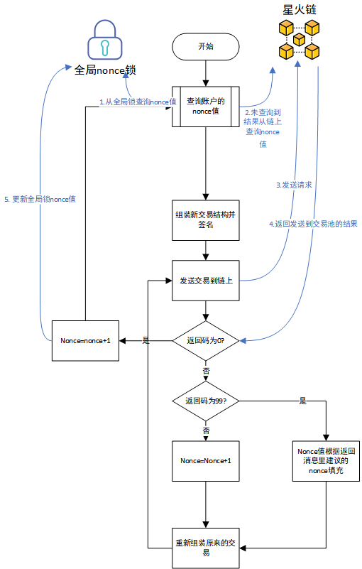

# 星火链进阶教程

星火链网底层区块链平台（下文简称星火链)作为“许可””公有“链，拥有一部分的公有属性，使用星火令（类似于以太坊的gas）作为智能合约执行的消耗，同时不同账户之间可以通过交易相互转移星火令，星火链的账户模型设计了连续递增的nonce值的方式来防止出现重放攻击。

同一账户的发送的交易需要保证nonce值的连续递增，否则交易会因为nonce值太小或者太大导致失败。我们推荐用户对同一账户的nonce值在本地全局维护，这样可以保证上链交易的成功率和性能。

## 具体方案



## 广播交易

广播交易是指通过广播的方式发起交易。广播交易包括以下步骤：

1. [获取账户nonce值](#获取账户nonce值)
1. [构建操作](#构建操作)
1. [序列化交易](#序列化交易)
1. [签名交易](#签名交易)
1. [提交交易](#提交交易)

#### 获取账户nonce值

开发者可自己维护各个账户`nonce`，在提交完一个交易后，自动为`nonce`值递增1，这样可以在短时间内发送多笔交易，否则，必须等上一个交易执行完成后，账户的`nonce`值才会加1。

调用如下：

```java
// 初始化请求参数
String senderAddress="did:bid:efnVUgqQFfYeu97ABf6sGm3WFtVXHZB2";
Long nonce=0L;
BIFAccountGetNonceRequest request = new BIFAccountGetNonceRequest();
request.setAddress(senderAddress);
HashOperations<String, String, String> redisHash = redis.opsForHash();
   Boolean isExist=redishash.hasKey(senderAddress,"nonce");
 if(isExist){
    nonce=Long.parseLong(redisHash.get(senderAddress,"nonce"));
 }else{
    // 调用getNonce接口
   BIFAccountGetNonceResponse response = sdk.getBIFAccountService().getNonce(request);
	if (0 == response.getErrorCode()) {
   	    nonce=response.getResult().getNonce()+1;
        redisHash.put(senderAddress,"nonce",Long.toString(nonce));
	}
}
```

#### 构建操作

这里的操作是指在交易中做的一些动作，便于序列化交易和评估费用。例如，构建创建账号操作(BIFAccountActivateOperation)，接口调用如下：

```java
String senderAddress = "adxSa4oENoQCc66JRouZu1rKu4RWjgS69YD4S";
String destAddress = "adxSgTxU1awVzNUeR8xcnd3K75XKU8ziNHcWW";

BIFAccountActivateOperation operation = new BIFAccountActivateOperation();
operation.setDestAddress(destAddress);
operation.setInitBalance(initBalance);
```

#### 序列化交易

该接口用于序列化交易，并生成交易Blob串，便于网络传输。其中nonce和operation是上面接口得到的。调用如下：

```java
// 初始化变量
String senderAddress = "adxSa4oENoQCc66JRouZu1rKu4RWjgS69YD4S";
Long gasPrice = 1000L;
Long feeLimit = ToBaseUnit.ToUGas("0.01");

// 初始化请求参数
BIFTransactionSerializeRequest serializeRequest = new BIFTransactionSerializeRequest();
   serializeRequest.setSourceAddress(senderAddress);
   serializeRequest.setNonce(nonce);
   serializeRequest.setFeeLimit(feeLimit);
   serializeRequest.setGasPrice(gasPrice);
   serializeRequest.setOperation(operation);
// 调用buildBlob接口
 BIFTransactionSerializeResponse serializeResponse = BIFSerializable(serializeRequest);
        if (!serializeResponse.getErrorCode().equals(Constant.SUCCESS)) {
            throw new SDKException(serializeResponse.getErrorCode(), serializeResponse.getErrorDesc());
        }
 String transactionBlob = serializeResponse.getResult().getTransactionBlob();
```

#### 签名交易

该接口用于交易发起者使用其账户私钥对交易进行签名。其中transactionBlob是上面接口得到的。调用如下：

```java
// 初始化请求参数
String senderPrivateKey = "privbwAQyE2vWwzt9NuC8vecqpZm7DS8kfiMPsKPcrTatUkmkxkVhfaf";
// 三、签名
 byte[] signBytes = PrivateKeyManager.sign(HexFormat.hexToByte(transactionBlob), senderPrivateKey);
```

#### 提交交易

该接口用于向BIF-Core区块链发送交易请求，触发交易的执行。其中transactionBlob和signBytes是上面接口得到的。调用如下：

```java
BIFTransactionSubmitRequest submitRequest = new BIFTransactionSubmitRequest();
  submitRequest.setSerialization(transactionBlob);
  submitRequest.setPublicKey(publicKey);
  submitRequest.setSignData(HexFormat.byteToHex(signBytes));
        // 调用bifSubmit接口
  BIFTransactionSubmitResponse transactionSubmitResponse = BIFSubmit(submitRequest);
if (response.getErrorCode() == 0) {
    //更新nonce值
    nonce=nonce+1;
    redisHash.put(senderAddress,"nonce",Long.toString(nonce));
}
```


### 