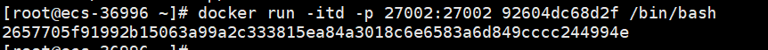

# 快速上手

以Java SDK为例, 在星火链测试网上部署, 调用, 查询一个`Javascript`、`Solidity`智能合约。

##  Quicknode节点部署

Quicknode节点是星火链网测试网上的快速部署节点，提供一个接入星火开发生态的途径。

### 环境要求

```sh
部署最小硬件要求：
内存：8G
硬盘：100G
cpu：8核
```

### 1. 获取镜像

```shell
#docker pull 待部署镜像(前提是确保主机有docker可用，并能上外网)

docker pull caictdevelop/bif-core:v1.2.1-4 
#说明：其中冒号后面v1.2.1-4代表底层链的版本号，阿拉伯数字组成越大代表版本号相较更新的版本，版本号递增更新
```

如果新机器上没有启动过docker服务会报如下错误：


执行命令：
```sh
service docker start
```

重新拉取镜像：
  

### 2. 启动镜像，进入容器

- 执行docker images查看拉取的镜像`IMAGE ID`
  

- 启动Quicknode服务

  ```sh
  # IMAGEID即上述查看的具体字段值
  docker run -itd -p 27002:27002 {IMAGEID} /bin/bash
  ```
  执行结果如下：
  

- 查询启动的docker镜像进程信息,获取`container ID`
  

- exec进入容器系统启动bif服务

  ```sh
  # 2657705f9199 即是上述查询到的container ID
  docker exec -it 2657705f9199 /bin/bash
  ```
  

- 进入容器系统当前目录即是bifchain底层链目录 给可执行程序添加权限执行

  ```shell
  chmod +x bin/*
  nohup ./bin/bif &
  ```
  

### 3. 查看节点进程是否启动

在镜像系统中执行上述命令后查看bif服务，如果查询不到进程，执行exit命令在宿主机再执行 **启动Quicknode服务**操作

```shell
ps aux |grep -v grep |grep bif
```


### 4. 查看节点同步高度

快速部署的节点会自动通过p2p和测试网其他节点链接，部署启动后先同步其他节点数据，跟据数据量和磁盘不同时间不同，同步完所有的数据大概需要几个小时，可以根据如下方式查询测试网以及部署后节点的区块高度，实时观察同步进度。

- 查询测试网节点区块高度url和结果如下：

  ```http
  http请求方式：GET
  http://test.bifcore.bitfactory.cn/getLedger
  ```

  响应报文：

  ```json
  {
  	error_code: 0,
  	result: {
  		header: {
  			account_tree_hash: "4c9a11f712331f5815a24dbab5fee7cff905953dee71e48549ddac00d3648372",
  			close_time: 1658995885587070,
  			consensus_value_hash: "dba4e31ce39a1297fd24478d5da58687a67a56275da01aa95cf6535f57d3e9a7",
  			fees_hash: "e3b0c44298fc1c149afbf4c8996fb92427ae41e4649b934ca495991b7852b855",
  			hash: "162beecd20a70c5dc6794e66981448466f48fc0e377a63118199cd39b52bc293",
  			previous_hash: "dd5130951b1982c55d4e52ce379d882465fe322a5f6881b91016f2272acd3d06",
  			seq: 1172057,   //seq即是测试网的区块高度值
  			tx_count: 797679,
  			validators_hash: "b8ebfb79b0aed24cd9122c4545c88b8f9c7c6c7b01d1f0f55f2d3c036064eefd",
  			version: 1003
  		},
  		ledger_length: 227
  	}
  }
  ```

- 同步查询Quicknode节点高度

  访问快速节点高度,host是主机ip(镜像映射到宿主机了)，port即部署时的`27002`

  ```http
  http请求方式：GET
  http://{host}:{port}/getLedger
  ```

  获取到响应报文，查看`seq`字段的值，高度一致即全部同步完成。

## SDK下载

请到[https://github.com/caict-4iot-dev/BIF-Core-SDK](https://github.com/caict-4iot-dev/BIF-Core-SDK)下载java版本的SDK。

## 账号创建

调用JavaSDK接口离线创建一个账户.

```java
import cn.bif.model.crypto.KeyPairEntity;
entity = KeyPairEntity.getBidAndKeyPair();                             //离线创建一个新账号
System.out.printf("BID address %s\n", entity.getEncAddress());          //账户地址, 可以公开
System.out.printf("privatekey %s\n", entity.getEncPrivateKey());      //账户私钥, 请妥善保管
```

## 获取星火令

账户需要拥有星火令才能正常使用星火链功能, 测试网星火令可以通过如下方式获取：

​    （1）通过星火插件钱包申请可信凭证获取`100`星火令

​    （2）星火可信企业可登录服务平台申请星火令

星火插件钱包下载地址：[https://bitfactory.cn/szsf.html](https://bitfactory.cn/szsf.html)

服务平台测试网地址：[http://test-bj-baas.bitfactory.cn](http://test-bj-baas.bitfactory.cn)

## 初始化SDK

通过配置星火链RPC地址连接SDK到星火链, 本次demo里链接到星火链测试网。

```java
import cn.bif.api.BIFSDK;

public static final String NODE_URL = "http://test.bifcore.bitfactory.cn";  //星火链测试网RPC地址

public staitc BIFSDK sdk = BIFSDK.getInstance(NODE_URL);
```

## 查看账户状态

```java
//构建查看账户请求
BIFAccountGetInfoRequest infoReq = new BIFAccountGetInfoRequest();
//要查看账户的地址
infoReq.setAddress(address);

//发出查询请求
BIFAccountGetInfoResponse infoRsp = sdk.getBIFAccountService().getAccount(infoReq);

if (infoRsp.getErrorCode() == 0) {
    //查询成功
    System.out.println(JsonUtils.toJSONString(infoRsp.getResult()));
} else {
    //查询失败
    System.out.println(infoRsp.getErrorDesc());
}
```

注意, 新创建的空白账户查询会失败, 需要转入星火令激活才能正常使用。


正常账户查询返回示例:

```json
{
    "address":"did:bid:efKkF5uKsopAishxkYja4ULRJhrhrJQU",    //账户地址
    "balance":10000000000,                                   //账户余额
    "nonce":0                                                //账户发出的交易计数
}
```

## 合约部署

部署合约分为`Javascript`、`solidity`智能合约的部署。

#### Javascript智能合约代码

* `Javascript`智能合约代码如下:

  ```js
  "use strict";
  
  function queryById(id) {                        //合约内部函数
      let data = Chain.load(id);
      return data;
  }
  
  function query(input) {                         //合约查询入口
      input = JSON.parse(input);
      let id = input.id;
      let object = queryById(id);
      return object;
  }
  
  function main(input) {                          //合约调用入口
      input = JSON.parse(input);
      Chain.store(input.id, input.data);
  }
  
  function init(input) {                          //初始化函数
      return;
  }
  ```

  该合约实现了一个简单的存储功能, 用户可以调用main接口存储自定义Key-Value信息, 然后通过query接口查询已经存入的Key-Value信息。

* 部署合约

  合约编写完毕后, 需要将合约部署到链上, **注意这里需要账户内有足够的XHT**, 部署代码如下:

  ```java
  //部署合约
  //合约代码，注意转义
  String contractCode = "\"use strict\";function queryById(id) {    let data = Chain.load(id);    return data;}function query(input) {    input = JSON.parse(input);    let id = input.id;    let object = queryById(id);    return object;}function main(input) {    input = JSON.parse(input);    Chain.store(input.id, input.data);}function init(input) {    return;}";
  
  BIFContractCreateRequest createCReq = new BIFContractCreateRequest();
  
  //创建方地址和私钥
  createCReq.setSenderAddress(address);
  createCReq.setPrivateKey(privateKey);
  
  //合约初始balance，一般为0
  createCReq.setInitBalance(0L);
  
  //合约代码
  createCReq.setPayload(contractCode);
  
  //标记和type，javascript合约type为0
  createCReq.setRemarks("create contract");
  createCReq.setType(0);
  
  //交易耗费上限
  createCReq.setFeeLimit(300000000L);
  
  //调用SDK创建该合约
  BIFContractCreateResponse createCRsp = sdk.getBIFContractService().contractCreate(createCReq);
  
  if (createCRsp.getErrorCode() == 0) {
      System.out.println(JsonUtils.toJSONString(createCRsp.getResult()));
  } else {
      System.out.println(JsonUtils.toJSONString(createCRsp));
  }
  ```
  
  如果部署成功, 调用返回里会拿到这个交易的hash:
  
  ```json
  {
        "hash":"b25567a482e674d79ac5f9b5f6601f27b676dde90a6a56539053ec882a99854f"
   }
  ```

* 交易信息和合约地址查询

  用SDK查询部署合约的交易详细信息, 可以从中获取到创建的合约地址。

  ```java
  BIFContractGetAddressRequest cAddrReq = new BIFContractGetAddressRequest();
  cAddrReq.setHash(cTxHash);
  
  BIFContractGetAddressResponse cAddrRsp = sdk.getBIFContractService().getContractAddress(cAddrReq);
  if (cAddrRsp.getErrorCode() == 0) {
      System.out.println(JsonUtils.toJSONString(cAddrRsp.getResult()));
  } else {
      System.out.println(cAddrRsp.getErrorDesc());
  }
  ```

  合约部署信息示例如下:

  ```json
  {
      "contract_address_infos":[
          {
              "contract_address":"did:bid:efSvDJivc2A4iqurRkUPzmpT5kB3nkNg",
              "operation_index":0
          }
      ]
  }
  ```

  did:bid:efSvDJivc2A4iqurRkUPzmpT5kB3nkNg即为刚刚创建的合约链上地址。


#### Solidity智能合约代码

* `Solidity`智能合约代码如下:

  ```solidity
  pragma solidity ^0.4.26;
  
  contract demo  {
  
    mapping(uint256 => string) private _datas;
  
    function queryById(uint256 id) public view returns (string) {                      
      
      return _datas[id];
    }
  
    function setById(uint256 id, string data) public {                      
      
      _datas[id] = data;
    }
  
  }
  ```

  该合约实现了一个简单的存储功能, 用户可以调用setById接口存储自定义Key-Value信息, 然后通过queryById接口查询已经存入的Key-Value信息。

* 部署合约

  合约编写完毕后, 需要将合约部署到链上, **注意这里需要账户内有足够的XHT**, 部署代码如下:

  `solidity`智能合约和`Javascript`智能合约的部署，区别在于：

  type的设置：0代表`Javascript`智能合约，1代表`solidity`智能合约。

  setPayload时，设置的不是`solidity`智能合约代码本身，而是对合约代码进行编译之后，得到的bytecode中的object值。可以参考[星火链Solidity编译器](https://bif-doc.readthedocs.io/zh_CN/latest/app/solidity.html#id5)章节。

  ```java
  //部署合约  -- 参照 Javascript 的代码，下面展示了差异点。
  
  //合约代码，注意转义
  String contractCode = "6080604052348015610.....................47da4090029";
  
  ........
  
  //type，javascript合约type为0，solidity合约type为1
  createCReq.setType(1);
  
  ........
  ```

  如果部署成功, 调用返回里会拿到这个交易的hash:

  ```json
  {
      "hash":"d6cd7be46964e4b4c46899cb96ec86737eb76af3941896e341686716a23057e6"
  }
  ```

* 交易信息和合约地址查询

  查询方式同`Javascript`。

  可以查询到刚刚创建的合约链上地址: did:bid:efexVGPgx8Brxmv68TnTic9TU8kAA9Hd

## 合约调用

#### Javascript智能合约调用:

合约成功部署并且获取到合约地址后, 就可以通过SDK发送交易调用合约接口, 我们存储一个Key-Value对到合约里:

调用合约input如下

```json
{
    "id":"test",
    "data": "test"
}
```

调用合约代码如下:

```java
//转义后input
String input = "{\"id\":\"test\", \"data\": \"test\"}";

BIFContractInvokeRequest cIvkReq = new BIFContractInvokeRequest();

//调用者地址和私钥
cIvkReq.setSenderAddress(publicKey);
cIvkReq.setPrivateKey(privateKey);

//合约地址
cIvkReq.setContractAddress(cAddr); // cAddr为 上述生成的 did:bid:efexVGPgx8Brxmv68TnTic9TU8kAA9Hd

//调用交易XHT金额
cIvkReq.setBIFAmount(0L);

//标记
cIvkReq.setRemarks("contract invoke");

//调用input
cIvkReq.setInput(input);

BIFContractInvokeResponse cIvkRsp = sdk.getBIFContractService().contractInvoke(cIvkReq);
if (cIvkRsp.getErrorCode() == 0) {
    System.out.println(JsonUtils.toJSONString(cIvkRsp.getResult()));
} else {
    System.out.println(cIvkRsp.getErrorDesc());
}
```

调用成功后，我们会得到调用交易的hash：

```json
{
    "hash":"c79835265e908f7f06d4fc2c61ef3fd046ae5252675e4671271bd921ad8fde89"
}
```

#### Solidity智能合约调用:

合约成功部署并且获取到合约地址后, 就可以通过SDK发送交易调用合约接口, 我们存储一个Key-Value对到合约里:

调用合约input如下

```json
{
    "id":123,
    "data": "abc"
}
```

调用合约代码如下:

```java
//合约调用  -- 参照 Javascript 的代码，下面展示了差异点。

//转义后input
String input = "{\"function\":\"setById(uint256,string)\", \"args\":\"123,'abc'\"}";
......
//合约地址
cIvkReq.setContractAddress(cAddr); // cAddr为 上述生成的 did:bid:efSvDJivc2A4iqurRkUPzmpT5kB3nkNg
//设置费用上限
request.setFeeLimit(100000000L);
request.setGasPrice(10L);
......
```

调用成功后，我们会得到调用交易的hash：

```json
{
    "hash":"43eabecdcd1059163ec4766e7ea90f3a0ac49a35293990fa3bb4e4e0b05acf3c"
}
```


## 查询合约

#### Javascript智能合约查询:

不同于调用合约, 查询合约为只读操作, 因此不需要发出上链交易和耗费gas, 这里我们查询刚刚设置的key, 查询input为:

```json
{
    "id":"test"
}
```

Java查询代码如下:

```java
BIFContractCallRequest cCallReq = new BIFContractCallRequest();             //查询请求

String callInput = "{\"id\":\"test\"}";                                     //查询input

cCallReq.setContractAddress(cAddr); // cAddr为 上述生成的 did:bid:efexVGPgx8Brxmv68TnTic9TU8kAA9Hd
cCallReq.setInput(callInput);

BIFContractCallResponse cCallRsp = sdk.getBIFContractService().contractQuery(cCallReq); //查询

if (cCallRsp.getErrorCode() == 0) {
    System.out.println(JsonUtils.toJSONString(cCallRsp.getResult()));
} else {
    System.out.println(cCallRsp.getErrorDesc());
}
```

查询的返回如下:

```json
{
    "query_rets":[
        {
            "result":
                {
                    "type":"string",
                    "value":"test"
                }
        }
    ]
}
```


#### Solidity智能合约查询:

不同于调用合约, 查询合约为只读操作, 因此不需要发出上链交易和耗费gas, 这里我们查询刚刚设置的key, 查询input为:

```json
{
    "id":123
}
```

Java查询代码如下:

```java
//合约调用  -- 参照 Javascript 的代码，下面展示了差异点。
......
String callInput = "{\"function\":\"queryById(uint256)\",\"args\":123,\"return\":\"returns(string)\"}";                                     //查询input
cCallReq.setContractAddress(cAddr); // cAddr为 上述生成的 did:bid:efSvDJivc2A4iqurRkUPzmpT5kB3nkNg
......
```

查询的返回如下:

```json
{
    "query_rets":[
        {
            "result":{
                "data":"[abc]",
            }
        }
    ]
}
```

**接下来**

至此我们就完成了一个链上合约从部署到操作的全过程, 有关合约的更高阶开发和星火链体系模型, 请参见后续专栏。
