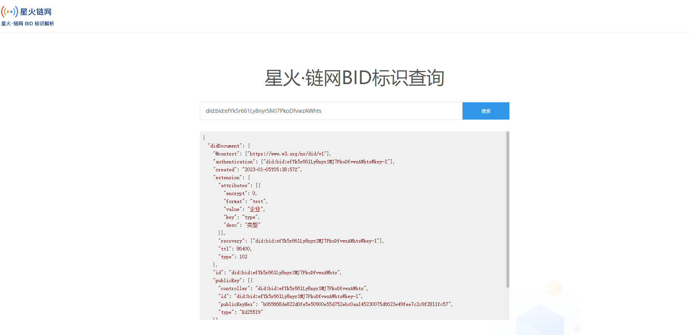

# 8.BID标识查询

**[星火·链网BID标识查询](http://test-bj-bidresolver.bitfactory.cn/)**

## 8.1产品概述

BID标识查询是星火链上的一种数据可视化工具，用户可以通过web页面，直接在浏览器上解析BID标识。

## 8.2 功能模块

### 8.2.1 检索首页

### 8.2.2 BID信息

在BID标识查询页面中，检索结果页会展示该BID标识的详细。 

## 8.3 应用场景

BID标识查询作为星火链的开放功能，任何人都可以从浏览器获取星火链的BID标识信息。 

