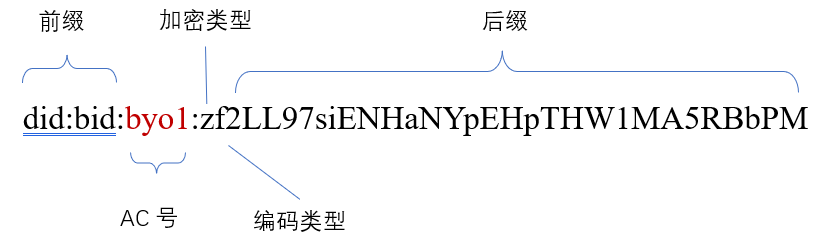
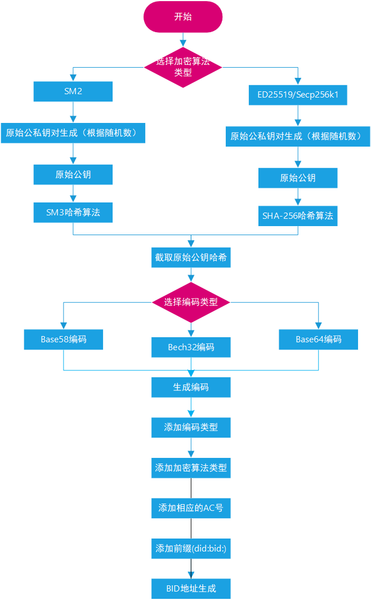
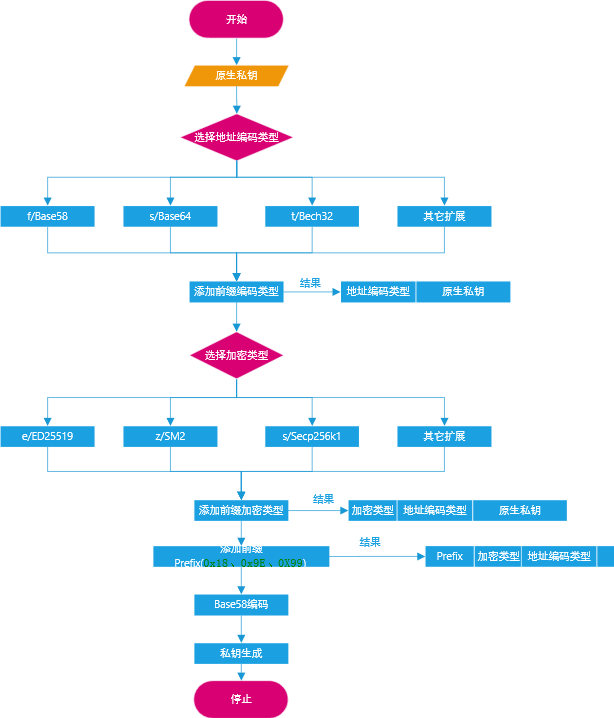
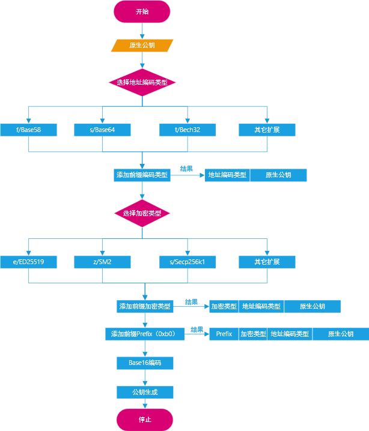

# 2.BID标识符

`BID`（Blockchain-based ID）是基于星火·链网区块链基础设施构建的新型分布式标识体系。它符合`W3C`的`DID`规范，采用密码学、数字身份、区块链、隐私计算等技术，实现标识自注册、自主管理，具有永久性、全球可解析、身份可验证和分散性的特点，主要是面向实体（包括人、物、组织）和数字对象，可用于拥有者证明其对`BID`的控制权及身份验证功能，而不需要依赖其他外部组织。

2020年，`BID`已成功写入`W3C DID` [注册表](https://w3c.github.io/did-spec-registries/#did-methods)，同时`BID`通用解析器驱动程序已完成研发并被[DIF通用解析器](https://dev.uniresolver.io/)合并，目前`BID`标识体系已具备全球解析服务能力。

## 2.1 什么是BID

星火标识`BID`是星火·链网的数据载体，也是星火链底层支持的原生地址，同时`BID`还是分布式身份标识符`DID`的一个`method`。

`BID`的组成结构如下：

- **前缀Prefix**

  `BID`的前缀，为固定字符串“did:bid:”，其中`did:bid`小写。

- **ACSN(Autonomous Consensus System Number),简称AC号**

  小写字母和数字组成的四位代码,星火链主链上的`BID`没有`AC`号，子链上的`BID`在前缀后缀之间增加子链的`AC`号,用于区分同一私钥控制的同一账户在不同子链上的地址。

  `AC`号是星火·链网中代表子链合法性的唯一代码，是由骨干节点申请超级节点签发的子链身份代码（简称链码）。链码申请时，骨干节点需要递交子链所属行业、子链名称、slogen、介绍、设备指纹信息、路由地址(包括设备IP、端口)等，超级节点审核通过后向骨干节点签发带有超级节点签名的链码，子链通过`AC`号生成其`BID`标识，实现整个链群中的寻址功能。

- **加密类型**

  生成`BID`原始公私钥对的加密算法类型，用一个小写字母表示，目前支持的加密类型有国际密码算法`ED25519`、`Secp256k1`和国密算法`SM2`，具体加密类型和公私钥对加密算法的映射关系如下表：
  
  | 加密类型     | 公私钥支持算法 |
  | ------------ | -------------- |
  | ‘e’          | `ED25519`      |
  | ‘z’          | `SM2`          |
  | ‘s’          | `Secp256k1`    |
  | 其他小写字母 | 预留待扩展     |
  
- **编码类型**

  后缀的编码算法和截取公钥哈希的长度，用一个小写字母表示，目前支持`Base58`、`Bech32`和`Base64`三种编码算法，截取公钥哈希的长度为`22`字节。具体编码方式和公钥哈希长度和编码类型的映射关系见下表：

  | 编码类型     | 编码方式   | 截取公钥哈希长度 |
  | ------------ | ---------- | ---------------- |
  | ‘f’          | `Base58`   | 22               |
  | ‘s’          | `Base64`   | 22               |
  | ‘t’          | `Bech32`   | 22               |
  | 其他小写字母 | 预留待扩展 | 预留待扩展       |

- **后缀**

  公钥经过哈希算法之后截取， 然后再进行编码后得到的字符串，不同的编码方式生成的后缀长度和格式不同。编码类型为‘t’生成的后缀字母全为小写，其他两种类型生成的字母区分大小写。

  不同类型的编码方式生成的后缀长度不同，以`Base58`编码方式生成的后缀长度为`22`-`31`字节，`Base64`编码方式生成的后缀长度长度为`32`字节，`Bech32`编码方式生成的后缀长度长度为`42`字节。

  星火链`BID`地址的包括前缀、`AC`号、加密类型、编码类型、后缀，最终的长度范围为`32`-`57`个字节。

## 2.2 BID标识生成流程描述

下图是`BID`标识生成流程图：

**第一步，生成原始公私钥对**

根据加密算法类型生成原始的公私钥对。

**第二步，计算原始公钥的哈希**

根据第一步生成的原始公私钥对，对原始公钥进行哈希运算，得到一个固定长度的输出摘要（`256-bit/32-Byte`）。原始公私钥对的生成算法不同，对应的哈希算法也不同，具体如下：

1. `SM2`对应的哈希算法是`SM3`

2. `ED25519`或者`Secp256k1`对应的哈希算法是`SHA-256`

**第三步，生成编码**

根据编码类型得到要截取的哈希长度和编码算法类型，截取上一步生成的哈希，然后进行编码生成相应的字节数组。

**第四步，添加编码类型**

在上一步编码完成之后的字节数组前面添加编码类型，生成新的字节数组。

**第五步，添加加密算法类型前缀**

在上一步的字节数组前面添加加密类型，生成新的字节数组。

**第六步，添加AC号**

若生成的是星火链的`BID`，跳过这一步；若生成的为子链的`BID`,在上一步的字节数组前面添加相应的`AC号` +` ‘:’`。

**第七步，添加Prefix前缀**

`Prefix`是个固定字符串值`"did:bid:"`，上一步的结果加上此前缀后即为`BID`的最终值。

## 2.3 BID私钥生成流程描述

下图是`BID`私钥生成流程图：

**第一步，生成原始公私钥对**

根据加密算法类型生成原始的公私钥对。此步骤没有具体列出，具体请参见`BID`标识生成流程描述中的第一步

**第二步，添加前缀地址编码类型**

在原始私钥前添加地址编码类型前缀，目前支持的地址编码类型请参见**2.1 什么是BID**正文中介绍的编码类型。

注意：此地址编码类型为`BID`标识编码类型，非生成私钥的最后一步`Base58`编码类型，两者并无直接相关关系。

**第三步，添加前缀加密类型**

上一步生成的结果基础上添加前缀加密类型，目前支持的加密编码类型请参见**2.1 什么是BID**正文中介绍的加密类型。

**第四步，添加前缀Prefix**

第三步的结果之上再次添加前缀`Prefix`。`Prefix`是三个字节`0x18`、`0x9E`、`0X99`,此固定字符串在`Base58`编码后生成固定字符串（`pri`）,目的是为了方便用户观察和使用。

**第五步，Base58编码**

经过前四个步骤后，得到一个新的字符数组。对这个字符数组进行`Base58`编码后即得到最终的私钥。

## 2.4 BID公钥生成流程描述

下图是`BID`公钥生成流程图：

**第一步，生成原始公私钥对**

根据加密算法类型生成原始的公私钥对。此步骤没有具体列出，具体请参见`BID`标识生成流程描述中的第一步

**第二步，添加前缀地址编码类型**

在原始公钥前添加地址编码类型前缀，目前支持的地址编码类型请参见**2.1 什么是BID**正文中介绍的编码类型。

注意：此地址编码类型为`BID`标识编码类型，非生成私钥的最后一步`Base16`编码类型，两者并无直接相关关系。

**第三步，添加前缀加密类型**

上一步生成的结果基础上添加前缀加密类型，目前支持的加密编码类型请参见**2.1 什么是BID**正文中介绍的加密类型。

**第四步，添加前缀Prefix**

第三步的结果之上再次添加前缀`Prefix`。`Prefix`是一个字节，值为`0xb0`,目的是为了方便用户观察和使用。

**第五步，Base16编码**

经过前四个步骤后，得到一个新的字符数组。对这个字符数组进行`Base16`编码后即得到最终的公钥。
