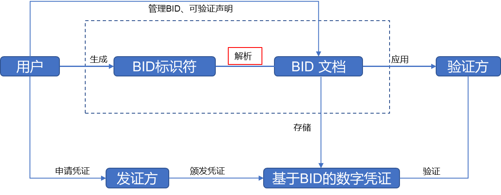

# 1.星火链BID体系介绍

星火标识**BID**(`Blockchain-based Identifier`, **BID**)，**BID**标识是基于W3C DID标准开发的新型分布式标识，任意实体可自主生成星火标识，不需要中心化注册机构就可以实现全球唯一性，具有**分布式、自主管理、隐私保护和安全易用**等特点，同时根据算法的不同，**BID**支持`39-57`位**变长编码**方式，有效适应各种业务场景，兼容各类设备。

**BID**主要包含以下方面：**BID标识符**、**BID文档**、**BID解析协议**、**基于BID的数字凭证**：

- **BID标识符：**

  - 是基于新型分布式标识符`DID`规范的一种方法，任意实体可自主生成**BID**，不需要中心化注册机构就可以实现全球唯一性；
  - **去中心化、互通**

- **BID文档：** 

  -  **BID**标识符只是表示一个身份的标识符，不包含身份的信息。而**BID**文档就是用于描述身份详细信息的文档，一个**BID**标识符关联到一个**BID**文档。**BID**标识符具体解析为**BID**文档，**BID**文档内包括**BID**标识符和公钥详细信息(持有者、加密算法、密钥状态等)，以及**BID**持有者的其他非隐私属性描述等；
  -  **信息承载**

- **BID解析协议：**

  -  星火·标识深耕物联网领域，自主构建了**BID**解析协议，优化了海量物联网设备的接入场景，同时支持`DID`解析器，为星火·链网智能设备自主交互奠定了基础；
  -  **互通**

- **基于BID的数字凭证：**

  - 提供了一种规范来描述实体所具有的某些属性。**BID**持有者，可以通过可验证声明，向其他实体证明自己的某些属性是可信的。结合数字签名和零知识证明等密码学技术，可以使得声明更加安全可信，并进一步保障用户隐私不被侵犯；

  - **隐私**

    

## 1.1 规范

星火标识编码规范如下：

由前缀`Prefix`、共识码（`AC号`）、加密类型、编码类型、后缀组成。

## 1.2 实现

### BID地址生成流程描述

下图是**BID**地址生成流程图：

**第一步，生成原始公私钥对** 

根据加密算法类型生成原始的公私钥对。

**第二步，计算原始公钥的哈希**

根据第一步生成的原始公私钥对，对原始公钥进行哈希运算，得到一个固定长度的输出摘要（`256-bit/32-Byte`）。原始公私钥对的生成算法不同，对应的哈希算法也不同，具体如下：

1. `SM2`对应的哈希算法是`SM3`

2. `ED25519`或者`Secp256k1`对应的哈希算法是`SHA-256`

**第三步，生成编码**

根据编码类型得到要截取的哈希长度和编码算法类型，截取上一步生成的哈希，然后进行编码生成相应的字节数组。

**第四步，添加编码类型**

在上一步编码完成之后的字节数组前面添加编码类型，生成新的字节数组。

**第五步，添加加密算法类型前缀**

在上一步的字节数组前面添加加密类型，生成新的字节数组。

**第六步，添加AC号**

若生成的是星火链的`BID`，跳过这一步；若生成的为子链的`BID`,在上一步的字节数组前面添加相应的`AC号` +` ‘:’`。

**第七步，添加Prefix前缀**

`Prefix`是个固定字符串值`"did:bid:"`，上一步的结果加上此前缀后即为`BID`的最终值。

### BID私钥生成流程描述

下图是BID私钥生成流程图：

**第一步，生成原始公私钥对**

根据加密算法类型生成原始的公私钥对。此步骤没有具体列出，具体请参见`BID`地址生成流程描述中的第一步

**第二步，添加前缀地址编码类型**

在原始私钥前添加地址编码类型前缀，目前支持的地址编码类型请参见什么是`BID`标题正文中介绍的编码类型。

注意：此地址编码类型为`BID`地址编码类型，非生成私钥的最后一步`Base58`编码类型，两者并无直接相关关系。

**第三步，添加前缀加密类型**

上一步生成的结果基础上添加前缀加密类型，目前支持的加密编码类型请参见什么是`BID`标题正文中介绍的加密类型。

**第四步，添加前缀Prefix**

第三步的结果之上再次添加前缀`Prefix`。`Prefix`是三个字节`0x18`、`0x9E`、`0X99`,此固定字符串在`Base58`编码后生成固定字符串（pri）,目的是为了方便用户观察和使用。

**第五步，Base58编码** 

经过前四个步骤后，得到一个新的字符数组。对这个字符数组进行`Base58`编码后即得到最终的私钥。

### BID公钥生成流程描述

下图是BID公钥生成流程图：

**第一步，生成原始公私钥对**

根据加密算法类型生成原始的公私钥对。此步骤没有具体列出，具体请参见`BID`地址生成流程描述中的第一步

**第二步，添加前缀地址编码类型**

在原始公钥前添加地址编码类型前缀，目前支持的地址编码类型请参见什么是`BID`标题正文中介绍的编码类型。

注意：此地址编码类型为`BID`地址编码类型，非生成私钥的最后一步`Base16`编码类型，两者并无直接相关关系。

**第三步，添加前缀加密类型**

上一步生成的结果基础上添加前缀加密类型，目前支持的加密编码类型请参见什么是`BID`标题正文中介绍的加密类型。

**第四步，添加前缀Prefix**

第三步的结果之上再次添加前缀`Prefix`。`Prefix`是一个字节，值为`0xb0`,目的是为了方便用户观察和使用。

**第五步，Base16编码** 

经过前四个步骤后，得到一个新的字符数组。对这个字符数组进行`Base16`编码后即得到最终的公钥。
