# 7.浏览器插件钱包

浏览器插件钱包是星火·数字身份服务ID3Entry提供的星火数字身份客户端，您可以使用浏览器插件钱包本地管理自己的私钥和身份数据，并通过签名授权出示身份数据，获取星火区块链应用服务。

## 7.1 安装说明

### 7.1.1 官网下载插件钱包

官网地址：https://bitfactory.cn/

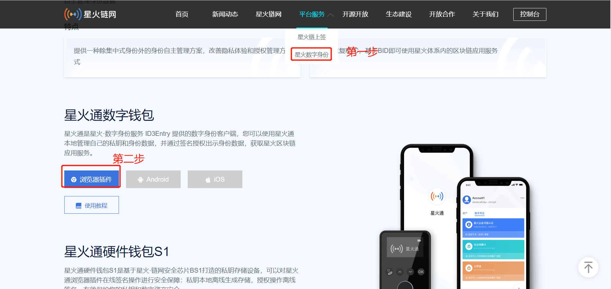

### 7.1.2 安装扩展程序

1.打开谷歌浏览器 更多工具-扩展程序- 打开开发者模式

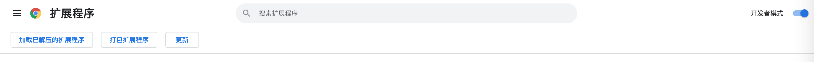

2.点击加载已解压的扩展程序

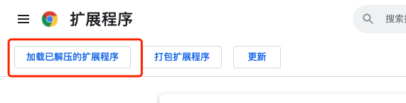

3.解压zip包后，选择文件夹

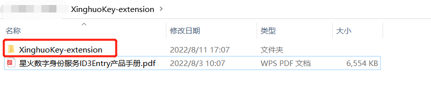

4.导入后，点击浏览器右上角，出现扩展程序列表，点击红色框内的按键，会生成访问钱包插件的快捷方式

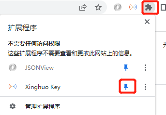

5.点击上图的快捷方式进入创建账户页面

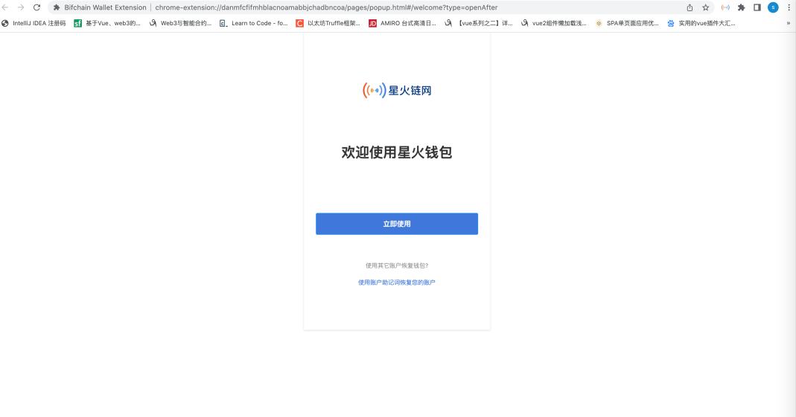

## 7.2 创建账户

1.点击立即使用后，选择加密方式、输入密码, 点击开始创建
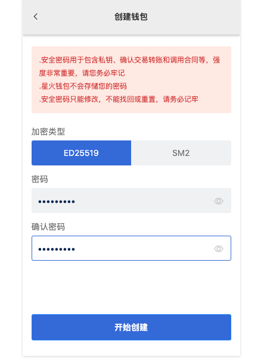

2.点击复制助记词，粘贴到本地，选中我已了解，点击继续
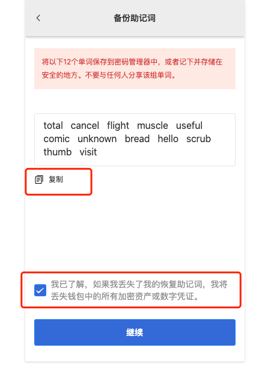

3.按照助记词顺序依次点击单词，全部选完后，点击按钮“完成”，跳转至钱包首页，默认账户已创建完成。

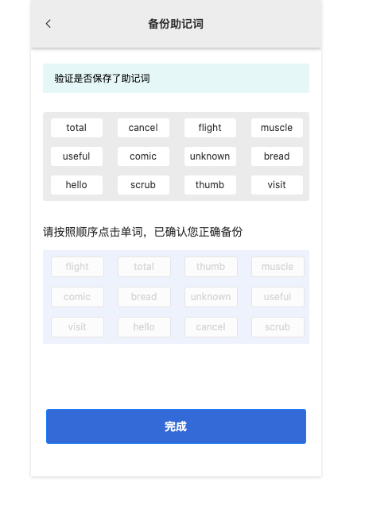

4.私钥或其他方式导入账户，点击首页左上角按钮，弹出左侧功能导航，点击导入账户，显示导入账户的弹窗后，选择您要导入账户的方式，录入相关信息后点击导入
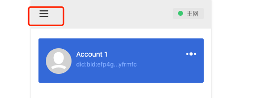
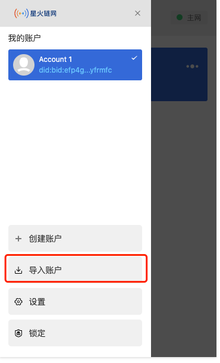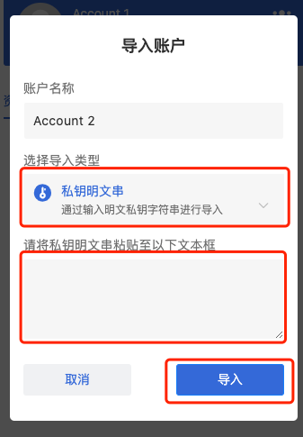

## 7.3 申请星火可信凭证

在星火链平台做业务时需要让您出示星火可信凭证，星火可信凭证分为星火企业可信凭证、星火政府可信凭证和星火个人数字凭证，以星火企业数字可信凭证申请为例进行说明：

**前置条件**
当用户已通过在浏览器插件或其他地方创建了钱包BID
具体步骤如下：

1.点击首页依次点击“数字凭证”-右下角“加号”-星火企业可信认证，如下图所示：

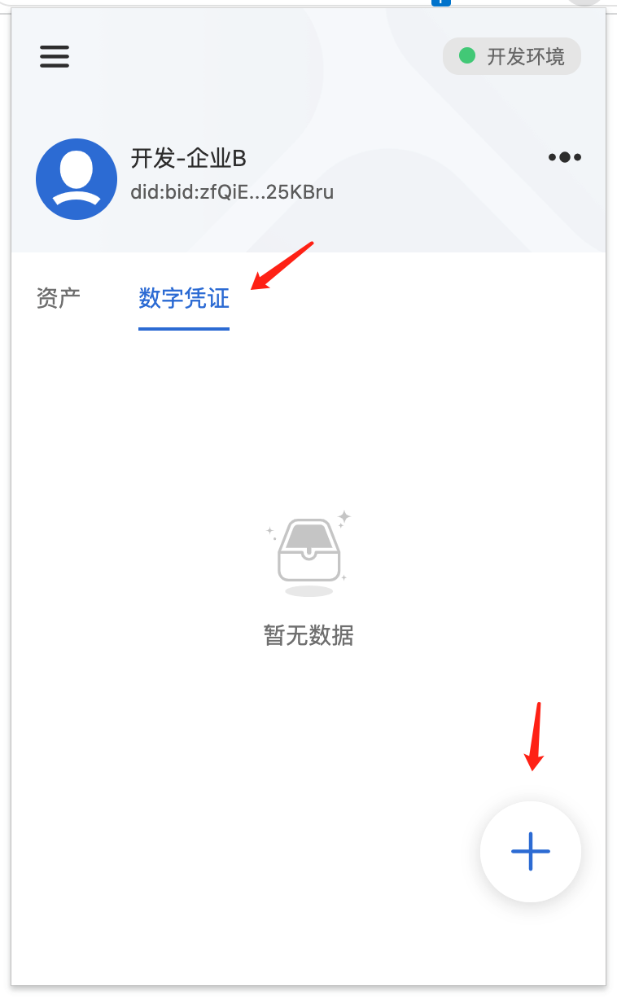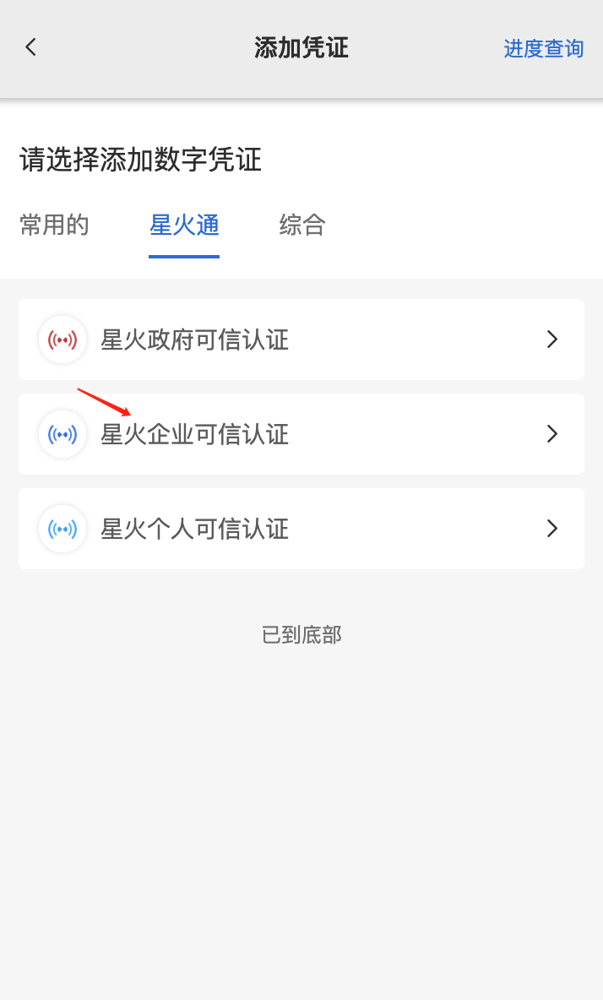

2.选择添加星火企业可信认证后，进入申请页面，依次输入“企业简称”、“所属行业”、“上传营业执照照片”、“联系人”及上传授权书，授权书可以在注意事项中进行下载，填完后以要求格式再进行上传。

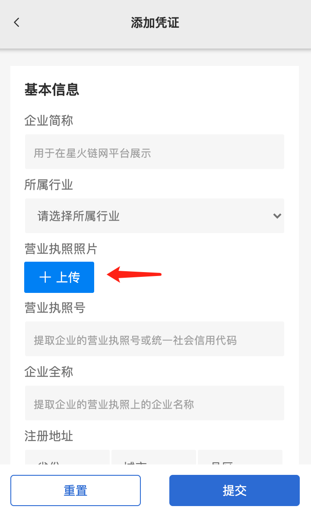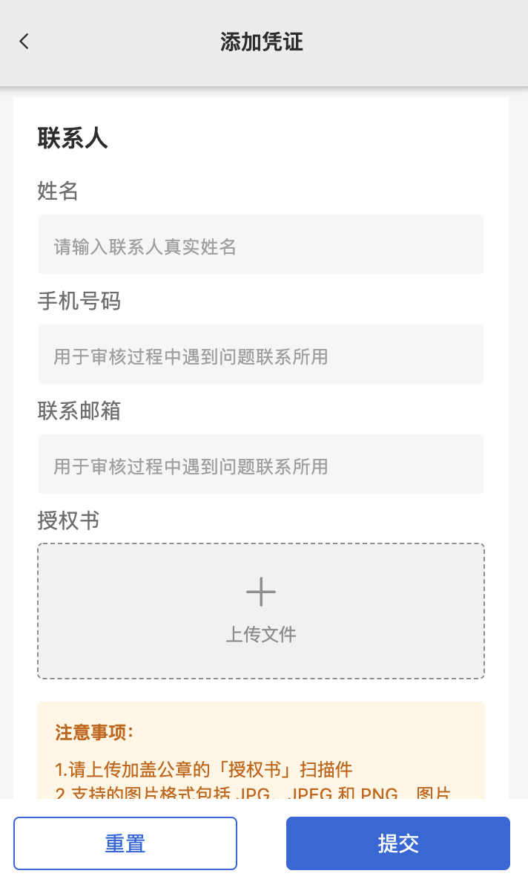

3.申请完可以在凭证添加进度查询中进行查看，如图所示：
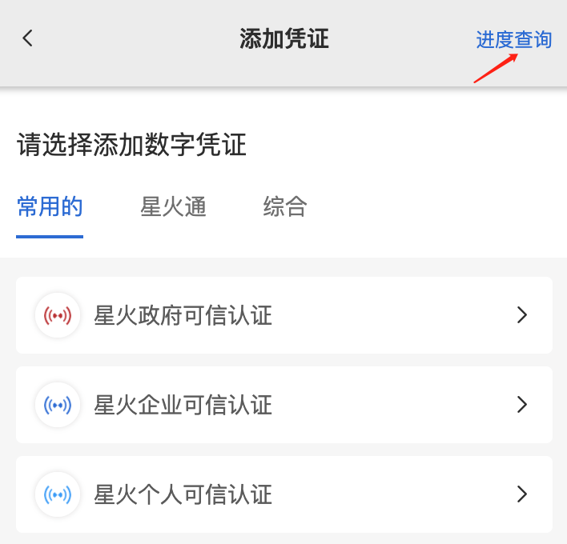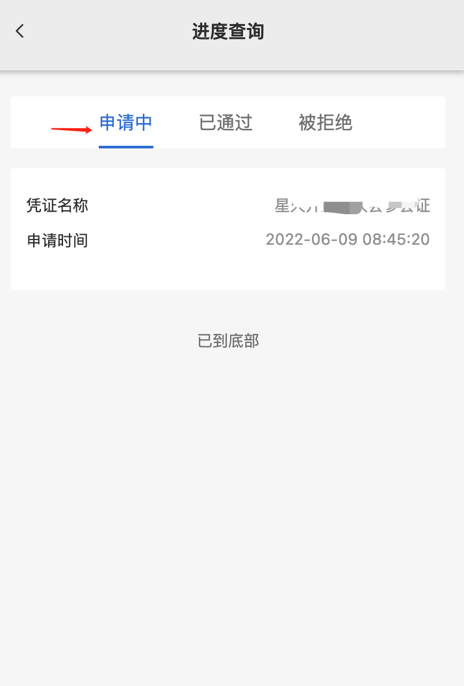

4.申请的数字凭证通过后可以在数字凭证查看到，如下图所示：
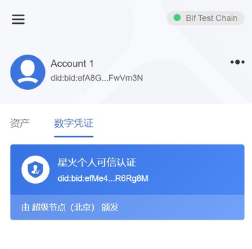
