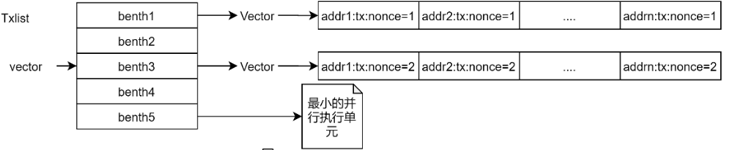

# 1.交易处理

## 3.1 交易类型

### 3.1.1 合约创建

只有Create类型的交易，才被允许创建合约账户。合约本身也具有可信属性，需要被许可之后才能被调用。

```protobuf
message InputCreateContract
{
     Contract contract = 1;
     int64 init_balance = 2;
     string init_input = 3;
}
message Contract{
    enum ContractType{
        SYSTEM = 0;
        EVM = 1;
        UNKNOWN = 10;
	};
    enum STATUS_FALG {
        ENABLED        = 0;
        DISABLED       = 1;
	};
    ContractType type = 1;
    string code = 2;
    int64 version = 3;
    bytes metadatas_hash = 4;
    STATUS_FALG status = 5;
}
```

- `contract` 合约创建交易需要创建的合约内容。

- `type` 为合约使用虚拟机类型；合约创建禁止创建`SYSTEM`合约，目前仅支持`EVM`合约。
  - `code`为合约代码，必填
  - `version`为合约版本号，不支持在合约创建时指定，默认为0；合约创建交易中不需要填写
  - `metadatas_hash`为合约元数据`hash`，与合约中具体变量值有关，不需要填写
  - `status`为合约使用状态描述，默认为`ENABLE`；合约创建交易不需填写

- `init_balance` 创建合约时赋予的初始原生资产数额，从创建该账号的源账户的`balance`内扣取。

- `init_input` 合约的初始化参数，可根据 `contract` 选填。

在区块链上创建一个合约。成功条件：

1. 各项参数合法。
2. 要创建的账号在区块链中不存在，即不能创建已有的账号。
3. 若创建时指定了合约代码，合约语法必须正确。

### 3.1.2 合约调用

任意一个已存在的普通账户都可以通过合约调用交易调用合约。

```protobuf
message InputCallContract{
     int64 amount = 2;
     string input = 3;
}
```

- `input` 合约调用参数。
- `amount` 合约调用时赋予被调用合约的初始原生资产数额，从调用该账号的源账户balance内扣除。

在区块链上调用一个合约。成功条件：

1. 各项参数合法。
2. 合约账户必须已存在，并且合约调用input调用参数合法。

## 3.2 交易校验

区块链网络内任意一个节点收到一笔交易请求或交易执行前，首先会对交易进行合法性检查。

### 3.2.2 交易缓存校验

- 服务域状态 检测：交易所在服务域状态是否正常，当交易所在服务域被禁用后，交易验证失败。

- 交易源账户 。

- 检测源账户在交易所在服务域下是否存在，如不存在，交易验证失败。

- 检测源账户在主共识域下是否存在，如不存在，交易验证失败；（交易源账户必须满足在主共识域及服务域下同时存在）。

- 交易基础信息校验。

- 交易签名验证 检测交易包含的签名是否合法，具体验证规则如下：

**签名内容**：
<left>
    signdata = source_address + sha256(TransactionData. SerializeAsString())
</left>

**验证结果**：
<left>
    result = edd25519.verify(signdata, Signature.public_key)
</left>

**签名结构**:
```protobuf
message Transaction {
    string source_address = 1;
    TransactionData data = 2;
    Signature signature = 3;
}
```


### 3.2.3 交易执行校验

**Nonce合法性检查**

​	为防止恶意节点重放交易，节点在执行交易前需要检查交易的唯一性，即检查交易的nonce和有效期。

**账户可信检查**

​	检查交易源账户有效性。

**合约可信检查**

​	检查被调用合约有效性。

## 3.3 交易列表

### 3.3.1 构建交易列表

交易池提供了双层索引结构用于构建交易列表。第一层索引是交易源账户的地址，通过源账户地址可以检索到源账户发送的所有交易集合；第二层索引是交易nonce，通过nonce可以找到交易。

1、构建建议列表时，先遍历所有源账户，并从每个源账户的交易集合中取一条交易组成一个bench。

2、重复执行步骤1，直到交易列表内的交易数量达到区块内最大交易数或交易池中没有交易为止。

### 3.3.2 最小并行单位 

为充分利用计算机多核的优势，服务域内的交易执行支持并行的方式进行，并以benth作为并行执行的最小单位，benth是一组不用源账户的交易ID，定义如下：


