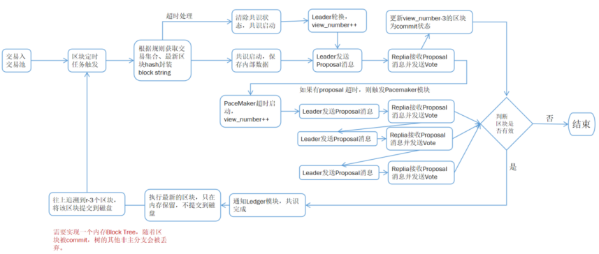

# 4.共识

## 4.1 概述

共识是区块链的核心模块，其目的是使得各个节点的数据状态达成一致。其原理是各节点有共同的初始状态，然后通过共识算法形成一致的中间交易，最后各节点形成一致的最终状态。综合考虑目前市面共识算法的先进性以及星火链对性能的要求，计划基于hotstuff构建星火链的共识算法，hotstuff共识算法的先进性如下：

- 通过在投票过程中引入门限签名实现了的消息验证复杂度。

- 使用了流水线共识加快了共识效率。

- 具有乐观响应性（Optimistic Responsiveness）。

- 安全性（Safety）与活性（Liveness）解耦。

## 4.2 安全性（Safety）

共识算法经过三阶段达成一致，分别为Prepare阶段、Precommit阶段以及Commit阶段。流程如下：

流程描述前对术语定义如下：

**1）Type**：有五种消息类型，`NEWVIEW`、`PREPARE`、`PRECOMMIT`、`COMMIT`及`DECIDE`，其中`NEWVIEW`为试图切换即`leader`重新选举阶段，其他可参照上图对应各阶段的消息类型。

**2）Node**：节点可以理解为需要提交的交易集合，其数据格式为<parent, cmds>，nodes通过parent指针进行连接，组成一棵树。Parent可以用hash实现。

**3）QC**：QC为Quorum Certificate仲裁证书，是一种加密证据，各个Replica节点对消息进行签名后，由Leader节点汇总后的一种加密数据，数据格式为<type，view_number,node, [signature]>; signature的格式为对<type, view_number, node>的签名数据。

**4）Msg**：由于hotstuff是基于消息传递的一致性算法，所以完整的消息格式为：<Type, view_number, node, justify>,Type为消息类型，view_number为视图编号，node为？，justify为QC。

**5）voteMsg**：投票类型的消息，格式为<Msg, partialSig>, 最终格式为<Type,view_number, node,justify, partialSig=signature<Type, view_numnber,node>>。

**6）prepareQC**：由大多数的replica对PREPARE消息投票成功后的仲裁证书，其格式为<PREPARE, view_number, node_hash, [signature]>，其中node应为<cmd>原始交易值。

流程解释如下：

在Chained HotStuff协议中，`prepare`阶段的副本的投票由`leader`节点加以收集，并且储存在状态变量`genericQC`里。接下来，`genericQC`被转发给下一个视图的`leader`，实质上是将下一阶段的职责（这曾经由`pre-commit`阶段负责的）委托给下一个`leader`节点。然而，下一位`leader`实际上并不单独进行`pre-commit`阶段，而是启动一个新的`prepare`阶段，添加自己的提议。视图v+1的`prepare`阶段同时充当视图的`pre-commit`阶段。视图v+2的`prepare`阶段同时充当视图v+1的`pre-commit`阶段和视图v的`commit`阶段。

针对Chained HotStuff，星火的共识流程如下：

1. 由星火核心模块调用共识模块，将共识`cons_value`值传递到共识模块。
2. 共识模块将`Cons_value`追加到最新树叶子节点，封装为`cur_node`，接下来判断当前的`Replica`是否为`leader`，如果为`leader`则签名并发送`Proposal`消息至各个`Replica`，`Proposal`消息为<PROPOSAL, cur_node<cons_value, view_number, highQC>, signature>。
3. `Replica`接收`Proposal`消息，此刻对树分支做判断，更新当前的`highQC`为前一个节点的`genericQC`，并且追溯到父节点的祖父节点为`commit`状态，此时可以对其做**执行处理**。
4. `Replica`和`Leader`，此时更新当前的`view`高度为`proposal`消息的高度（对应论文中的安全性检测和或许检测），接下来，对`cur_node`签名后，发送`VOTE`消息到`Leader`，`VOTE`消息为<VOTE, cure_node_hash, signature<VOTE, cur_node_hash>>。
5. `Leader`接收各`Replica`的`VOTE`消息后，判断`VOTE`消息是否大于绝大多数，如果正好为绝大多数，则将合并后的`genericQC`更新到当前的`node`中。

## 4.3 活性（Liveness)

为保证共识算法的活性（`liveness`），Chained Hotstuff算法提出`PaceMaker`（起搏器）机制，其工作流程分为两种情况：启动正常共识（Beat）以及超时处理流程。

启动正常共识是指区块链节点接收到客户提交的交易时，如何提交到`Safety`模块。其流程如下：

1. 节点接收用户提交的交易，交易入到交易缓存集，`PaceMaker`定时收集交易序列，判断上一共识流程是否完成，如果完成即可启动下一共识流程。
2. 节点启动时，定时检查没有达到终态的`decision`，发起节点轮换；将replica id 为`view_number + 1 / replica_count`的节点设置为下一轮共识的`leader`节点。接下来依次发起新三轮共识（因为是流水线作业），这三轮共识的交易集为空即可。使得最新一次正常共识达到`decision`状态。

## 4.4 共识流程

从交易提交到交易被确认的整体流程如下：

1. 用户提交交易后，交易入到交易池。定时任务启动后，将交易集合及部分区块头信息序列化，并提交到共识模块。
2. 共识模块按照三阶段chained hotstuff流程进行共识。
3. 区块共识完成后，通知`ledger`核心模块，`ledger`模块进行预执行，执行结果只保留在内存。所以该模块需要实现一个memory block tree，因为根据`hotstuff`共识算法，由于节点作恶、超时，某些分支最后可能会被丢弃，只有主分支被保留。
