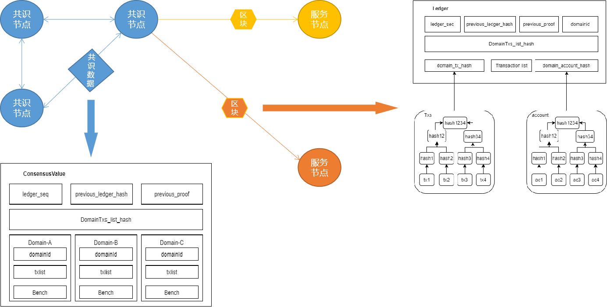
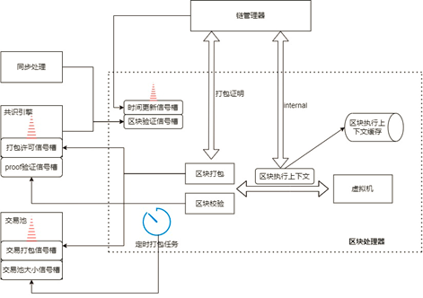
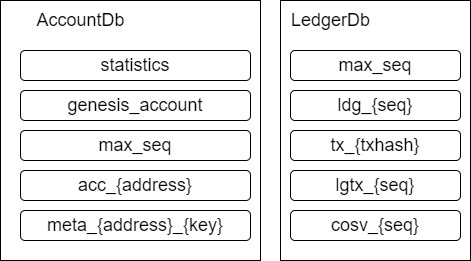

# 2.区块处理

星火链区块处理包含区块中交易的执行以及区块执行结果上链。针对共识节点的共识数据以及针对普通节点的同步数据均需进行区块处理。但是这两种情况使用的协议不同，所以分开进行描述。



共识节点之间对`ConsensusValue`结构进行共识，共识达成之后，共识节点根据`ConsensusValue`结构生成服务域区块，并通过`P2P`网络广播区块到对应的服务节点。服务节点仅接受区块结构，并进行验证。因此网络出块的过程包括共识数据处理和区块数据处理两部分。

## 2.1 共识数据

### 2.1.1 共识数据结构定义

星火链共识节点出块时，需要符合星火共识结构规则。星火链共识数据结构如下：

```protobuf
message BenchSegmentRange{
    repeated int32 batch_txs_size = 1;
}
message DomainAccountHash{
	int32 domain_id = 1;
	bytes account_tree_hash = 2; //区块内修改账户的hash
	bytes domain_tx_hash = 3;
	int64 txcount = 4;
}
message Neighbor {
    repeated int32 neighbors = 1;
}
message DAG {
    repeated Neighbor vertexes = 2;
}
message DomainTxsIndex{
	int32 domainId = 1;
	bytes domaintxshash = 2;
}
message DomainTxs{
	int32 domainId = 1;
	bytes txs = 2;
	BenchSegmentRange bench_segment_range = 3;
}
enum ConsensusType {
	DATA_CONSENSUS = 0;
	CONFIG_CONSENSUS = 1;
	DOMAIN_CONSENSUS = 2;
}

message ConsensusValueHeader{
	int64 close_time = 1;
	bytes previous_proof = 2;
	int64 ledger_seq = 3;
	bytes previous_ledger_hash = 4;
	repeated DomainTxsIndex txs_index = 6;
}

message ConsensusValueBody{
	repeated DomainTxs txs_list = 2;
}

message ConsensusValue{
	ConsensusValueHeader consensus_header = 1;
	ConsensusValueBody consensus_body = 2;
	repeated DomainAccountHash domain_accounttrie_hashs = 3; //Hash tree of incremental accounts
}
```

星火链使用`ConsensusValue`结构作为节点共识的主体，包含共识区块头`ConsensusValueHeader`、共识区块体`ConsensusValueBody`、共识执行结果集合`DomainAccountHash`。

#### 2.1.1.1 ConsensusValueHeader

- `close_time` 区块打包时间，由出块节点控制生成；由出块时间间隔进行控制。

- `previous_proof `上一区块出块证明；星火链使用该字段进行上一区块的确认，与共识类型相关。单节点情况下，该字段为固定字符串，如为多节点情况，该字段一般为其余共识节点的签名信息。

- `ledger_seq` 当前共识的区块高度。

- `previous_ledger_hash` 前一个区块的账本hash，即`LedgerHeader.header_hash`。

- `DomainTxsIndex` 各服务域交易哈希信息。
  - `domainId `服务域标识id
  - `domaintxshash` 对应`ConsensusValueBody`中的`DomainTxs`，即域数据的快照信息

#### 2.1.1.2 ConsensusValueBody

该结构中包含内容为共识过程中各服务域的具体信息数据。

- `domainId` 服务域标识id。

- `txs` 服务域打包的交易数据:使用bytes存放，具体内容为全部交易的序列化字符串，即
  
  <left>
      txs = tx1. SerializeAsString() + tx2. SerializeAsString() + …
  </left>
  
- `txs_dag` 并行结构数据，目前暂未使用。

- `bench_segment_range`并行结构数据，目前暂未使用。

#### 2.1.1.3 DomainAccountHash

同区块中DomainAccountHash。

#### 2.1.1.4 共识数据处理

按服务域并行处理域内交易列表。流程如下：



## 2.2 区块数据处理

### 2.2.1 区块数据定义

```protobuf
message LedgerHeaderData{
     int64	seq		= 1;
     bytes	previous_hash	= 2;
     int64   close_time	= 3;
     int64	version		= 4;
     int64	chain_id	= 5;
     repeated DomainAccountHash domain_hashs = 6;
     int64   conf_seq = 7; 
}

message LedgerHeader{
     LedgerHeaderData header = 1;
     bytes headerhash = 2;
     bytes extra_data = 3;    
}

message Ledger{
     LedgerHeader header = 1;
     int32 domain_id = 2;
     repeated Transaction transactions = 3;
}
```

### 2.2.2 区块数据处理

以benth为单位一次并行执行交易列表，每个benth执行完毕后，根据交易修改的数据库的key判断冲突。如果有冲突，按照交易ID从小到大的顺序重新执行冲突交易。

## 2.3 数据存储

星火链交易在处理完成后，需要将交易写到区块链中；共识完成后，需要将区块数据写到区块链中；为维护区块链环境正常运行，同样需要包含其它一些配置性参数上链。

为保证区块链各服务域的数据隔离，每个服务域维护各自的数据库；为保证区块链处理效率，针对同一个域数据读写频次不同，目前分为账户库和账本库两个数据库：



**AccountDB**

| 字段                 | 说明                 | 公式                                                       |
| -------------------- | -------------------- | ---------------------------------------------------------- |
| statistics           | 保存所在域下账户总数 | DB(“statistics”) = int64(accountNum)                       |
| genesis_account      | 域创世区块账号地址   | DB(“genesis_account”) = string(genesis_address)            |
| max_seq              | 当前链上最大区块高度 | DB{“max_seq”} = int64(seq)                                 |
| acc_{address}        | 账户数据             | DB{“acc_{address}”} = string(Account. SerializeAsString()) |
| meta_{address}_{key} | 合约的matedata数据   | DB{“meta_{address}_{key}”} = string(value)                 |

**LedgerDB**

| 字段        | 说明                   | 公式                                                         |
| ----------- | ---------------------- | ------------------------------------------------------------ |
| max_seq     | 最大区块高度           | DB{“max_seq”} = int64(seq)                                   |
| ldg_{seq}   | 区块头数据             | DB{“ldg_{seq}”} = LedgerHeader. LedgerHeaderData.SerializeAsString() |
| tx_{txhash} | 交易执行结果记录       | DB{“tx_{txhash}”} = TransactionEnvStore. SerializeAsString() |
| lgtx_{seq}  | 区块中包含交易列表信息 | DB{“lgtx_{seq}”} = LedgerTxList.SerializeAsString()          |
| cosv_{seq}  | 服务域共识结构数据     | DB{“cosv_{seq}”} = ConsensusValue.SerializeAsString()        |

