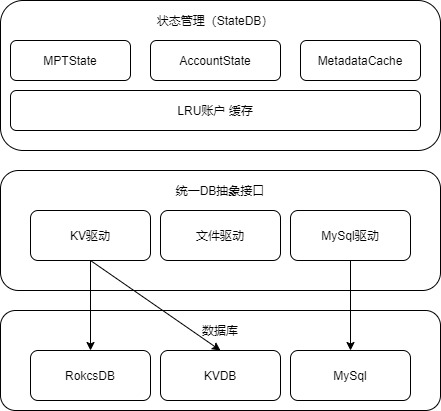

# 6.存储设计

存储层需要能够满足海量数据存储、热点合约访问等场景下的性能要求，为此我们采用1+1+N的结构来设计存储模块。“1+1+N”即1状态管理、1抽象接口+N数据库实例。存储模块的整体结构如下：

## 8.1 状态管理

状态管理模块使用MPT树，管理区块执行过程中，区块内账户的状态，缓存账户修改的内容。为交易执行模块获取和修改账户提供统一的接口，实现模块间逻辑和数据的解耦。

## 8.2 抽象接口

统一的DB抽象接口实现SQL和NoSQL数据库的兼容，为状态管理模块提供统一的数据访问接口，屏蔽数据库细节，便于实现数据库模块水平扩展，支持多实例数据库。

## 8.3 多实例扩展

抽象接口层允许星火链提供多种数据库实例，RocksDB引擎提供基本的数据库，用于服务节点。

为了支持海量数据上链，尤其是共识节点存储所有服务域的数据，需要性能稳定、可扩展容量的数据库系统，因此集成了TiKV数据库引擎。
