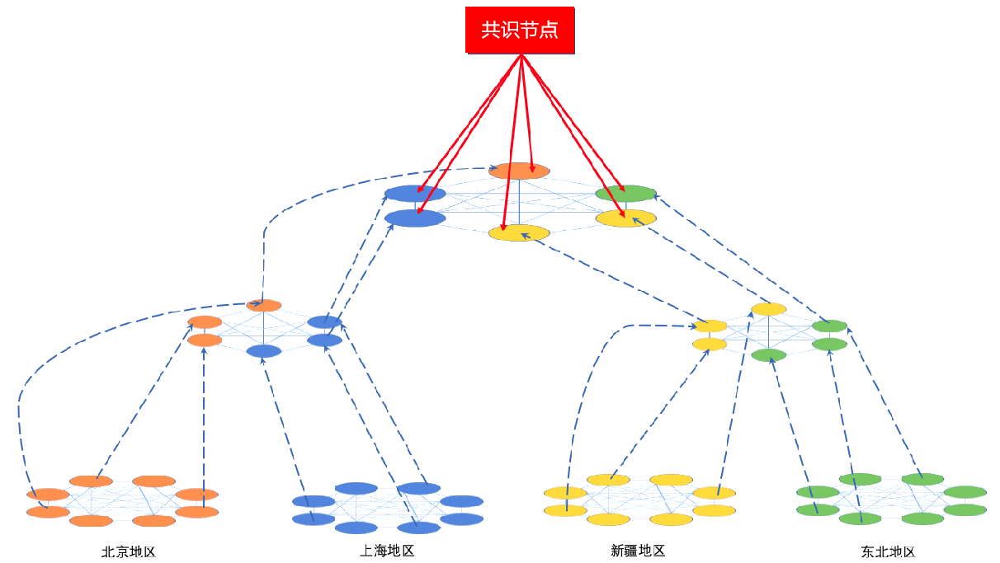
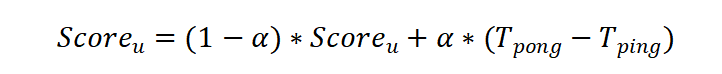
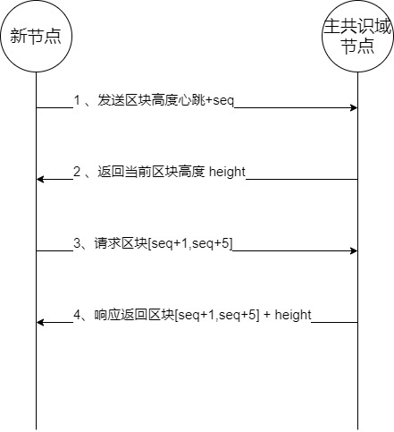

# 5.对等网络

从网络层的角度看，数据传输效率是影响区块链系统吞吐量的一个重要因素。区块链处理交易的能力在很大程度上取决于底层网络的可靠性，及其在对等节点之间传输数据数据的机制。在区块链系统中传输的主要数据类型包含交易和区块两大类。由于单个节点的上行带宽和下行带宽是有限的，如果交易占用过多资源，对于共识节点来说用于共识过程的带宽就会相对应的减少，而这会对系统共识算法的吞吐量造成很大的影响。

对于`Gossip`协议来说它提供了大约`90%`的冗余鲁棒性。但`hotstuff`共识算法，最多能容忍的作恶节点数量也仅仅不超过`33%`，换句话说`Gossip`协议提供的鲁棒性对于区块链系统过于强了，这导致了消息冗余度偏高。

另外，如果节点采用随机邻居选择机制来决定与哪些网络中的其他节点建立连接、交换数据。那么，这种方式可能会导致选择有通讯延迟较大或者其他因素不匹配自己的邻居节点，使得两个距离相对较远的对等节点频繁发生消息转换，导致数据传输延迟增加或者说数据传输过程的收敛需要很长的时间。

因此星火链提出了包含Virtual Ring-Tree在内的双层网络架构设计。网络层划分为两个部分：一部分是由共识节点之间组成的共识网络。为了提高共识的效率，这些节点之间采取的是全连接的拓扑结构；另一部分是服务节点组成的群体，这部分节点以Virtual Ring-Tree的拓扑结构进行组织。

Virtual Ring-Tree是一个自上而下建立、由节点分布式自发自下而上维护的多层全连接环结构。其中较低层次级的全连接环从自身选择多个节点作为代表，然后这些代表节点就会在更高层次递归地形成一个新的全连接环。最后，顶层只剩下一个全局全连接环，至此同一业务域下的所有节点都通过这些代表节点连接。然后最顶层的环，每个节点都和同一个共识节点建立连接。

## 5.1 节点的加入

如果当前服务域有新的节点想要加入，新节点需要先找到负责当前业务域的共识节点请求当前业务域顶层全连接环的节点信息，然后向当前处于最顶层全连接环的节点发送`ping`消息，然后新节点选择回复`ping`消息最快的代表节点发送加入请求，然后该代表节点，将自己下一层环的全部节点信息发送给该新节点，该新节点将递归的发送`ping`消息并选择选择响应最快的代表节点所在的子环加入，直至递归到最底层的全连接环，至此新加入的节点确定了自己所在的位置，然后与最底层的全连接环的每个节点建立连接，形成全连接环。

## 5.2 代表节点的选举

每个非顶层全连接环，都需要选举出来一定数量的代表节点，并形成更上一层的全连接环。全连接环代表节点的选举策略如下：

​	1）当前全连接环中的每一个节点都与环中的节点定期的发送`ping`消息，并根据其他节点回复`ping`消息的延迟，给每个节点通过加权平均的方式进行打分，例如对于节点v来说，它对其它节点u的分数评估计算方式如下：

​	其中 `α `是我们的加权值，根据已有实验结果，当`α = 3 `时，有着最好的评估效果。

​	2）假设，我们每个全连接环中要选举c个代表节点，那么每个节点就将自己的投票发送给在自己视角下Score最高的c个节点，并将自己的投票情况广播给同层全连接环中的其他节点，最后得票最高的c个的节点自动成为下一轮次的该全连接环的代表节点。

## 5.3 数据传输

通过上述的Virtual Ring-Tree结构，可以实现数据在**LogN**的时间内传播到全网，并且在传输过程中通过Virtual Ring-Tree中明确的数据流向实现无冗余的数据传输，极大的提高了数据传输过程中的效率、节省了带宽消耗。

​	由于每一层的全连接环都会选举出c个代表节点形成更高层的全连接环，而这c个代表节点从高层获得的数据是完全相同的，因此在实际的传输过程中采取“订阅”的策略，即选取`score`最高的代表节点作为自己的数据来源，其他的c-1个代表节点作为提供鲁棒性的冗余连接，只定期进行数据同步确认，保证异常或极端情况下数据仍然可以实现正常的传输。同时在日常和“订阅”代表节点的数据传输过程和其他代表节点的数据同步确认过程中动态更新节点的`score`，时刻选择`score`最高的代表节点作为“订阅”。这样一层层自底向上，实际上就形成了一个虚拟的动态树形结构与数据流向。

### 5.3.1 交易传输

交易传输的起点，显然是最底层的全连接环。交易传输的策略如下：

​	1）全连接环中的节点需要将交易发送给当前全连接层自己“订阅”的代表节点。

​	2）代表节点收到后，会将其广播给上一层的其他代表节点，来自其他下层全连接环的代表节点收到该笔交易后，立马进行交易的下发，发送给“订阅”自己的节点。

​	重复1）2）这个过程，自下而上直至将交易发送给超级节点。这个过程中数据的上行分发和下行分发是并行进行的，可以保证在正常情况下当前业务域下所有的交易都会比包含这些交易的区块更先传播到业务域中的每个节点。

​	在交易传输过程中，一笔交易从出发点到达共识节点进行共识的时间复杂度可以得到*LogN*的下限保证，并且由于“订阅”机制的存在，对于一笔交易每个节点也只会收到一次，并不会造成冗余传输。

### 5.3.2 区块传输

区块传输的起点是最顶层的共识节点。区块传输的策略如下：

​	1）共识节点将完成共识得到确认的新区块，发送给最顶层的全连接环中的代表节点。

​	2）每个代表节点，将收到的新区块发送给下层全连接环中“订阅”自己的节点。

​	重复步骤2），直至自上而下递归到最底层的全连接环，完成当前业务域内新区块的传输。

​	由于下层全连接环中的节点和上层全连接环中节点之间的订阅机制，等价于形成了一棵纵向的树形结构，而区块的传输即沿着这棵树形结构完成了自上而下的传输，保证了整个区块传输过程中**LogN**的下限保证，并且对于每一个区块每个节点也只会收到一次，并不会造成冗余传输。

### 5.3.3 区块同步

区块同步策略用于新节点加入主共识域或服务域时快速追赶区块高度，节点区块高度达到最新高度后，停止区块同步。

#### 5.3.3.1 主共识域同步策略

