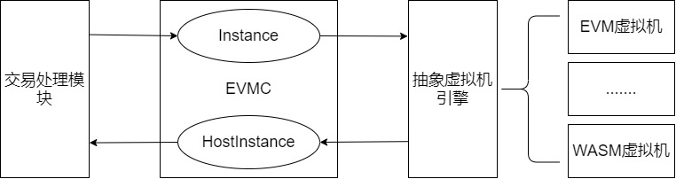

# 3.虚拟机

## 3.1 可插拔设计

在星火链中，基于以太坊`EMVC`技术，提供了虚拟机的可插拔接口，支持水平扩展虚拟机实现，并基于原生以太坊`EVM`虚拟机实现了星火EVM虚拟机。



`EVMC`主要定义了两种调用的接口：

- `Instance`接口：节点调用虚拟机引擎的接口；虚拟机引擎按照规则实现具体接口，标识具体虚拟机引擎信息，创建及销毁逻辑。

- `HostInterface`接口：虚拟机引擎回调节点的接口；虚拟机引擎在具体实现逻辑中需要调用节点接口时，直接调用`HostInterface`中提供的接口。

当存在具体实例化调用时，节点需要根据`HostInterface`逻辑实现并绑定到`EVMC`模块中。

虚拟机引擎本身不保存状态数据，节点通过instance接口操作引擎，引擎反过来，调`HostInterface`接口，对节点的状态进行操作。 

## 3.2 星火链EVM虚拟机

在星火链合约账户中，`Solidity`编译后生成的opCode指令码会存储到合约账户中，用于合约的执行。星火链平台支持的`solidity`语法基本与官方`solidity`基本一致，目前支持`0.4.26`版本。

### 3.2.1 地址兼容

为了实现地址兼容，星火链对`solidity`编译器以及`EVM`指令做了修改，使得虚拟机可以识别24字节长度的星火地址。

```properties
Function Evm2BifAddress(EvmAddress){
     addressBody = “”;
     addressPrefix = “did:bid:”
     prefix = Hex2Ascii(EvmAddress.substr(0,4))
     codeType = prefix.substr(1,1)
     if(BASE58) {
         addressBody = base58Encode(hex2Bin(EvmAddress.substr(4)))
     }
     return addressPrefix + prefix + addressBody;
}

Function BifAddress2Evm(BifAddress){
     evmAddress = “”;
     subAddress = BifAddress.substr(8);
     signType = subAddress.substr(0,1)
     encodeType = subAddress.substr(1,1)
     if(EDD25519)	evmAddress += hex(‘e’)
     Else(SM2)  	evmAddress += hex(‘z’)

     if(BASE58)	{
          evmAddress += hex(‘f’)
          evmAddress += base58Decode(subAddress.substr(2))
     }else {
    		暂未支持；
		   }
     return evmAddress;
}
```

### 3.2.2 指令兼容

星火链平台中，`solidity`不支持`STATICCALL`指令。

星火链平台中，`solidity`不支持`CALLCODE`指令。

星火链平台中，`solidity`不支持`SELFDESTRUCT`指令。

星火链平台中，合约账户无`codehash`，`solidity`不支持`EXTCODEHASH`指令。

星火链平台中，区块中未保存出块人信息，`solidity`不支持`COINBASE`指令。

星火链平台中，无难度值概念，`solidity`不支持`DIFFICULT`指令。

## 3.3 异常处理

当合约运行中出现未捕获的异常时，处理规定：

- 本次合约执行失败，合约中做的所有交易都不会生效。

- 触发本次合约的这笔交易为失败。

注：**合约中可以执行多个交易，只要有一个交易失败，就会抛出异常，导致整个交易失败**
