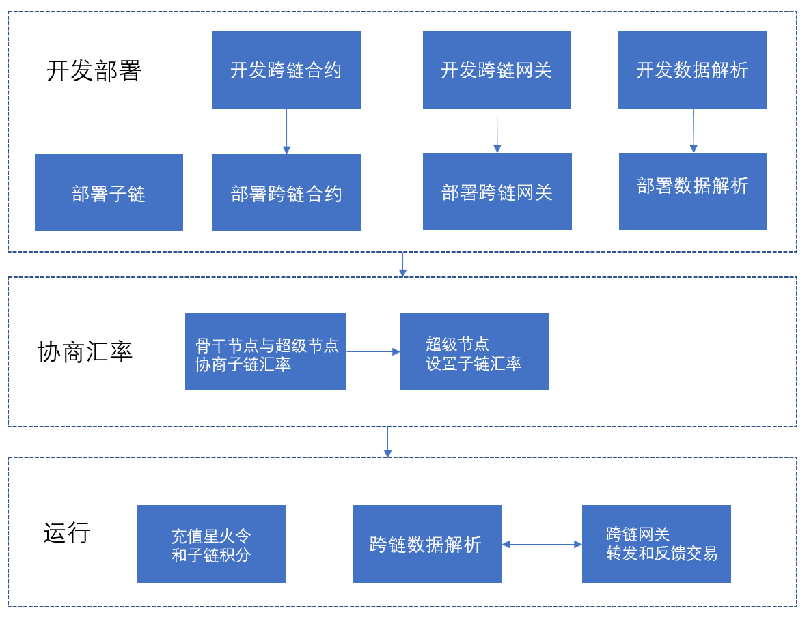
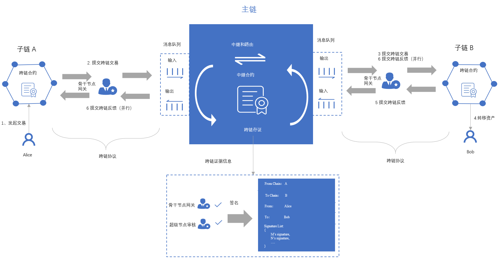
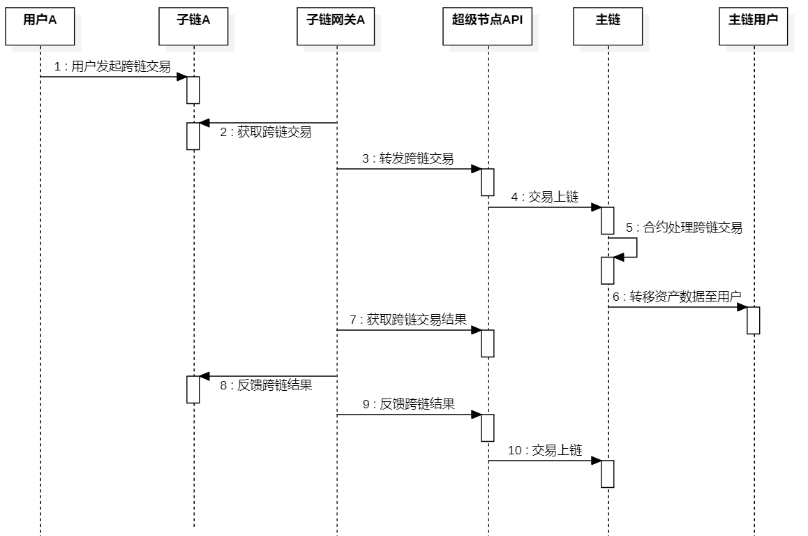
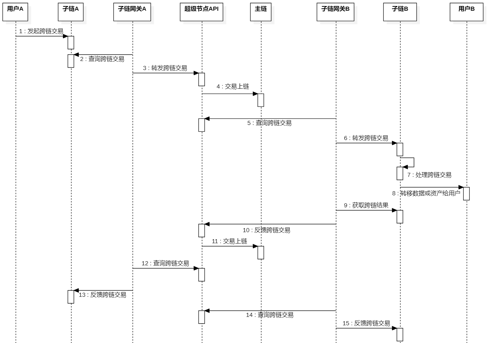

# 7.跨链

## 7.1 跨链互操作介绍

### 7.1.1 跨链接入流程说明

数据互联互通后，需要开发骨干节点与超级节点之间的跨链互操作功能，实现数据跨链、资产跨链和智能合约跨链互操作过程。骨干节点接入跨链的具体流程如下图所示：



流程说明：

1. 骨干节点部署一条子链，或使用已有的子链，该子链需要支持图灵完备智能合约功能（该跨链协议也支持中心化系统，需要骨干节点按照跨链协议实现对应的接口即可，这里仅以具有智能合约的区块链为例，来阐述骨干节点接入跨链流程）；
2. 骨干节点开发子链的跨链合约，该合约需要支持主链积分转移、子链积分转移、数据跨链、智能合约跨链互操作功能；
3. 骨干节点开发跨链数据解析功能，解析子链上与该跨链合约相关的所有跨链交易，解析后存储到数据库中，便于后续用户查询、数据展示、业务分析等；
4. 骨干节点在子链上部署跨链合约，初始化该子链的跨链合约数据，如子链的跨链网关账户地址、合约版本等；
5. 骨干节点开发跨链网关功能，其主链网关账户与上报子链账户一致，该网关程序主要有两大功能：一是将子链的跨链交易转发/反馈至主链跨链合约；二是将主链上与自己相关的跨链交易转发/反馈到当前子链跨链合约；
6. 骨干节点部署子链数据解析和跨链网关的程序；
7. 骨干节点与超级节点协商确定子链汇率，由超级节点设置子链积分汇率；
8. 骨干节点在主链上向网关账户充值一定额度的星火令；在子链上向网关账户充值一定额度的子链积分，用于积分转移或兑换使用；
9. 跨链网关程序调用超级节点跨链API，查询跨链操作，根据主链结果，转发/反馈跨链交易到子链；
10. 跨链网关程序根据子链跨链解析服务的结果，调用超级节点API接口，转发/反馈跨链交易到主链；

备注：

- 骨干节点如果有多个子链，需要在每个子链上部署跨链合约；
- 骨干节点如果有多个子链，可以部署一个或多个跨链网关程序，具体根据网关程序的实现来部署；
- 跨链网关程序通过超级节点API调用转发跨链交易、反馈跨链交易时，需要支付星火令手续费；
- 骨干节点的网关账户上，当主链星火令或者子链积分不足时，会导致跨链交易失败。需要由骨干节点在相应的链上，向网关账户充值，质押足够星火令或者子链积分，用于保证跨链交易顺利进行；

跨链网关服务要根据当前子链的共识特性来保证交易的确认性和合法性。如pow共识类型情况下，子链数据解析服务在解析跨链数据后，需要保证在N个块确认，才认定当前交易为合法交易；在pbft情况下，只需确认1个区块即可。

### 7.1.2 跨链内容规范

该跨链协议基于主子链群架构设计，解决链群之间的资产信息互联互通问题。该链群架构由一个国家主链和多个行业/区域子链组成，这种架构可以让各个行业业务更加高效地运行在各自的子链上，这些业务相互独立且不会受到彼此影响。在该主子链群架构中，需要被跨链传递的内容包含如下：

（1）主链积分转移

主链的积分由主链共识及其激励机制产生。激励机制是指对参与区块链共同治理节点的奖励机制，一个有效的激励模型能够提高用户参与度的积极性，从而保证了区块链系统的活跃性；因为区块链关系到所有参与者的利益，因此能够促使参与者共同维护区块链系统，防止黑客攻击，使区块链系统运行的稳定性、安全性和高效性，从而建立一个功能更加完善的区块链生态系统。

主链的星火积分可以转在主子链群中做任意转移，主链可以转移到子链的任一账户地址中，子链的星火积分仍然可以在子链中转移给子链的其他用户，从而达到主链积分在全网中流通及使用。

（2）子链积分兑换

子链积分由子链共识及其激励机制产生。每个子链的生态中，子链积分对生态的影响有着关键性因素。在实际的生产和商业活动中，子链积分也有着跨域使用的需求。因此需要对子链积分跨链流通和使用进行支持。

子链积分兑换成主链积分后才能进行转移。在源链中，用户需要先找骨干节点按照汇率先兑换成对应的主链积分，转移到对端链中，由骨干节点按照目标链积分的汇率进行兑换。

（3）合约互操作

用户调用合约，可以传递参数。

（4）数据传递

源链传递到对端的BID合约，以BID DOC方式存储。

## 7.2 跨链原理

如下图所示，本方案提出了中继链（主链）+平行链（子链）跨链模式，用于实现不同业务场景的跨链功能，这种模式可以保证跨链的安全性和扩展性。

本方案架构的模块包含如下内容：包括中继链（主链）、平行链（子链）、跨链网关（骨干节点网关）。中继链即现有的国家主链，国家超级节点负责维护区块链安全稳定的运行，其高效的共识算法，保证跨链的效率，满足平行链跨链对性能的不同要求。平行链是所有参与接入跨链生态的同构/异构区块链，可以是各种公链、联盟链、私链等。跨链网关是中继链和平行链的适配网关，实现平行链/中继链互联互通跨链通信，一般由骨干节点承担网关功能。

        

以子链A上的用户Alice向子链B上的用户Bob转移跨链资产为例，其流程如下：

1) 用户Alice向子链A跨链合约发起一笔跨链交易；

2) 子链A的骨干节点网关监听到跨链交易，经过验证后跨链信息，提交跨链交易到中继链中；

3) 子链B的骨干节点网监听到跨链交易，并进行校验成功后，提交跨链交易到子链B中；

4) 子链B中，跨链提案共识成功后，转移资产给用户Bob；

5) 子链B的骨干节点网关监听到跨链交易成功后，向中继链提交跨链交易反馈，标示跨链反馈交易成功；

6) 子链A和子链B的骨干节点网关监听到中继链跨链交易反馈成功后，分别向子链A和子链B提交跨链交易反馈，标示跨链反馈交易成功；

7) 至此，跨链结束；

主子链架构中，骨干节点在主链和子链上，负责申请创建/加入子链，当其申请的子链由超级节点审批成功后，骨干节点参与子链共识即成为子链的共识节点，并可以承担跨链网关角色。

（1）骨干节点（骨干节点网关）

骨干节点在自己的子链上部署跨链服务，基于跨链CCP协议实现跨链网关，与主链通讯交互，并通过主链作为中继链，与其他任意子链进行跨链操作。

（2）超时机制

基于主子链的架构中，存在多条子链，主链与每个子链，以及子链之间的时间无法保证一致性。因此会带来超时异常的问题，很难保证每个链的超时时间保持一致，为此本方案提出了基于主链的统一超时机制。任意用户在任意链上发起的交易，最终以主链的时间为基准。当主链认定某个跨链交易超时，则骨干节点会同步该消息至各个子链，从而达到不同域范围内的子链时间的一致性，进而保证跨链事务的一致性。

时间锁（Time Locked Contract，TLC) 让多个用户之间能在多条区块链之间进行资产支付。时间锁可以组成多跳支付 (即双方在交易过程中可借助多个中间节点来完成交易）和原子交换（Atomic Swap），是链下支付通道和跨链交易的基础。 时间锁指交易双方约定在某个时间内提交才有效，超时则承诺方案失效（无论是提出方或接受方）。

（3）SEND和ACK机制

SEND和ACK机制是任意一条发送的跨链消息，在发出后经过目标链处理完成后，必须确认给源链，源链收到确认消息后才将此跨链消息进行确认操作（如锁定、解锁、转移资产）。 ACK消息包含三种类型：

-   成功

目标链处理完成后，骨干节点监听后，向源链发送ACK SUCEESD消息。

-   失败

目标链处理异常，如交易失败，骨干节点监听后，向源链发送ACK FAILED消息。

-   超时

目标链一直没有相应，骨干节点会先查询主链是否为超时状态，如果为超时，则会向源链发送ACK TIMEOUT消息。

## 7.3 跨链通讯协议定义

| **参数**       | **数据类型** | **描述**                                                     |
| -------------- | ------------ | ------------------------------------------------------------ |
| srcAC          | String       | 源链的AC码                                                   |
| destAC         | String       | 目标链的AC码                                                 |
| crossTxNo      | String       | 跨链编号。"A:B:XXXXXXXX"，A为源AC码，B为目标AC码，XXXX为随机编码 |
| srcAddress     | String       | 源地址                                                       |
| destAddress    | String       | 目标地址                                                     |
| txType         | String       | 交易类型，详情见以下定义                                     |
| payload        | Object       | 根据交易类型定义对应的扩展信息，详情见以下定义               |
| remark         | String       | 用户备注信息                                                 |
| txList         | Array        | 跨链交易数组                                                 |
| txList[i].hash | String       | 跨链交易hash                                                 |
| status         | String       | 跨链交易的状态。"0":初始化，"1":已确认成功, "2":已确认失败, "3":已超时，"4":已退款 |
| result         | String       | 跨链结果。0正在进行，1是已完成                               |
| extension      | Object       | 扩展消息。用户自定义消息                                     |
| version        | String       | 协议版本号.如果版本号不兼容，则跨链交易失败                  |

## 7.4 跨链交易类型及结构体定义

### 7.4.1 主链积分转移（payloadType="0"）

| 变量           | 类型   | 描述         |
| -------------- | ------ | ------------ |
| payload        | Object | 主链积分信息 |
| payload.amount | String | 积分数量     |

### 7.4.2 子链积分兑换（payloadType="1"）

场景使用：

-   子链积分兑换成主链星火令
-   子链积分兑换成其他子链积分
-   主链星火令兑换成子链积分

骨干节点的跨链网关需要承担兑换子链积分和转移主链积分的功能。

参数说明：

| 变量                  | 类型   | 描述             |
| --------------------- | ------ | ---------------- |
| payload               | Object | 源链积分信息     |
| payload.masterAmount  | String | 主链积分数量     |
| payload.srcAmount     | String | 源链积分数量     |
| payload.srcTokenRate  | String | 源链积分的汇率   |
| payload.destAmount    | String | 目标链积分数量   |
| payload.destTokenRate | String | 目标链积分的汇率 |

| **变量**              | **类型** | **描述**                       |
| --------------------- | -------- | ------------------------------ |
| payload               | Object   | 源链积分信息                   |
| payload.masterAmount  | String   | 主链星火令数量                 |
| payload.srcAmount     | String   | 源链积分数量                   |
| payload.srcTokenRate  | String   | 源链积分的汇率（从主链获取）   |
| payload.destAmount    | String   | 目标链积分数量                 |
| payload.destTokenRate | String   | 目标链积分的汇率（从主链获取） |

兑换汇率换算方式如下：

`masterAmount = srcAmount/srcTokenRate`;  主链积分=源链积分/源链汇率

`masterAmount = destAmount/destTokenRate`;  主链积分=目标链积分/目标链汇率

`srcAmount/srcTokenRate = destAmount/destTokenRate`;  源链积分/源链汇率 = 目标链积分/目标链汇率

### 7.4.3 合约互操作（payloadType="2"）

| 变量                        | 类型                | 描述                                                         |
| --------------------------- | ------------------- | ------------------------------------------------------------ |
| payload                     | Object              | 自定义消息                                                   |
| payload.contractMethod      | String              | 目标合约方法                                                 |
| payload.contractInput       | Array               | 合约参数。用户自定义                                         |
| payload.contractInput[0]    | Object/String/Array | 自定义参数一                                                 |
| payload.contractInput[n]    | Object/String/Array | 自定义参数N                                                  |
| payload.token               | Object              | 可以为空，源链积分信息当涉及到需要支付资产时候，可以使用子链积分兑换的协议进行扩展 |
| payload.token.masterAmount  | String              | 主链积分数量                                                 |
| payload.token.srcAmount     | String              | 源链积分数量                                                 |
| payload.token.srcTokenRate  | String              | 源链积分的汇率                                               |
| payload.token.destAmount    | String              | 目标链积分数量                                               |
| payload.token.destTokenRate | String              | 目标链积分的汇率                                             |

### 7.4.4 数据传递（payloadType="3"）

源链用户发起，传递到目标链，最终以BID DOC方式存储

| 变量         | 类型   | 描述                                                    |
| ------------ | ------ | ------------------------------------------------------- |
| payload      | Object | 数据对象                                                |
| payload.data | String | BID 协议数据的json字符串形式，参考《BID协议》元数据章节 |

参考示例如下为json对象，需要转换成json字符串传输

```json
{
	"document":{
        //BID协议字段
        "extension": {
            "attributes": [{
                "encrypt": 0,
                "format": "text",
                "value": "",
                "key": "name",
                "desc": "名称"
            }],
            "recovery": ["did:bid:efDGF1rKehMRM62vqxLS4aqrcFxmF2sQ#key-3"],
            "type": 101,
            "ttl": 86400
        },
        "created": "2021-09-15T09:09:58Z",
        "id": "did:bid:efDGF1rKehMRM62vqxLS4aqrcFxmF2sQ",
        "publicKey": [{
            "controller": "did:bid:efDGF1rKehMRM62vqxLS4aqrcFxmF2sQ",
            "publicKeyHex": "b06566fb27d38700b02f300b47427842e602e90c5768b553cfd6538af1681c6dbc5e38",
            "id": "did:bid:efDGF1rKehMRM62vqxLS4aqrcFxmF2sQ#key-1",
            "type": "Ed25519"
        }],
        "@context": ["https://w3.org/ns/did/v1"],
        "updated": "2021-09-15T09:09:58Z",
        "version": "1.0.0",
        "authentication": ["did:bid:efDGF1rKehMRM62vqxLS4aqrcFxmF2sQ#key-3"]
   }
}
```

## 7.5 开发子链跨链合约

骨干节点如果是一条链的情况下，需要开发和部署子链跨链合约，接口包含如下：

### 7.5.1 发起跨链交易

功能：

用户发起跨链交易（类型为主链积分、子链积分、合约资产、数据传递），目标链为主链或者其他子链。

以下为伪代码接口和及参数：

```json
{

"method": "startTx",

"params":{

    "srcAddress": "",

    "destAddress": "",

    "destAC": "",

    "txType": "",

    "payload":{

   },

    "remark": "",

    "extension": {},

    "version": ""

 }

}
```

请求参数说明：

| **变量**    | **类型** | **描述**                                                     |
| ----------- | -------- | ------------------------------------------------------------ |
| srcAddress  | String   | 源地址                                                       |
| destAddress | String   | 目标地址                                                     |
| destAC      | String   | 目标链的AC码                                                 |
| txType      | String   | 交易类型。参照跨链数据格式定义                               |
| payload     | Object   | 根据交易类型定义对应的扩展信息。参照跨链数据格式定义         |
| extension   | Object   | 用户扩展信息                                                 |
| remark      | String   | 备注信息                                                     |
| version     | String   | 版本信息，由原始用户发起交易携带，填写源链跨链合约的版本信息 |

### 7.5.2 转发跨链交易

功能：

骨干节点通过超级节点API，监听到主链或者其他子链上有与自己相关的首次交易，需要构建转发跨链交易，触发当前子链的跨链合约。

以下为伪代码接口和及参数：

```json
{

"method": "sendTx",

"params":{

     "srcAddress": "",

     "destAddress": "",

     "srcAC": "",

     "destAC": "",

     "txType": "",

     "payload":{},

     "remark": "",

     "extension": {},

     "version": ""

  }

 }
```

请求参数说明：

| **变量**    | **类型** | **描述**                                                     |
| ----------- | -------- | ------------------------------------------------------------ |
| srcAddress  | String   | 源地址                                                       |
| destAddress | String   | 目标地址                                                     |
| srcAC       | String   | 源链的AC码                                                   |
| destAC      | String   | 目标链的AC码                                                 |
| txType      | String   | 交易类型。参照跨链数据格式定义                               |
| payload     | Object   | 根据交易类型定义对应的扩展信息。参照跨链数据格式定义         |
| extension   | Object   | 用户扩展信息                                                 |
| version     | String   | 版本信息，由原始用户发起交易携带，填写源链跨链合约的版本信息 |
| remark      | String   | 备注信息                                                     |

（3）反馈跨链交易

功能：

骨干节点通过超级节点API，监听与当前子链相关的跨链交易，如果主链上的跨链交易的状态发生变化时，需要构建子链上的跨链确认交易，触发子链跨链合约。以下为伪代码接口和及参数：

```json
{

"method": "sendAcked",

"params":{

     "crossTxNo": "",

      "result": "",

     "extension": {},

     "version": ""

  }

 }
```

请求参数说明：

| **变量**  | **类型** | **描述**                                                     |
| --------- | -------- | ------------------------------------------------------------ |
| crossTxNo | String   | 跨链交易编号                                                 |
| result    | String   | 跨链交易结果。"0"成功，"1"失败，"2":"超时"                   |
| extension | Object   | 用户扩展信息                                                 |
| version   | String   | 版本信息，由原始用户发起交易携带，填写源链跨链合约的版本信息 |

（4）提取失败的跨链资产

功能：

用户在发起跨链交易异常（失败或者超时）后，可以主动取出资产。

以下为伪代码接口和及参数：

```json
{

"method": "takeOut",

"params":{

     "crossTxNo": "",

     "toBid": "",

     "payload": {}

  }

 }
```

请求参数说明：

| **变量**                 | **类型**            | **描述**                                            |
| ------------------------ | ------------------- | --------------------------------------------------- |
| crossTxNo                | String              | 跨链交易编号                                        |
| toBid                    | String              | 取出跨链资产后要转移的目标地址。                    |
| payload                  | Object/Array/String | 可以为空。如果toBid是合约的话，需要自定义合约的参数 |
| payload.contractMethod   | String              | 目标合约方法                                        |
| payload.contractInput    | Array               | 合约参数。用户自定义                                |
| payload.contractInput[0] | Object/String/Array | 合约参数自定义参数一                                |
| payload.contractInput[n] | Object/String/Array | 自定义参数N                                         |

## 7.6 开发跨链网关服务

跨链网关具备转移跨链交易的功能。其同时监听主和子链跨链交易，当检测到跨链交易事件后，根据业务类型，构建对端链相应的交易，并上链。

（1）监听主链跨链交易

跨链网关通过超级节点API接口，监听和读取与当前子链相关的跨链交易。

（2）转发/反馈跨链交易到子链跨链合约

跨链网关监听与当前子链相关的跨链交易后，根据跨链状态定义，向子链跨链合约发起转发/返回跨链交易。

（3）监听子链跨链交易

跨链网关查询子链的跨链交易数据。

（4）转发/反馈跨链交易到主链跨链合约

跨链网关监听子链上跨链交易后，根据跨链状态定义，向主链跨链合约发起转发/返回跨链交易。

## 7.7 跨链数据流时序图

跨链的数据流向分为三种场景，一是主链到子链方向的跨链；二是子链到主链方向的跨链；三是子链到其他子链的跨链。无论是积分转移、兑换、合约互操作、数据转移任何一种类型的跨链，都会在这三种场景下，进行数据流向。我们将抽象成统一类型的数据流，来阐述跨链过程。

### 7.7.1 主链到子链的跨链        

      

1. 主链用户通过超级节点API，发起跨链交易，源链为主链，目标链是子链A，目标用户为子链A下的用户A；
2. 超级节点API接收到跨链交易后，将交易转发到主链；
3. 子链网关A查询到与自己相关的跨链交易；
4. 构建跨链交易，发送到子链A的跨链合约上；
5. 子链A的跨链合约处理跨链交易；
6. 子链A的跨链合约，判断如果有资产或者数据，将会把资产转移给用户；
7. 子链网关A获取子链A的跨链结果；
8. 子链网关根据交易结果，构建一笔跨链交易（结果为成功或者失败），通过超级节点API反馈给主链；
9. 超级节点API将交易转发到主链；
10. 子链网关A查询到主链上跨链反馈结果；
11. 子链网关A构建反馈的跨链交易，发送到子链A上；

1. 子链到主链的跨链；

      

1. 子链用户A发起跨链交易，源链为子链A，目标链是主链，目标用户为主链下的用户；
2. 子链网关A获取跨链交易；
3. 子链网关A根据跨链交易，通过超级节点API，构建一笔主链的跨链交易，并通过超级节点API转发跨链交易；
4. 超级节点API转发交易到主链，交易上链；
5. 主链跨链合约处理跨链交易；
6. 如果涉及到资产、数据，将会转移给目标用户；
7. 子链网关A通过超级节点API获取跨链执行结果；
8. 子链网关A根据结果，构建子链A上的反馈跨链交易（成功或者失败）；
9. 子链网关A根据结果，构建主链的反馈跨链交易（成功或者失败），并通过超级节点API发送到主链；
10. 超级节点API将交易上链；


### 7.7.2 子链到其他子链的跨链

        

1. 子链用户A发起跨链交易，源链为子链A，目标链是子链B，目标用户为子链B下的用户B；
2. 子链网关A，在主链A上查询到跨链交易；
3. 子链网关A根据跨链交易，通过超级节点API，构建一笔主链的跨链交易，并通过超级节点API转发跨链交易；
4. 超级节点API转发交易到主链，交易上链；
5. 子链网关B获取与自己子链B相关的跨链交易；
6. 子链网关B构建一笔跨链交易，转发到子链B的跨链合约；
7. 子链跨链合约处理跨链交易；
8. 如果涉及到资产、数据，将会转移给目标用户；
9. 子链网关B获取子链B上的跨链交易结果；
10. 子链网关B根据结果，构建主链的反馈跨链交易（成功或者失败），并通过超级节点API发送到主链；
11. 超级节点API会将交易上链，触发主链合约；
12. 子链网关A通过超级节点API获取跨链执行结果；
13. 子链网关A根据结果，构建子链A上的反馈跨链交易（成功或者失败）；
14. 子链网关B通过超级节点API获取跨链执行结果；
15. 子链网关B根据结果，构建子链B上的反馈跨链交易（成功或者失败）；

## 7.8 [通用查询操作](https://bif-open-api-doc.readthedocs.io/zh_CN/latest/docs/API%E6%8E%A5%E5%8F%A3/8-%E8%B7%A8%E9%93%BE%E6%9C%8D%E5%8A%A1%E6%8E%A5%E5%85%A5.html#id2)


## 7.9 [用户发起跨链交易](https://bif-open-api-doc.readthedocs.io/zh_CN/latest/docs/API%E6%8E%A5%E5%8F%A3/8-%E8%B7%A8%E9%93%BE%E6%9C%8D%E5%8A%A1%E6%8E%A5%E5%85%A5.html#id8)

## 7.10 [骨干节点的跨链网关操作](https://bif-open-api-doc.readthedocs.io/zh_CN/latest/docs/API%E6%8E%A5%E5%8F%A3/8-%E8%B7%A8%E9%93%BE%E6%9C%8D%E5%8A%A1%E6%8E%A5%E5%85%A5.html#id19)

## 7.11 [跨链交易类型及结构体定义](https://bif-open-api-doc.readthedocs.io/zh_CN/latest/docs/API%E6%8E%A5%E5%8F%A3/8-%E8%B7%A8%E9%93%BE%E6%9C%8D%E5%8A%A1%E6%8E%A5%E5%85%A5.html#id35)
