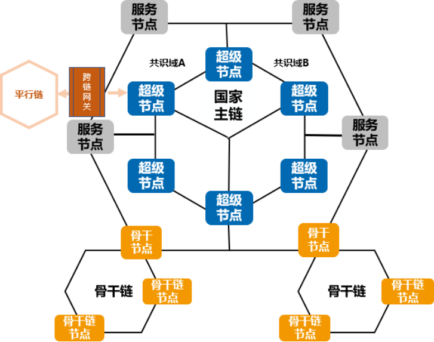
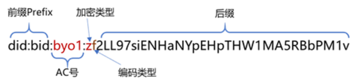

# 星火·链网介绍

## 背景
“星火·链网”是在工信部的领导与专项支持下，由中国信通院牵头、联合北航、北邮、中国联通等多家大型企事业单位建设的国家区块链新型融合基础设施体系，是为持续推进产业数字化转型，推动数字资产价值化，利用区块链自主创新能力而谋划布局的数字经济“新型基础设施”。其以代表产业数字化转型的工业互联网为主要应用场景，以网络标识这一数字化关键资源为突破口，推动区块链的应用发展，实现新基建的引擎作用。 “星火·链网”建设策略及治理模式开放，定位于面向全球服务的国家级区块链新型基础设施，2020年8月正式启动部署。2021年8月3日，中国信通院正式发布了“星火·链网”底层核心技术-BIF-Core，标志着“星火·链网”主链正式启动运行，并开始向全球进行服务。

## 星火主链简介
星火主链是由信通院牵头，联合多家单位共同打造的许可公有链，定位于面向全球服务的国家级区块链新型基础设施，为业务用户、DApp开发者、节点运营方等多种角色提供的开放、稳定、安全、易用、高性能区块链网络，共同促进产业生态发展。 “星火·链网”采用开放的建设模式，通过星火主链向接入的区块链网络提供标识基础服务进而提供跨区块链、跨区域、跨行业的互通能力，构建新时代下智能可信的价值互联网。通过双层体系架构设计及分片技术，实现区块链的性能与规模化场景的有效平衡，促进区块链的应用成效。 星火主链实现的许可公有链技术，支持同构/异构区块链接入，内置的标识管理能力通过超级节点向接入“星火·链网”的骨干节点和子链提供标识基础服务，进而提供跨链互通的基础。星火主链中包含超级节点、服务节点、骨干节点：

**超级节点**

1. 定位：超级节点是星火主链的构成主体，建设主体一般为地方政府，拥有星火主链全量数据，负责执行星火主链的共识计算，确保星火主链的正常运行，并运营和维护星火主链上的公共数据、标识资源、标识解等基础服务，充分发挥超级节点新型基础设施的引擎作用。
    
2. 业务：管理骨干节点接入，同时建设数字身份（基于智能标识BID）、多标识融合管理、可信存证、隐私计算、运行监测等基础服务能力，为保障链群高效运行和整个链群生态的稳定健康发展保驾护航。
    
**服务节点**

1. 定位：服务节点作为主链的非共识节点，建设主体一般为行业机构，如银行、公证处等，可验证交易，但不参与链上共识，可基于主链账本，面向骨干节点提供行业公共服务。

2. 业务：作为主链的服务提供方，服务节点为主链注入服务资源，增强主链的公共服务能力，如法院可为主链存证服务提供背书，银行可通过跨链验证骨干链上产生的供应链金融凭证为企业提供金融服务等，是主链应用形成业务共识的核心。

**骨干节点**

1. 定位：星火主链与面向特定行业或特定区域的子链，主要通过骨干节点执行跨链互操作等交互功能，从而实现星火·链网链链协同和链链互联。骨干节点作为主链的非共识节点，可验证交易，同步主链账本内相关数据，是骨干链、子链与主链间的跨链网关，负责管理子链的接入，可基于骨干链提供具体的区块链行业应用。

2. 业务：管理业务子链接入；对接主链数字身份、标识等资源供子链应用使用；提供行业、区域内的如司法存证、供应链溯源等具体应用。

**共识域**

1. 定位：服务节点基于主链开展具体的应用服务，超级节点与服务节点组成共识域，超级节点负责共识计算，域内服务节点负责达成业务共识，面向骨干节点提供服务。

2. 业务：服务节点可以按照不同业务需求与超级节点组成不同的共识域，共识域内可设置不同业务共识策略，让不同的组织参与背书增信，让多方协作共治。     

## 星火主链服务特性

**绿色低碳**

星火主链作为国家级区块链基础设施，链上业务由超级节点基于高效的共识算法，保证可靠安全的出块，从而充分发挥超级节点新型基础设施的引擎作用，让更多的参与方能“绿色低碳”的使用星火主链服务。

**多方治理**

星火主链超级节点在共识域管理、节点管理、账本读写等方面提供了灵活的治理规则，可根据业务需求进行设置。服务节点可根据业务需求与超级节点设置不同共识域，让更多服务节点参与业务共识，让多方协作共治；用户按周期可对超级节点进行投票，选举产生执行共识计算的超级节点，保障星火主链共识计算的高效与稳定。

**智能标识**

星火主链底层地址应用星火标识（BID），BID是基于W3C DID标准开发的新型分布式标识，任意实体可自主生成星火标识，不需要中心化注册机构就可以实现全球唯一性，具有分布式、自主管理、隐私保护和安全易用等特点，同时根据算法的不同，BID支持39-57位变长编码方式，有效适应各种业务场景，兼容各类设备。 

**内生安全**

BID结合星火主链可以提供一套安全强大、简单易用、符合SSI规范的分布式身份服务，星火主链通过BID，基于SSI自主身份，能够分布式地产生和验证全局唯一的BID来标识各种实体（人、机构、物体等），为实体之间跨机构、跨地域的可信数字身份、数字凭证与数据交换提供基础设施，助力企业解决数字化过程中的数据孤岛难题，促进异构、异主、异地数据的共享使用，解决跨链安全可信连接和互操作，打造万物互联的智能世界。

**可信跨链**

星火主链通过骨干节点实现对同构、异构链接入的支持。星火主链可信跨链服务通过提供通用标准化组件和跨链通信协议，具备高通用性和易扩展性，基于跨链身份管理协议及组件实现不同子链之间的业务协作支撑，结合超级节点的节点管理能力实现高安全高可信的跨链协同治理，从而支持星火·链网内各子链在不同业务场景下的可信跨链过程。   

## 星火主链技术优势
**高效混合共识机制** 星火共识算法主要分为选举主链共识节点的委托权益证明算法（DPoS）共识算法和选举出块节点的星火拜占庭共识算法（Star-BFT）两部分：首先，用户通过委托权益证明共识算法，投票产生出主链共识节点集合。然后，由被选出来的节点通过Star-BFT共识算法产生区块。Star-BFT算法基于区块链和商业应用需求，结合可验证随机函数（VRF）、实用拜占庭（PBFT）等算法进行创新优化，是一种不会产生链分叉且强一致性的算法，实现了用户交易秒级时间确认。 **主子链群结构** 星火主链支持同构/异构链接入，从而实现星火·链网“1+N”主子链群结构，兼顾主链规范管理和多子链个性化应用场景，实现同构/异构链跨链共享与交互、隐私保护和运行效率提升。 **高性能交易** “星火·链网”支持并发交易。基于有向无环图（DAG）数据结构改进的高效并发技术，通过在交易池构建交易DAG的方式，智能识别无关联交易并构建在DAG的同一层级，利用计算机多核机制并发执行交易,在保证数据安全的基础上提高交易的处理速度，降低交易全流程的处理时间。 **可插拔设计** l 可插拔的共识机制，支持按照业务需求和技术趋势，配置不同的共识算法，保持星火主链共识机制对业务的良好适配性和技术先进性。 l 可插拔的智能合约引擎，提供了一套新的可插拔的区块链智能合约底层引擎，通过可插拔引擎适配器，基于隔离的容器环境，可以支持运行各种主流编程语言开发的智能合约，可以动态适配的支持JSVM引擎、EVM引擎、WASM引擎，可以执行JavaScript、Solidity、C/C++、Go等多种语言。 l 可插拔的数据库存储，账本可以支持灵活配置，支持使用多种数据库作为状态数据缓存。 **安全隐私** 星火主链在隐私保护层面，具有灵活可选的多种方式，链底层支持共识域账本隔离、数据加密、隐私交易、私有交易、零知识证明等，同时搭配可信执行环境（TEE）和多方安全计算（MPC）等技术手段，可实现数据可用不可见。星火主链还支持基于星火安全芯片BS1的身份管理以及国密算法，提高链安全性。 **易用合约** 星火主链提供给用户一体化的智能合约集成开发调试环境，支持不同语言开发的智能合约，让用户更便捷的快速构建基于智能合约的业务共识，不仅具备基本的IDE功能，还专门提供了智能合约安全检查服务，同时星火主链同时支持多种智能合约语言（包括JavaScript/Solidity/C/C++/Go）及合约引擎（包括JSVM/EVM/WASM等），通过执行环境为智能合约执行引擎提供统一的数据访问接口等能力，提供全生命周期管理服务。另外星火主链还提供了多样化的合约模板，让开发者仅填写少量参数即可快速构建安全可靠的智能合约，在执行性能、安全性、多语言支持、开发友好、应用扩展等方面提供更好的支持。 

## 星火·链网典型应用
**(1) 可信标识管理服务** 基于“星火·链网”底层内生的可信标识BID技术对外提供可信标识服务。BID标识基于区块链技术实现标识自注册和自管理，具有永久性、全球可解析、身份可验证和分散性等特点。“星火·链网”对外提供标识注册、标识解析以、标识数据共享及数字资产价值化等服务，履行标识管理义务，真正保证全球唯一、互通互认和天然可信，助力企业解决数字化过程中的数据孤岛难题，促进异构、异主、异地数据的共享使用，解决跨链安全可信连接和互操作，打造万物互联的智能世界。 **（2）产融平台** 基于星火·链网构建的机构间信任基础与数据治理框架，打通信息孤岛，连接业务断点，提供产融链条完整业务视图，实现企业间联动，减少业务重复审核，提升协作效率，帮助资金方以更低的成本完成风控，解决中小企业融资难的问题，丰富星火主链网服务实体经济的能力。 **（3）授权通信** 基于星火·链网从用户授权开始，对授权信息进行上链存证，为用户提供授权可追溯，保障了用户权益，避免非法骚扰；为企业减少客户投诉数量，规避投诉法律风险，提高企业信誉和形象；为监管部门提供授权通信监管手段，提高政府信用。 **（4）可信账单服务平台** 基于星火·链网为产业上下游统一对账数据来源，基于链上数据实现各方统一视图对账结算，为各方节省多头对账的人力成本，缩短应收账期；有效增强账单可信度，解决银行信任难题，盘活资金流，促进企业健康经营。 **（5）链上签** 链上签提供便捷的链上协议签约、证书签发服务。适用于各种自定义合作协议、MOU签署，以及现场签约仪式、骨干节点接入证明颁发等。同时，链上签支持签约文件持有者进行链上查验，支持所有用户链上通过BID对上链的签约文件进行查询。通过链上签，将传统的签约模式转移到区块链上实现，利用区块链多方记账、难以篡改等特性，对链上签约文件进行存证，并记录上链过程，便于随时随地查验、查询。 **（6）数字身份平台** 星火数字身份平台计划要实现基于星火·链网主链构建分布式数字身份网络，为用户的身份交互提供安全可信、自主掌控的数字身份。智能标识平台将星火·可信认证的SSI凭证规范化，使用户在使用主链、子链业务时一证通行，避免重复的KYC，将用户在星火·链网主链的BID身份拓展到全网区块链应用当中。    
