# 数字身份服务

## 产品概述

星火数字身份服务`ID3Entry`是基于星火·链网构建的分布式数字身份服务，将用户身份标识与星火·链网主链账户地址进行融合，提供数字身份一站式全流程管理，帮助用户更方便地通过星火数字身份服务进行证书颁发、管理及验证。从而不再依赖于传统的IDP，而是通过自主管理和表达其身份信息，开启BID即身份的Web世界。

## 产品组成

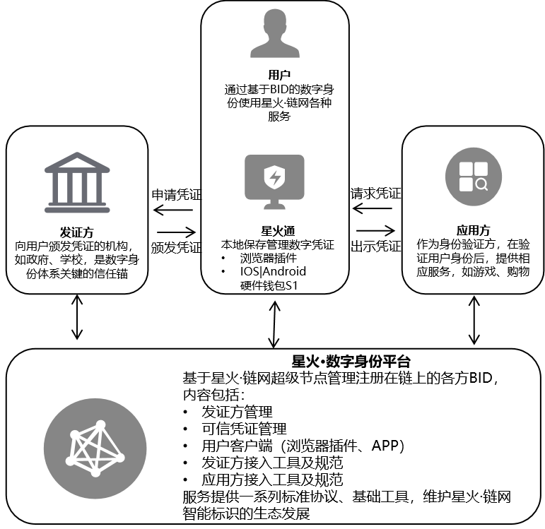

- **用户数字身份管理**

  提供基于星火统一身份协议开发的星火通客户端（`IOS`/`Android`/`浏览器插件`），为用户提供身份的创建、更新及验证功能。

- **发证方凭证管理**
  
  支持数字凭证颁发方入驻、数字凭证数据模板创建及数字凭证的颁发、验证和注销。
  
- **应用方数字凭证验证**
  
  基于星火数字身份协议为应用方提供易用的SDK结合星火通客户端浏览器插件进行身份确权交互  来完成数字凭证的验证。

## 产品特点

- **身份标识BID自生成、自管理**

  基于分布式标识DID规范实现的星火标识BID，颠覆了中心化的标识注册模式。基于密码学算法，用户可以自生成唯一的BID，作为其身份标识和其在星火主链使用的账户地址，通过自生成的私钥赋予用户链上自主管理身份标识和身份信息的能力。

- **凭证分布式注册、验证**

  发证方可注册机构信息及凭证模板信息至星火主链可信发证方合约，基于BID可信证书协议为用户实体颁发各类凭证；验证方可基于星火主链验证用户实体对BID身份标识的控制权，并进一步验证发证方身份及主体凭证数据的真实性、完整性。

- **身份跨链操作性**

  按照星火RFC规范，提供了标准化身份协议和接口，基于主链身份，实现了星火主子链架构下，各子链区块链应用身份的统一，增强主子链数据互联互通的跨链互操作性。

- **身份数据的自主管理**

  用户实体身份标识存储于主链，凭证等具体的身份信息均存储于链下，用户实体可选择使用星火通客户端，将凭证保存于自己本地，或加密后分片备份至星火超级节点TEE可信执行环境，同时，用户实体可将身份信息从本地选择性披露给其他实体。

## 应用场景

星火数字身份ID3Entry为金融、医疗、政务等应用场景提供统一的分布式数字身份服务。

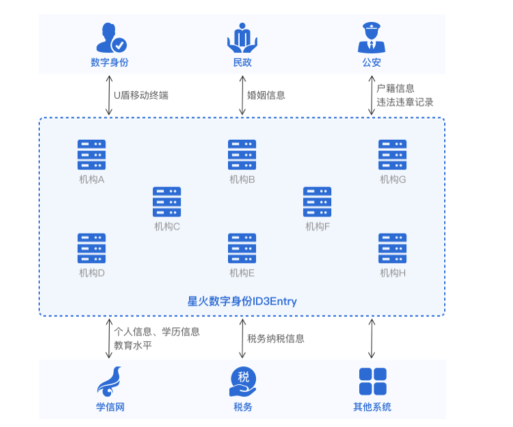

- **数据可信流转的数字身份基础设施** 

  利用星火主链记录实体的BID标识信息以及其对应的公私钥关系，实现高效无障碍访问，提供可验证、可授权的数字身份基础设施服务。

- **信息可信聚合，可验可追溯**

  利用标识串联实体分散在星火体系内的信息，实现信息聚合。同时，实体可使用公私钥进行身份验证，意愿确认及行为追溯。

## 技术指标

数字身份服务平台

-  最多支持`1500`用户同时在线操作
-  页面响应时间：`1s`内
-  链上交易响应时间：`3s`内

## 用户使用手册

如果您想管理自己在星火·链网的数字身份，自主管理身份数据，请下载**星火通客户端**（`IOS`/`Android`/`浏览器插件`），同时星火通客户端可搭配**星火通硬件钱包S1**来更安全的管理自己在星火·链网的身份数据。

**星火通**：星火通是星火·数字身份服务`ID3Entry`提供的星火数字身份客户端，您可以使用星火通本地管理自己的私钥和身份数据，并通过签名授权出示身份数据，获取星火区块链应用服务。

**星火通硬件钱包S1**：星火通硬件钱包S1是基于星火·链网安全芯片BS1打造的私钥存储设备，可以对星火通插件版在线签名操作进行安全保障：私钥本地离线生成存储，授权操作离线签名，有效保护您的私钥和数字资产安全。

**特点**：

1）提供一种除集中式身份外的身份自主管理方案，改善隐私体验和授权管理方式；

2）避免重复KYC，基于BID即可使用星火体系内的区块链应用服务；

### 星火通插件版使用手册

参见**星火链网工具-浏览器插件钱包**章节

### 星火通硬件钱包S1使用手册

星火通硬件钱包S1是一款带有生物识别指纹模块的安全便捷的密钥存储设备，主要是用来对区块链链上操作安全进行保障，内置安全芯片，私钥离线存储，交易离线签名，有效保护您的私钥安全，可基于Windows使用管理应用进行配置，同时可与星火通客户端浏览器插件进行绑定。

#### 下载使用星火通硬件钱包S1管理应用

星火通管理应用是一个运行在电脑上的客户端软件，通过该软件可对星火通进行管理，包括指纹的录入和删除，设备驱动管理，以及身份认证方式的切换等功能。
打开官网 [www.bitfactory.cn](https://www.bitfactory.cn)，在产品服务页面上下载星火通硬件钱包S1管理应用安装包。

#### 连接星火通硬件钱包S1至电脑

1. 确保已安装星火通硬件钱包S1管理应用（内含驱动）。

    

2. 通过USB Type-C连接线将设备与电脑连接，设备会自动开机。

    

3. 输入PIN码解锁设备。

    

4. 打开星火通管理应用，如应用能获取到设备信息，则星火通已成功连接。


#### 创建私钥

1. 长按开机键2s使设备开机，如出现低电量提示，请将设备连接至电脑或充电器。
1. 选择创建私钥并设置PIN码。
1. 按顺序准确抄写所有助记词，并完成助记词验证题目。
1. 等待私钥创建完成，自动进入主页面。

#### 指纹管理

添加指纹

1. 在星火通硬件钱包S1管理应用的指纹管理页中，点击录入指纹按钮。

    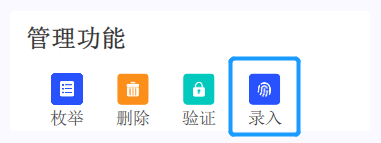

2. 在设备上验证PIN码。
3. 根据星火通管理应用和设备上的相应提示，按压指纹区域录入指纹，需重复采样5次。

    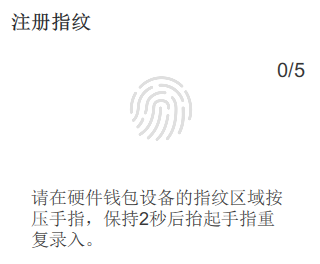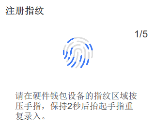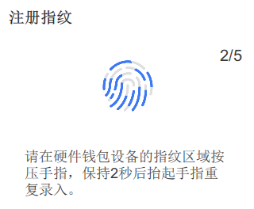
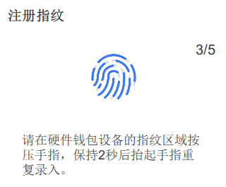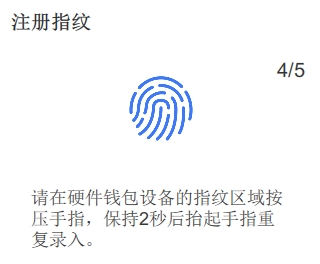

删除指纹
1. 在管理应用的指纹管理菜单项中，选择删除某一指纹。
   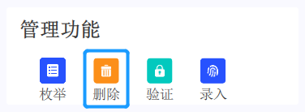

2. 在设备上验证PIN码。
3. 在设备上按下确认键，确认删除指纹。

#### 恢复私钥

1. 长按开机键2s使设备开机，如出现低电量提示，请将设备连接至电脑或充电器。
1. 选择恢复私钥并设置PIN码。
1. 按顺序将助记词输入设备。
1. 等待私钥恢复完成，自动进入主页面。

#### 将硬件钱包账户导入星火通浏览器插件

点击插件左侧菜单的导入账户，选择星火通S1绑定，点击导入。

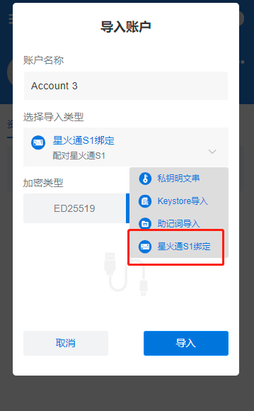

点击连接星火通S1，此时请保证已经连接硬件钱包。
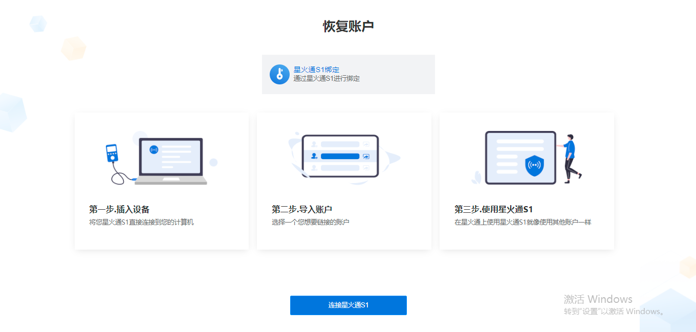
选中您要导入的硬件钱包（xinghuo key）点击继续。

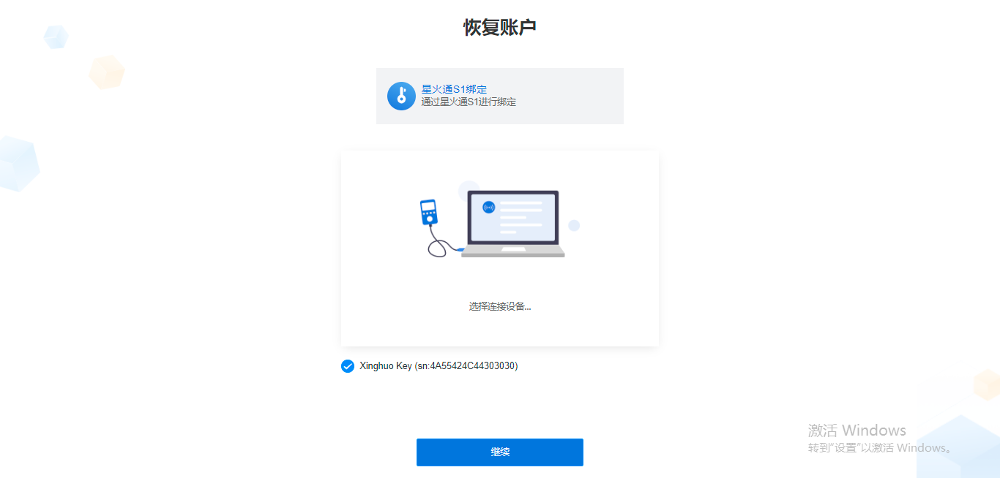

点击完成后，硬件钱包账户会导入至插件内。
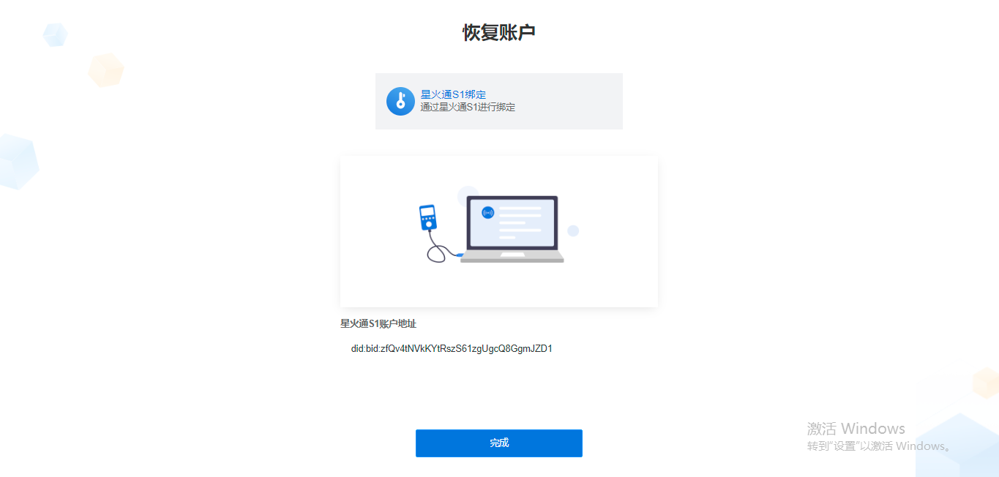

进入钱包菜单栏选中硬件钱包账户（硬件钱包账户会显示白色小图标），可操作插件内的其他功能。

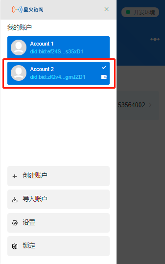

#### 使用硬件钱包账户签名

同星火通插件版普通账户一样的操作，区别是当进入转账确认页点击按钮执行转账时，会提示“请在星火通S1上进行签名！”

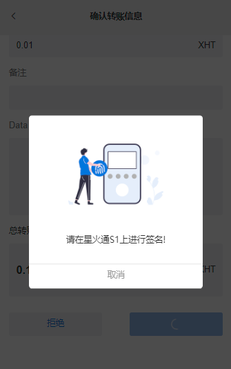

此时需要在硬件钱包内进行密码或指纹验证。

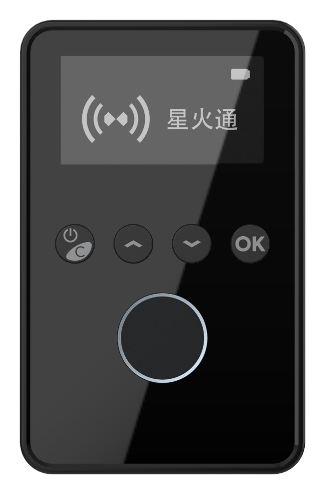

验证完毕后，转账自动执行并跳转至结果页。

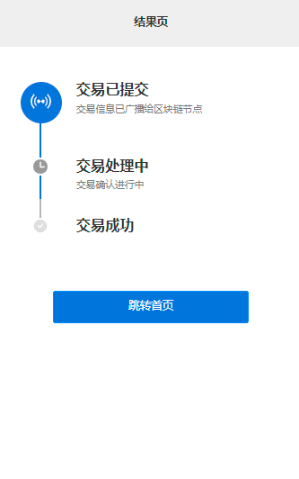

## 发证方使用手册

如果您想在星火·链网提供发证服务，为用户提供可基于区块链验证的身份证明。您可以参照此手册进行使用。

**特点**：

- 新模式：增加新的基于区块链的发证模式，拓展业务场景和范围。

- 新技术：应用区块链等新兴技术，响应国务院办公厅关于加快推进电子证照扩大应用领域和全国互通互认的意见。

- 安全：基于BID和非对称加密签发凭证，保证凭证的可验证性与不可篡改性。

- 便捷：凭证可通过星火主链直接完成验证，发证方可以只需实现发证服务，降低发证方服务成本、管理成本。

**特别说明**：

1、如果您没有自己的发证服务或者不希望基于星火·链网改造自己的发证服务，可基于此手册快速接入使用。

2、如果您已有自己的发证服务，希望对接星火·链网，提供基于区块链的发证服务，请通过“星火·链网”微信公众号联系我们。

### 发证方入驻

本文介绍用户如何使用星火数字身份服务平台成为数字凭证发证方，并基于星火数字身份服务平台创建管理自己的发证服务。

#### 前置条件

用户已完成星火企业可信认证流程。

#### 操作流程

1）进入数字身份服务平台后会引导进入发证方入驻流程，通过点击“立即入驻”进入发证方入驻流程。如下下图所示：
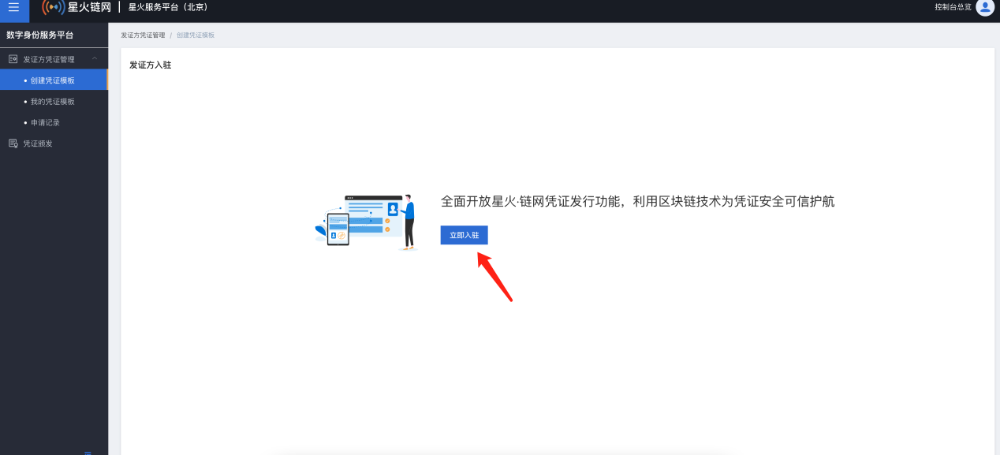
2）选择入驻类型，如果您可以自己建设数字身份业务平台可选择“使用自建业务平台颁发凭证”，如果您想借助星火链网平台颁发及管理数字凭证可以选择“使用星火数字身份平台颁发凭证”
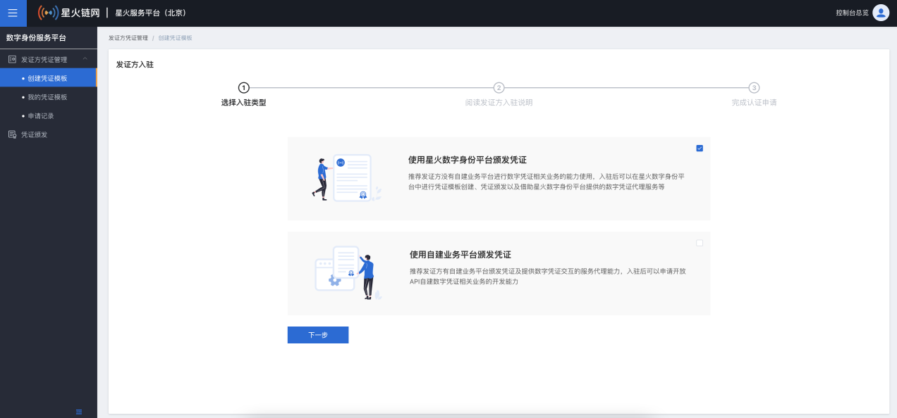
3）勾选发证方入驻说明，已代表您了解星火数字凭证颁发协议，点击“提交”进入身份签名确认页面。
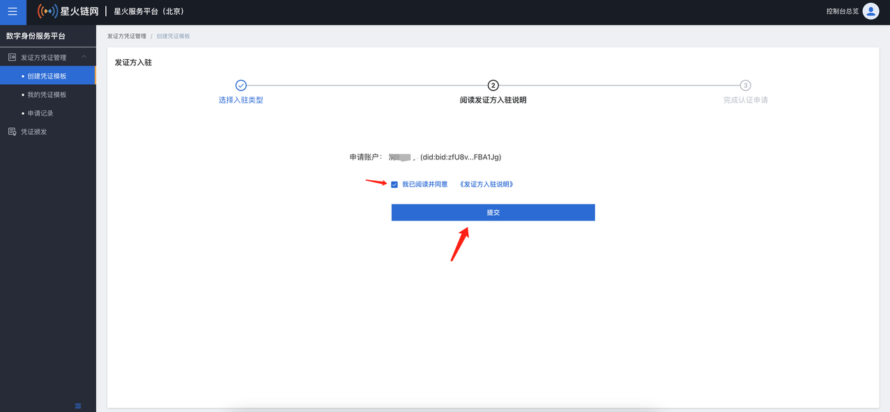
4）用户入驻发证方需要进行身份鉴权，此时平台会和已安装的星火通浏览器插件进行交互，弹出“请求签名”页面如下图所示：
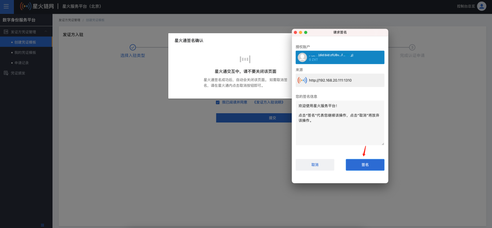
5）完成身份鉴权后进入完成认证申请结果页，如下图所示：
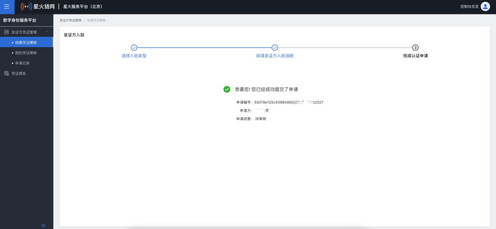

### 凭证模板创建

#### 操作流程

1） 填写凭证基本信息，用于检索凭证模板及数字凭证卡片上显示。
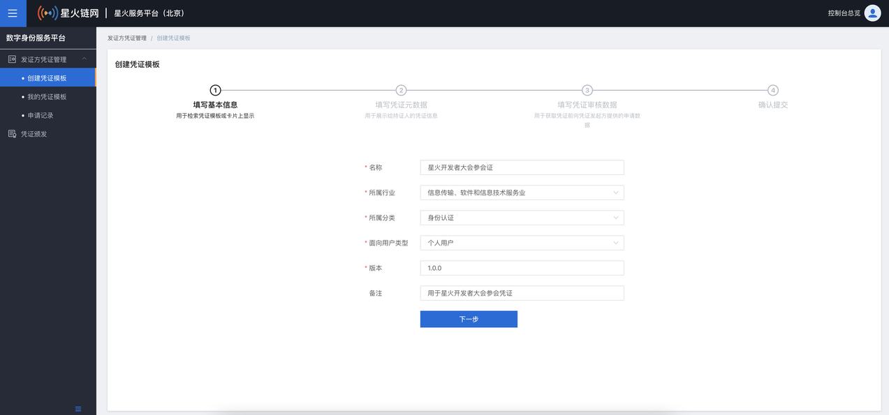
2）填写凭证元数据，用于制定凭证属性内容，支持自定义增加凭证内容，添加“增加”按钮添加自定义凭证属性。
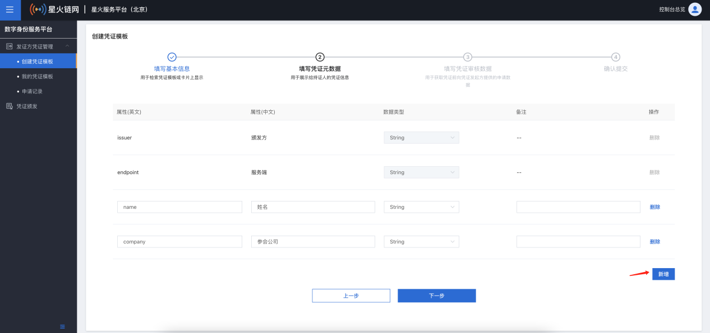
3）填写用户领取凭证的所需资料信息。
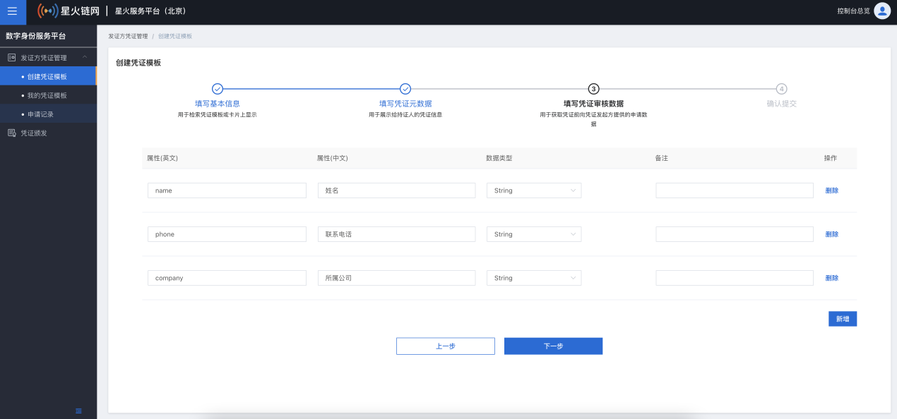
4）对自定义凭证信息的身份确认，身份确认后该数字凭证模板会提审到超级节点进行审核。
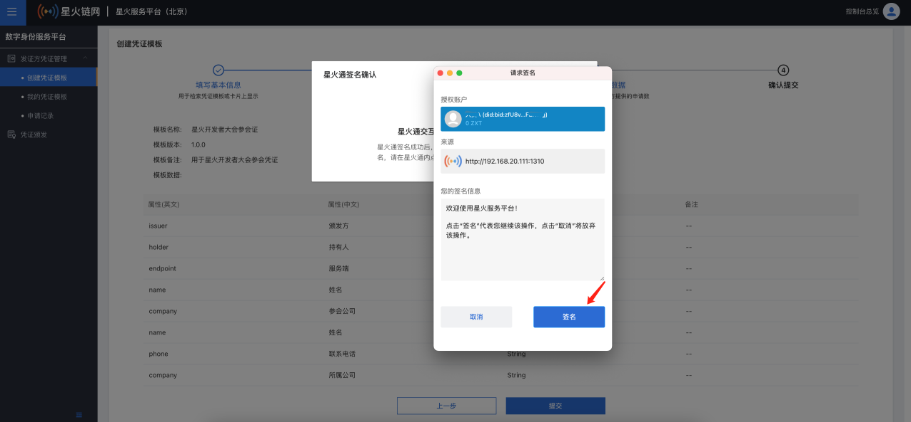
5）申请结果可以在申请记录模块进行查询，如图所示：


### 颁发凭证

#### 前置条件

当用户已通过星火通浏览器插件或开发者通过自己业务应用引导用户申请了该数字凭证。

#### 操作流程

1）颁发方在数字身份服务平台凭证颁发模块可以颁发凭证。
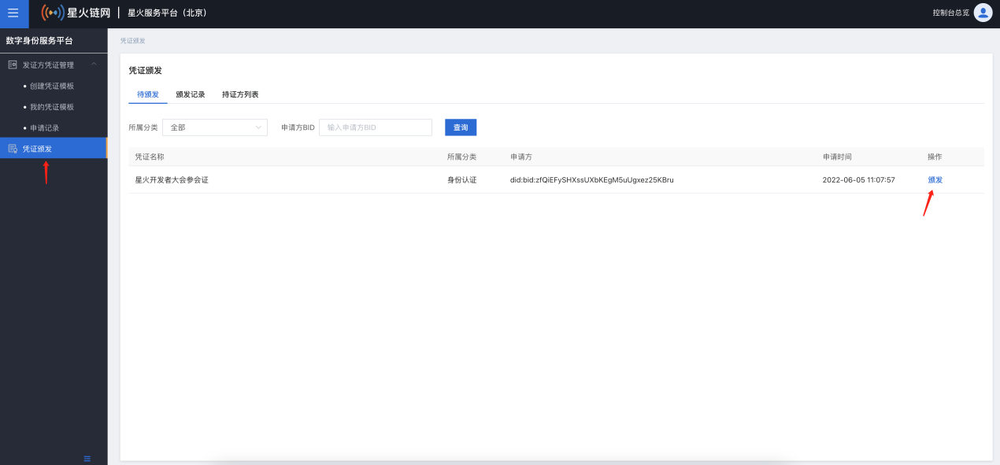
2）点击“颁发”按钮进入凭证颁发页面，如下图所示，凭证颁发进行身份签名后完成凭证的颁发。
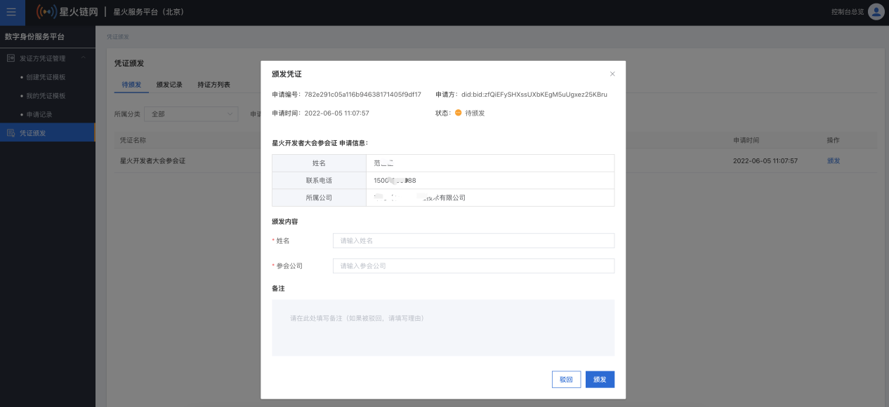

## 应用方使用手册

如果您想集成星火·数字身份服务ID3Entry到您的应用，基于区块链合规地向用户请求身份数据，请参照此手册进行使用。

**特点**：

- 降低身份数据接入难度：可直接面向用户请求身份数据，不需经过第三方，更加合规。

- 降低身份数据的验证费用：可通过非对称加密和星火主链，自建验证服务，直接对用户身份数据进行验证。

### 介绍

数字身份服务是为数字凭证颁发方提供了数字凭证管理及服务能力，数字凭证的使用可以通过该开发文档进行对接，使您可以在自建应用系统进行数字凭证的应用。

### 星火通浏览器插件版SDK

本文以电脑端浏览器应用为例借助星火通浏览器插件SDK完成对星火数字凭证的应用，完成浏览器插件安装后会自动将插件对象注入到浏览器中，应用侧调用SDK提供相关接口即可使用星火通插件版的开发能力。

#### 概览

| 接口名           | 接口功能描述                |
| ---------------- | --------------------------- |
| window.bifWallet | 在浏览器中检测bifWallet对象 |
| signAuth         | 签名授权                    |
| getPV            | 出示并获取验证数字凭证结果  |
| sendTransaction  |                             |
|                  |                             |

#### 调用方法

##### 检测插件对象

```javascript
var bifWallet = null
if (typeOf window.bifWallet !== 'undefined') { 
  bifWallet = window.bifWallet 
} else { 
  console.info("插件未安装") 
}
```

##### 签名授权

通过该方法可以提供给业务侧生成的随机串进行签名，签名后会返回该随机串、签名账户的公钥、BID以及签名串供业务侧进行验证。特别提醒：**randomCode**必须是一个16进制的字符串。

```javascript
var obj = {
  // 16进制字符串
  randomCode:'839402'
}
bifWallet.signAuth(obj, function(resp){ 
})
```

**请求字段:**

| 字段名     | 类型   | 描述                     |
| ---------- | ------ | ------------------------ |
| randomCode | String | 业务侧提供的16进制字符串 |

**返回值：**

```json
resp: 
{
    "code": 0,
    "data": {
        "publicKey": "b07a66045197ea4f790e74b3614f771ea5caba335e14c145d0ef02f65710395334078fee0ae302a0ecf338b2474fea96ddafdfcb3fa9269a6165b2caf28c9ca06b14703f",
        "signData": "d4c281c8d76d6579258f4104ea662b8f03918b3710c824cba5591808c0dc2e659206c774cab9a7f5c976a50668b1e993eb9e0cb55373f37bdd40a61be7d5837a",
        "bid": "did:bid:zf5EHbHLDDEgY5rA2hnwp5YPhaw9iUPu",
        "randomCode": "839402"
    },
    "message": ""
}
```

**返回参数说明:**

| **字段名**          | **类型**   | **描述**              |
| ------------------- | ---------- | --------------------- |
| **code**            | **Int**    | **错误码**            |
| **message**         | **String** | **接口返回消息**      |
| **data.publicKey**  | **String** | **钱包签名账户公钥**  |
| **data.signData**   | **String** | **签名串**            |
| **data.bid**        | **String** | **钱包签名账户的BID** |
| **data.randomCode** | **String** | **随机串的16进制串**  |

**错误码说明:**

| **错误码** | **说明**                       |
| ---------- | ------------------------------ |
| **1**      | **用户在钱包界面执行取消操作** |
| **0**      | **请求成功**                   |


##### 出示并验证数字凭证

调用该方法可以选择性出示数字凭证声明，且星火链网验证服务会对该声明进行验证，验证通过后会返回"验证通过证明"及"证明内容"。

```javascript
var obj = {
  ctid:'did:bid:efvBPiZWCuB89LpynLUpmXCozjGEouhU',
  vpList:['certBid','companyName'],
  address:'did:bid:efPiZuNndJuKsBUavPxq186TBNEFziCP'
}
bifWallet.getPV(obj, function(resp){

})
```

**请求字段:**

| 字段名  | 类型   | 描述                                                         |
| ------- | ------ | ------------------------------------------------------------ |
| ctid    | String | 凭证模板ID以星火可信凭证为例：个人：'did:bid:efopa6rM7KtZLaYdaVv8euC674Rphq7J'政府：'did:bid:ef2ANH8zrVM8Ko1HAjV6NncadgCELB9N1'企业：'did:bid:efvBPiZWCuB89LpynLUpmXCozjGEouhU' |
| vpList  | Array  | 模板KEY集合，可选择其中几项，需对应凭证模板ID个人：certBid(证书ID)、id(证书拥有者)、idNumber(证件号)、realName(真实名称)政府：certBid(证书ID)、id(证书拥有者)、governmentName(政府名称)企业：certBid(证书ID)、id(证书拥有者)、companyName(企业全称)、legalPersonName(法人名称)、qualifieNumber(营业执照号)、businessScope(营业范围)、establishDate(成立日期)、registerCapital(注册资本)、registeredAddressDetail(企业注册地址)、qualifieValidateStart(营业期限开始日期)、qualifieValidateEnd(营业期限结束日期) |
| address | String | 出示数字凭证的钱包账户地址                                   |


**返回值：**

| 字段名            | 类型   | 描述                                  |
| ----------------- | ------ | ------------------------------------- |
| code              | Int    | 错误码                                |
| message           | String | 接⼝返回消息                          |
| data.state        | String | 验证结果 0不通过 1通过                |
| data.errorMessage | String | 验证（不通过）的描述信息              |
| data.pv           | Object | "验证通过证明（星火VC协议）"的jws数据 |
| data.plaintext    | Object | 证书需要证明的明文内容                |
| data.verifier     | String | 验证方地址                            |

```json
{
  code: 0, 
  data: {
    "state": '1',
    "errorMessage": ""
     "pv": {
        "jws":"eyJhbGciOiJTTTIifQ.eyJAY29udGV4dCI6WyJodHRwczovL3d3dy53My5vcmcvMjAxOC9jcmVkZW50aWFscy92MSJdLCJjcmVhdGUiOiIyMDEwLTAxLTAxVDE5OjIzOjI0WiIsImNyZWRlbnRpYWxSZXF1ZXN0Ijp7Imp3cyI6ImV5SmhiR2NpT2lKSVV6STFOaUlzSW5SNWNDSTZJa3BYVkNKOS5leUpqWlhKMFZIbHdaU0k2SXVhVXYtVzZuT1dQci1TX29laXVwT2l2Z1NJc0ltTmxjblJDYVdRaU9pSmthV1E2WW1sa09tVm1NVFIxVUhOWU4xaFpUSHB6VlRSME1uSnVVbkp6U3pKNlpsVmlSa1ZxSWl3aWFYTnpkV1ZPYjJSbFRtRnRaU0k2SXVpMmhlZTZwLWlLZ3VlQ3VlLThpT1dNbC1TNnJPLThpU0lzSW1KcFpDSTZJbVJwWkRwaWFXUTZaV1pRYVZwMVRtNWtTblZMYzBKVllYWlFlSEV4T0RaVVFrNUZSbnBwUTFBaWZRLkE4eUNOS283NWdNM3ZOdldMNUJRVGFGS0Z4dVBURnpTMlVuOUZKVllXOXMifSwiaXNzdWVyIjoiZGlkOmJpZDplZkpndDQ0bU5EZXdLSzFWRSBONDU0UjE3Y2pzbzNtU0ciLCJ0eXBlIjpbIlByZXNlbnRhdGlvblZlcmlmaWVkIl19.XhvAmj393olpFKzECwtDJmcaW4-i_Fn_U-UVd6tQjyUeR8eadVsxbl6NbxsKYV0RQ9xlYRESPkk4FTYvjmOEAA"
      },
    "plaintext": {
      "certType": "政府可信认证",
      "certBid": "did:bid:ef14uPsX7XYLzsU4t2rnRrsK2zfUbFEj",
      "issueNodeName": "超级节点（北京）",
      "bid": "did:bid:efPiZuNndJuKsBUavPxq186TBNEFziCP"
    },
    "verifier": 'did:bid:zf97YWbs29RtxwjbLs5Db6XX96zRhFQ2'
  },
  message: ''
}
```

**错误码说明:**

| **错误码** | **说明**                       |
| ---------- | ------------------------------ |
| **1**      | **用户在钱包界面执行取消操作** |
| **0**      | **请求成功**                   |

##### 转账

调用该方法可以支持星火令转账、智能合约的创建和调用。通常用于链上的交易时可以调用该接口，开 发者调用该接口前需要根据以下数据模板组装符合自己的数据结构。调用该接口后会唤起插件交易 确认页面供星火通侧账户自主签名交易，签名后星火通会将该交易广播给区块链节点，同时钱包侧会响应提交状态，交易最终状态需要开发者通过返回的交易hash值后再调用交易查询接口来确认交易的终态。

```javascript
var obj = {
  from:'did:bid:efptrbCFrm3rZj3rFgfpdmE98b23KWHs',
  to:'did:bid:zf97YWbs29RtxwjbLs5Db6XX96zRhFQ2',
  nonce:1,
  amount:1,
  gasFee: 0.1,
  data:'{"method":"mint","params":{"platform":true,"to":"did:bid:zfDLjY22D8TUzcCNnZ3WeNnvb1mDuM3m","id":"2","value":"1"}}',
  chainId:'0'
}
bifWallet.sendTransaction(obj, function(resp){
  
})
```

**请求字段:**

| 字段名  | 类型   | 描述                                                         |
| ------- | ------ | ------------------------------------------------------------ |
| from    | String | 交易发起方的账户地址                                         |
| to      | String | 目标账户地址                                                 |
| nonce   | Number | 账户交易序列号，账户需要保障连续，且新交易时需要在该账户的nonce加1 |
| amount  | Number | 交易星火令数量，调用合约是支持为0                            |
| gasFee  | Number | 交易预估费用                                                 |
| data    | String | 合约调用函数，通常为JSON字符串                               |
| chainId | String | 网络环境标识 ：0主网 1测试网                                 |

**返回值：**

| 字段名    | 类型   | 描述         |
| --------- | ------ | ------------ |
| code      | Int    | 错误码       |
| message   | String | 接⼝返回消息 |
| data.hash | String | 交易hash     |

```json
resp:

{
  code: 0,
  data: {
    hash: '',
  },
  message: ''
}
```

**错误码说明:**

| **错误码** | **说明**                       |
| ---------- | ------------------------------ |
| **1**      | **用户在钱包界面执行取消操作** |
| **0**      | **请求成功**                   |

##### 消息签名

通过调用该方法可以支持应用侧传入消息内容，让钱包对其签名。调用该方法后会唤起插件，并展示要签名的内容，操作者签名后会返回原始消息内容、签名账户公钥、签名串等。

**_特别提醒：业务侧需要进行验签操作时需要将原始消息内容进行16进制转换后再通过bif sdk进行验证。_**

```javascript
var obj = {
  message: '欢迎使用星火通...'
}
bifWallet.signMessage(obj, function(resp){
  
})
```

**请求字段:**

| 字段名  | 类型   | 描述                   |
| ------- | ------ | ---------------------- |
| message | String | 业务侧提供的待签名信息 |

**返回参数说明:**

| **字段名**         | **类型**   | **描述**              |
| ------------------ | ---------- | --------------------- |
| **code**           | **Int**    | **错误码**            |
| **message**        | **String** | **接口返回消息**      |
| **data.publicKey** | **String** | **钱包签名账户公钥**  |
| **data.signData**  | **String** | **签名串**            |
| **data.bid**       | **String** | **钱包签名账户的BID** |
| **data.message**   | **String** | **待签名信息**        |

**错误码说明:**

| **错误码** | **说明**                       |
| ---------- | ------------------------------ |
| **1**      | **用户在钱包界面执行取消操作** |
| **0**      | **请求成功**                   |


