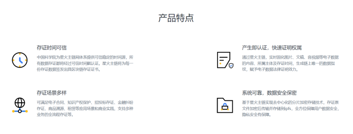
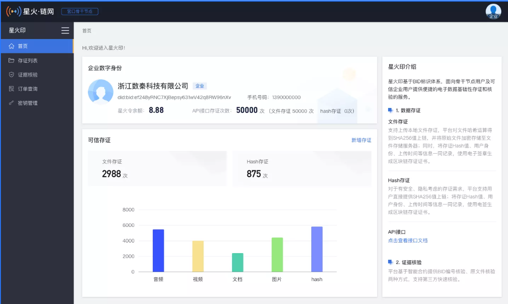
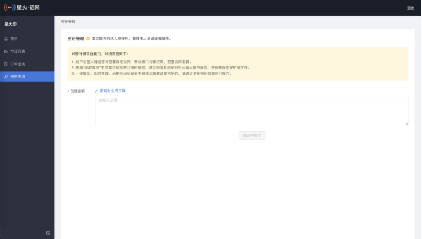
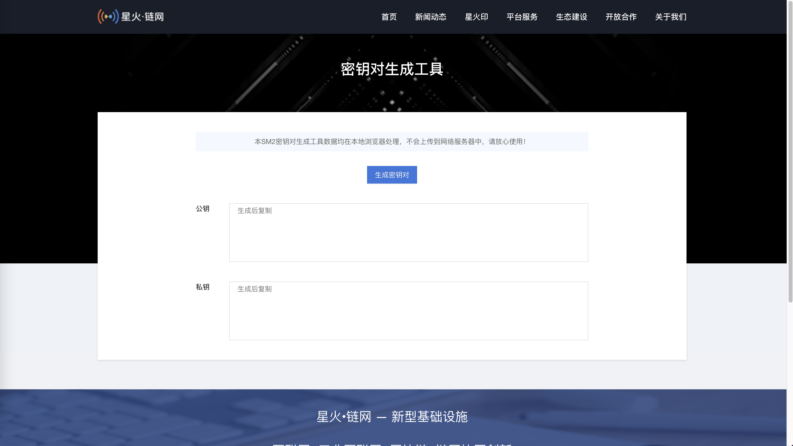
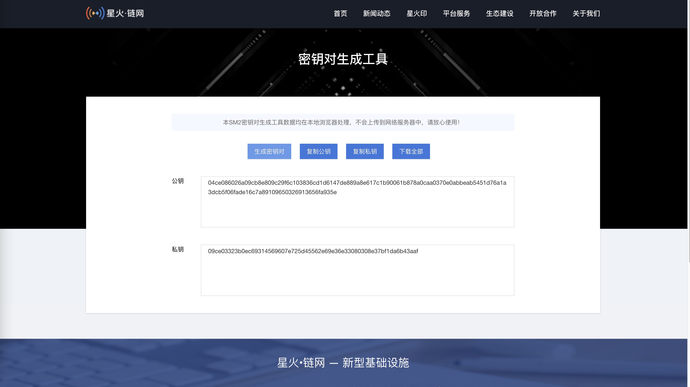
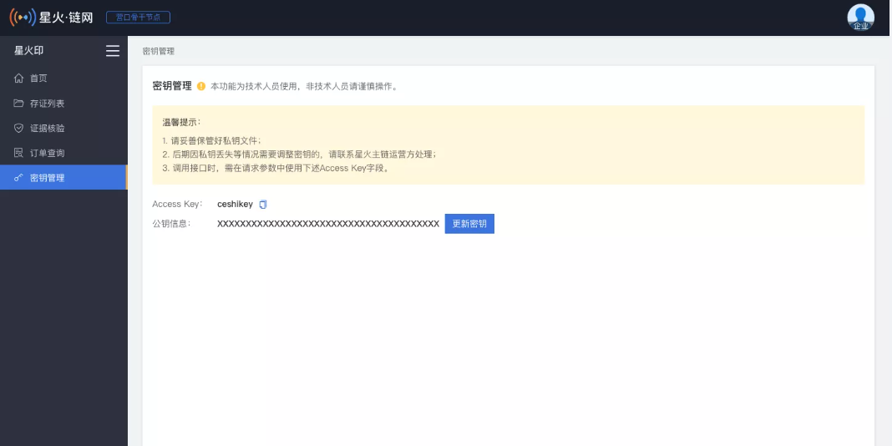

# 星火印

## 1 前言

### **1.1编写目的**

本文档旨在指导星火印使用，接入方式**先通过星火印测试网络平台进行测试验证**，接入测试成功后再接入星火印生产系统。

### **1.2 环境**

测试网络平台：[https://test-stamp.bitfactory.cn](https://test-stamp.bitfactory.cn)

生产系统：[https://stamp.bitfactory.cn](https://stamp.bitfactory.cn)

### **1.3 参考文档**

参考文档：[《浏览器插件钱包》](https://bif-doc.readthedocs.io/zh_CN/latest/tools/wallet.html)

## 2.产品概述

欢迎使用星火·链网 星火印可信存证服务。

星火印是星火链网主链上的一项基础性公共服务，基于BID标识体系，面向骨干节点用户及可信企业用户提供安全、便捷的电子数据存证和核验服务。提供文件存证和Hash存证，提供原文件核验和文件BID查验。其利用区块链分布式记账、难以篡改等特性，对数据文件上链进行存证，使文件记录在“星火·链网”这一基础设施上实现，提升认可度。适用于骨干节点单位和星火可信企业知识产权、业务数据保护等多种场景。

## 3.产品特点

国家节点背书：采用分布式账本保存，并由国家主链多个有公信力的权威节点共同见证，保障存证数据安全可信与不可篡改。

数据真实可靠：采用完全分布式的架构，对数据加密、计算和交互在多个计算节点之间独立完成，无中心控制节点，真实保障不可篡改。

应用场景广泛：可应用于电子合同、金融、司法、版权、政务、溯源、供应链管理等多个应用场景。

隐私保护合规：所有计算均在加密之后进行计算，最大程度的保障个人隐私数据安全。

技术安全可靠：基于星火链网存证，具备高数据安全、高性能、低延时以及集群灾备高可用设计，使得存证及流转得到安全可靠的保证。

使用便捷：骨干节点及企业用户可以在线使用或通过 API一站式调用存证服务，使用便捷高效。

## 4.产品功能

**存证功能**

文件存证：支持将文档、图片、音频、视频文件提交存证，支持一次提交5个文件同时存证。

Hash存证：提供在线生成Hash小工具，同时支持本地生成Hash进行上传、支持一次提交5个Hash同时存证。

API接口存证：支持管理端配置套餐，提供密钥生成小工具和密钥更新管理，支持调取接口

**核验功能**

BID编号查验：用户输入BID编号，与链上BID编号进行对比，查验该BID对应文件是否已存链上，查看上链相关信息。

原文件核验：用户提交文件至存证平台，平台计算文件hash，与链上文件hash进行对比，查验该文件是否已存链上，查看上链相关信息。

## 5.应用场景

（1）知识产权原创保护：互联网时代信息传播极快，没有提前登记的情况下，数字作品被侵权的概率非常高，维权时因拿不出切实可信的证据，维权成本高。通过对数字作品，包括图片、视频、音频、文字、代码等文件存证，让原创作品快速生成司法认可的电子数据存证。

（2）平台服务须知存证：互联网服务大量的纠纷源于平台是否将服务限制性条件提前明确的告知用户，包括限制性条件，使用范围，服务协议，隐私保护条款等。通过对服务须知进。

（3）电子凭证存证：电子证明、交易凭证、电子合同、电子票据等数据凭证等不容易管理，容易遗失，很难流通，很难验真。存证可获得永久性保存和验证，方便凭证管理、易于流通。

（4）在线交易存证：网络在线交易行为存在大量的细节性数据，随着时间的推移这些数据易覆盖、遗失，产生纠纷时很难有串接起来的数据证据。将上述数据存证，公正客观、司法认可，为线上交易、数据分析提供双保险。

## 6.接入流程

第一步：登录星火印（测试网：[https://test-stamp.bitfactory.cn](https://test-stamp.bitfactory.cn)）

绑定手机号进入网站，联系客服线下签约或者商务申请开通API服务。

第二步：进入星火印（网页地址） 密钥管理，新建密钥。

第三步：点击进入密钥对生成工具。

第四步：点击生成密钥对。

第五步：上传SM2公钥，上传成功后的结果如下：

注意：**请保管好自己的私钥**

## 7.接口文档

[《星火印平台API 》](https://xhy-docs.readthedocs.io/en/latest/)
