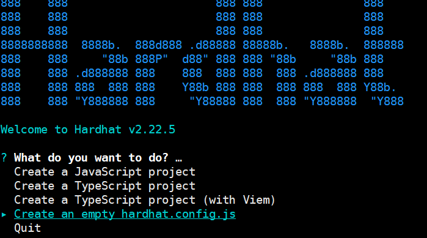
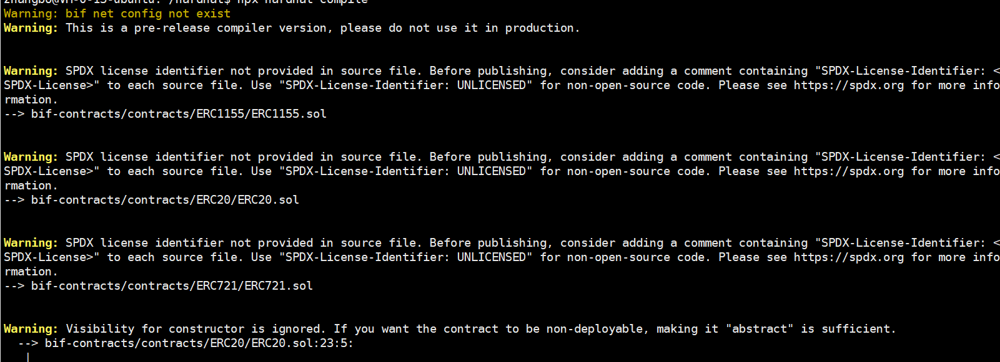
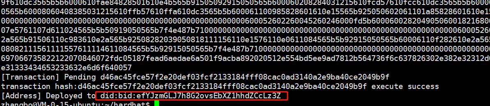
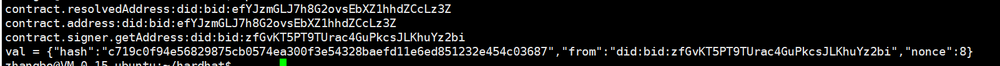
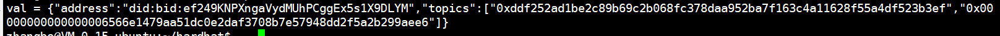

# 7.Hardhat星火插件使用说明

## 7.1 简介

为了让“星火·链网”开发者更方便高效的开发调试智能合约，同时让以太坊生态的开发者无缝接入“星火·链网”，我们结合 Hardhat 的插件式架构，为开发者提供了一整套工具链，覆盖从合约开发到部署的全流程：

1）配置灵活便捷：通过Hardhat的配置灵活添加任务，方便自动化执行；

2）全面的链上数据交互接口：包括获取区块、获取交易等接口；

3）星火智能合约全流程支持：包括合约编译、测试、部署调用等；

4）样例丰富：内置丰富的开发模板和示例代码，大幅降低开发门槛。

## 7.2 使用说明

### 依赖环境

npm 7+、nodejs 14+

### 安装

````
npm install @bifproject/hardhat-bif-tool
````

### 初始化项目

```
npx hardhat init
```

选择创建一个`hardhat.config.js`空文件



### 引入插件

```
vim hardhat.config.js
添加：
require("@bifproject/hardhat-bif-tool");
```

### 编译合约

首先创建一个`contracts`目录，然后在目录里新建一个合约文件，我们以`ERC20`合约为例：

```javascript
pragma solidity ^0.8.20;

contract TokenERC20 {
    string public name; // ERC20标准
    string public symbol; // ERC20标准
    uint8 public decimals = 2;  // ERC20标准，decimals 可以有的小数点个数，最小的代币单位。18 是建议的默认值
    uint256 public totalSupply; // ERC20标准 总供应量

    // 用mapping保存每个地址对应的余额 ERC20标准
    mapping (address => uint256) public _balanceOf;
    // 存储对账号的控制 ERC20标准
    mapping (address => mapping (address => uint256)) public allowance;

    // 事件，用来通知客户端交易发生 ERC20标准
    event Transfer(address indexed from, address indexed to, uint256 value);

    // 事件，用来通知客户端代币被消费 ERC20标准
    event Burn(address indexed from, uint256 value);

    /**
     * 初始化构造
     */
    constructor(uint256 initialSupply, string memory tokenName, string memory tokenSymbol) public {
        totalSupply = initialSupply * 10 ** uint256(decimals);  // 供应的份额，份额跟最小的代币单位有关，份额 = 币数 * 10 ** decimals。
        _balanceOf[msg.sender] = totalSupply;                // 创建者拥有所有的代币
        name = tokenName;                                   // 代币名称
        symbol = tokenSymbol;                               // 代币符号
    }

    /**
     * 代币交易转移的内部实现
     */
    function _transfer(address _from, address _to, uint _value) internal {
        // 确保目标地址不为0x0，因为0x0地址代表销毁
        require(_to != address(0x0));
        // 检查发送者余额
        require(_balanceOf[_from] >= _value);
        // 确保转移为正数个
        require(_balanceOf[_to] + _value > _balanceOf[_to]);

        // 以下用来检查交易，
        uint previousBalances = _balanceOf[_from] + _balanceOf[_to];
        // Subtract from the sender
        _balanceOf[_from] -= _value;
        // Add the same to the recipient
        _balanceOf[_to] += _value;
        emit Transfer(_from, _to, _value);

        // 用assert来检查代码逻辑。
        assert(_balanceOf[_from] + _balanceOf[_to] == previousBalances);
    }

   function balanceOf(address owner) public view returns (uint256) {
        require(owner != address(0), "ERC20: balance query for the zero address");
        return _balanceOf[owner];
    }

    /**
     *  代币交易转移
     *  从自己（创建交易者）账号发送`_value`个代币到 `_to`账号
     * ERC20标准
     * @param _to 接收者地址
     * @param _value 转移数额
     */
    function transfer(address _to, uint256 _value) public {
        _transfer(msg.sender, _to, _value);
    }

    /**
     * 账号之间代币交易转移
     * ERC20标准
     * @param _from 发送者地址
     * @param _to 接收者地址
     * @param _value 转移数额
     */
    function transferFrom(address _from, address _to, uint256 _value) public returns (bool success) {
        require(_value <= allowance[_from][msg.sender]);     // Check allowance
        allowance[_from][msg.sender] -= _value;
        _transfer(_from, _to, _value);
        return true;
    }

    /**
     * 设置某个地址（合约）可以创建交易者名义花费的代币数。
     *
     * 允许发送者`_spender` 花费不多于 `_value` 个代币
     * ERC20标准
     * @param _spender The address authorized to spend
     * @param _value the max amount they can spend
     */
    function approve(address _spender, uint256 _value) public
    returns (bool success) {
        allowance[msg.sender][_spender] = _value;
        return true;
    }

    /**
     * 销毁我（创建交易者）账户中指定个代币
     *-非ERC20标准
     */
    function burn(uint256 _value) public returns (bool success) {
        require(_balanceOf[msg.sender] >= _value);   // Check if the sender has enough
        _balanceOf[msg.sender] -= _value;            // Subtract from the sender
        totalSupply -= _value;                      // Updates totalSupply
        emit Burn(msg.sender, _value);
        return true;
    }

    /**
     * 销毁用户账户中指定个代币
     *-非ERC20标准
     * Remove `_value` tokens from the system irreversibly on behalf of `_from`.
     *
     * @param _from the address of the sender
     * @param _value the amount of money to burn
     */
    function burnFrom(address _from, uint256 _value) public returns (bool success) {
        require(_balanceOf[_from] >= _value);                // Check if the targeted balance is enough
        require(_value <= allowance[_from][msg.sender]);    // Check allowance
        _balanceOf[_from] -= _value;                         // Subtract from the targeted balance
        allowance[_from][msg.sender] -= _value;             // Subtract from the sender's allowance
        totalSupply -= _value;                              // Update totalSupply
        emit Burn(_from, _value);
        return true;
    }
}
```

编译合约

```
npx hardhat compile
```

编译过程中会有一些警告，可以忽略



### 部署合约

星火链没有对`harthat`原生的`ignition`模块做适配，而是以插件的形式实现了与`hardhat`的适配，因此部署合约的时候与原生hardhat使用`ignition`部署合约不同，星火链使用`hardhat`以任务的方式部署合约。

首先，需要在`hardhat.config.js`中添加网络配置：

```javascript
require("@bifproject/hardhat-bif-tool");
module.exports = {
        solidity: "0.8.21",
        paths: {
                sources: "./bif-contracts", //合约目录
        },
    	solidity: "0.8.21",
		networks: {
    		"bifchain": {
      			url: "http://test.bifcore.bitfactory.cn",//星火链测试网地址
      			bifNet: true,
      			bifAccounts: [ "xxx" ]//部署合约的账户私钥
    	}
  	},
};
```

添加部署任务：

```javascript
//deploy 参数1. 名称 2.描述
task("deploy", "合约部署", async (taskArgs, hre) => {
        try{
                //合约名称
                const factory = await hre.bif.getContractFactory("TokenERC20");
                console.log(factory.bytecode);
                //1. 发布token的金额， 2. token的名称 3. token 的符号 4.其他交易相关的参数，如nonce, gas,amout等      
                const initialSupply = 1024;
                const tokenName = "xht";
                const tokenSymbol = "&";
                const contract = await factory.deploy(initialSupply,tokenName,tokenSymbol,{})
                const tx = contract.deployTransaction;
                console.log(`[Transaction] Pending ${tx.hash}`);

                const ct = await contract.deployed();
                if (ct !== null)
                        console.log(`[Address] Deployed to ${contract.address}`);
        }catch(e) {
                console.log(e)
        }
});
```

执行部署任务：

```bash
 npx hardhat deploy --network bifchain
```

合约部署成功且返回合约地址：



如果执行失败可以打开执行日志查看详细报错信息

```
npx hardhat deploy --network bifchain --verbose
```

### 调用合约

添加调用合约任务

```javascript
//deploy 参数1. 名称 2.描述
task("transfer", "调用合约转账", async (taskArgs, hre) => {
        try{
                //合约名称
                const factory = await hre.bif.getContractFactory("TokenERC20");
               //部署合约返回的合约地址
                const contract = await factory.attach("did:bid:efYJzmGLJ7h8G2ovsEbXZ1hhdZCcLz3Z");

            	console.log(`contract.resolvedAddress:${await contract.resolvedAddress}`);
			   console.log(`contract.address:${await contract.address}`);
		       console.log(`contract.signer.getAddress:${await contract.signer.getAddress()}`);
                //1. 要调用的函数名 2. 函数参数 a. 转给谁  b. 转账的金额
                const val = await contract.functions["transfer"]("did:bid:efehs2xrzswELV2ZKJE3AMFd8g33i4Kt",100)
		       console.log(`val = ${JSON.stringify(val)}`)
        }catch(e) {
                console.log(e)
        }
});
```

执行调用

```
 npx hardhat transfer --network bifchain 
```

执行完成



### 查询合约

添加查询合约任务

```javascript
//deploy 参数1. 名称 2.描述
task("balanceOf", "查询账户余额", async (taskArgs, hre) => {
        try{
                //合约名称
                const factory = await hre.bif.getContractFactory("TokenERC20");
               //部署合约返回的合约地址
                const contract = await factory.attach("did:bid:efYJzmGLJ7h8G2ovsEbXZ1hhdZCcLz3Z");
                //1. 要调用的函数名 2. 函数参数 a. 要查询余额的账户
                const val = await contract.callStatic["balanceOf"]("did:bid:efehs2xrzswELV2ZKJE3AMFd8g33i4Kt")
		       console.log(`val = ${JSON.stringify(val)}`)
        }catch(e) {
                console.log(e)
        }
});
```

执行查询

```
npx hardhat balanceOf --network bifchain 
```

查询成功


### 过滤Event事件

添加过滤event任务

```javascript
//deploy 参数1. 名称 2.描述
task("filter", "filter", async (taskArgs, hre) => {
	try{
		const factory = await hre.bif.getContractFactory("TokenERC20");
		const contract = await factory.attach("did:bid:ef249KNPXngaVydMUhPCggEx5s1X9DLYM");
// 1 事件名字 2 合约地址
		const val = await contract.filters["Transfer"]("did:bid:ef249KNPXngaVydMUhPCggEx5s1X9DLYM","transfer")

		console.log(`val = ${JSON.stringify(val)}`)
        } catch(e) {
		console.log(e)
	}
});
```

执行查询

```
npx hardhat filter --network bifchain 
```

执行结果



### 其他任务

#### 查询账户地址

添加查询合约任务

```javascript
task("getsigners", "Prints the list of accounts", async (taskArgs, hre) => {
  const accounts = await hre.bif.getSigners();
  for (const account of accounts) {
    console.log(account.address);
  }
});
```

执行查询

```
npx hardhat getsigners --network bifchain 
```

#### 查询区块高度

添加任务

```javascript
task("getBlockNumber", "Prints the networksBlockNumber", async (taskArgs, hre) => {
  const number = await hre.bif.provider.getBlockNumber();
  console.log(`blockNumber:${number}`);
});
```

执行查询

```
npx hardhat getBlockNumber --network bifchain 
```

#### 查询账户余额

添加任务

```javascript
task("balance", "Prints an account's balance")
  .addParam("account", "The account's address")
  .setAction(async (taskArgs) => {
    const balance = await hre.bif.provider.getBalance(taskArgs.account);

    console.log(`account ${taskArgs.account} balance:${balance}`);
});
```

执行查询

```
npx hardhat balance --network bifchain --account did:bid:ef249KNPXngaVydMUhPCggEx5s1X9DLYM
```