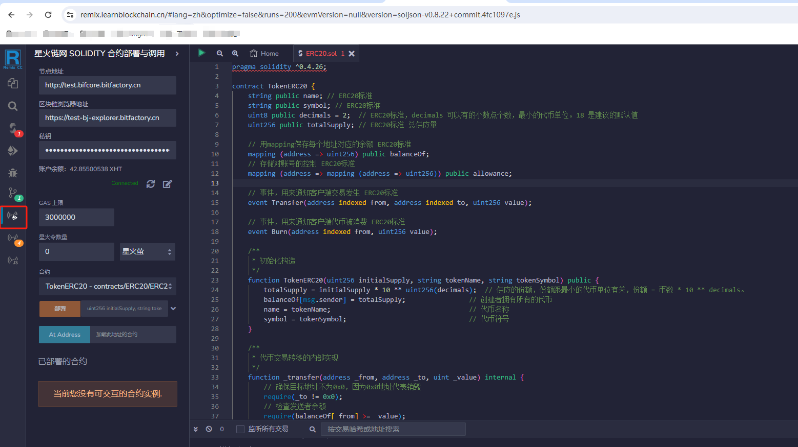

# 7.Remix合约IDE星火插件

## 7.1 简介

Remix 是用于以太坊智能合约开发的Web端集成开发环境 (IDE)。由于其操作简单、功能强大，成为开发者学习以太坊智能合约开发的首要工具，在以太坊生态中占据很重要的一席之地。

Remix合约IDE星火插件是“星火·链网”研发团队联合Remix中文社区，基于Remix研发的IDE插件，支持“星火·链网”智能合约的编辑、部署和调用。其具备三大优势：网页可访问、可视化编程和兼容以太坊生态。该插件提供了网页可访问的开发环境，使得开发者无需复杂的本地设置，即可在任何地点通过互联网进行智能合约的编译、部署和调用。同时，借助Remix的可视化编程界面，开发者可以更加直观、便捷地在“星火·链网”上开发和测试使用Solidity和JavaScript语言编写的智能合约。另外，这一插件的设计兼容以太坊生态，为熟悉以太坊开发环境的开发者提供了平滑过渡，进一步提升了开发效率。

## 7.2 使用说明

### 7.2.1 访问Remix

remix官方地址：[https://remix.ethereum.org](https://remix.ethereum.org)

remix 国内镜像：[https://remix.learnblockchain.cn](https://remix.learnblockchain.cn)


### 7.2.2 安装星火插件

点击插件选型，会出现插件搜索框，在插件搜索框输入“星火链网”，会出现三个插件，分别点击启用，即可完成Remix合约IDE星火插件的安装。


如下图所示，左侧出现三个星火的小图标代表即代表插件安装成功（建议使用国内镜像打开remix， 否则插件会加载很慢）。


### 7.2.3  创建合约项目

第一步，点击文件浏览器

- 在IDE创建合约项目

  

  第二步，点击工作空间->新建->选择空白模板->给工作空间取名

  

  

  第三步，新建文件，即可在工作空间编写智能合约

  

- 从github拉取已经存在的合约项目

  第二步，点击工作空间->克隆->填入git仓库地址后点击确认后即可
  


  

**特殊说明**

目前星火链支持的solidity版本为0.4.26， remix自带的编译器默认的版本是0.8，所以在没有编译之前合约会有下面的错误提示信息，可以忽略，不影响后续的合约编译。


### 7.2.4  用星火插件编译部署调用Solidity合约

- 编译solidity合约

  第一步，点开星火Solidity编译插件，然后点击编译按钮，完成合约编译

  

  编译之后可能会出现警告，用户可以忽略。

  

- 部署solidity合约

  第一步，点开部署solidity合约插件，会出现合约部署的界面

  

  第二步，连接星火链节点。填写星火链网测网的节点地址、浏览器的地址以及用户的私钥（下个版本IDE会集成星火链网浏览器插件钱包，省去用户输入私钥的步骤）

  1. 点击修改按钮

  2. 输入节点地址

  3. 输入浏览器地址

  4. 输入私钥

  5. 点击保存按钮

     

  

  当修改按钮旁边显示Connected即表示已经连接上链节点

  

  第三步，输入部署参数，点击部署按钮，然后在**控制台**会显示合约部署结果，点击在区块链浏览器查看可以跳到区块链浏览器查看交易的详细信息。

  

  

- 调用solidity合约

  第一步加载合约。用户可以调用刚才部署的合约，也可以加载之前已经部署好的智能合约。如果调用刚部署的合约点开已部署的合约即可，如果要加载之前部署好的合约需要输入合约地址后点击At Address按钮，之后点开已部署的合约

  

  第二步，调用合约。在合约下方有合约内每个方法的按钮，输入按钮右边的参数，点击按钮即可调用合约方法（其中橙色按钮代表写方法，蓝色按钮代表读方法，红色按钮代表是payable方法）。调用合约的结果在**控制台**查看。

  

  

  **传参注意事项**

  1.  json 字符串限制

     如果要传 json 字符串的话，一定要记得把双引号都替换成单引号。可在浏览器开发者工具的 `Console` 中做字符串处理，下面是示例

     ```javascript
     JSON.stringify({
       method: 'store',
       params: {
         num: 1,
       },
     }).replaceAll('"', "'")
     ```

     

  2. bytes限制

     如果要传 bytes 的话，一定要记得先转成 HEX 

     可以到这个网站做参数转换 -- https://playground.ethers.org/

     ```javascript
     ethers.utils.hexlify(ethers.utils.toUtf8Bytes('DNA 1155'))
     ```

     

### 7.2.5 用星火插件部署调用js合约

第一步，点击js合约插件按钮


第二步，连接星火链节点，步骤和solidity合约一样。

第三步，部署调用js合约

- 带 abi 部署调用

  JS 合约没有 abi ，如果想获得像 Solidity 那样操作体验，那就需要用户自己定义 abi 。

  

  如图所示，自定义一个 `.jsi` 后缀的文件（其实就是个 json），里面有三个字段

  1. file 表示 js 合约文件路径
  2. name 表示合约名称
  3. abi 表示合约接口

  具体 abi 该怎么定义，这里给个例子，简单说明一下。

  ```json
  [
    {
      "constant": false, // 这个字段应该没啥用，可以不写，但我没测过。query 方法写 false ，init 和 main 都写 true
      "inputs": [
        // 这个字段定义输入参数
        {
          "name": "num", // 参数名随便怎么定义都行
          "type": "number" // 参数类型需要注意三种类型，数字类型写 number ，数字数组写 number[] ，json 字符串写 json 。这三个类型是在代码里有逻辑判断的，必须这么写，其他类型随意了，就只是界面上看看的，无所谓
        }
      ],
      "name": "store", // 这是方法名称
      "outputs": [], // 写方法没有返回值，这里填空数组就可以了
      "payable": false, // 这个字段应该也没啥用，可以不写，但我没测过。用于表示该方法是否可接受转账区块链的原生货币。先都写 false 吧。
      "stateMutability": "nonpayable", // 这个字段定义方法是 main 还是 query ，main 方法填 nonpayable ，query 方法填 view
      "type": "function" // main 和 query 方法都填 function
    },
    {
      "constant": true,
      "inputs": [
        {
          "name": "num",
          "type": "number"
        }
      ],
      "name": "retrieve",
      "outputs": [
        // 这个字段定义 query 方法的返回参数类型，具体定义参考前面的 inputs
        {
          "name": "",
          "type": "number"
        }
      ],
      "payable": false,
      "stateMutability": "view",
      "type": "function"
    },
    {
      "inputs": [
        {
          "name": "num",
          "type": "number"
        },
        {
          "name": "num1",
          "type": "number"
        }
      ],
      "payable": false,
      "stateMutability": "nonpayable",
      "type": "constructor" // init 方法填 constructor
    }
  ]
  ```

  另外，可参考[星火链网合约示例](https://github.com/caict-4iot-dev/bif-contracts)，这里有大量的 jsi 示例。

  准备好 jsi 文件后，确保该文件在编辑器中出于选中状态。后面的操作就和 Solidity 都一样了。

  **合约代码的编写有一定的限制**

  JS 合约本质上只有三个方法

  1. init 对应 solidity 的 **constructor**
  2. main 对应 solidity 的 **写函数**
  3. query 对应 solidity 的 **读函数**

  如果想实现多个 **读** 或 **写** 函数，一般是传这样一个 json 字符串

  ```json
  {
    "method": "store",
    "params": {
      "num": 1
    }
  }
  ```

  `method` 表示方法名，`params` 表示参数。

  JS 合约有一个问题，就是太灵活了，字段名可以随意起。你也可以用 `function` 表示方法名，`arguments` 表示参数。只要合约代码能和这些字段名对上就可以。

  但是，插件无法处理这种随意的情况。所以在插件代码中就写死了 `method` 表示方法名，`params` 表示参数。用户如果想带 abi 部署，就必须按照这个规范来写合约代码。

  **另外，init 方法有点特殊。** 因为不需要 `method` ，所以 json 定义的更简单一点，直接写参数就可以了。

  ```json
  {
    "num": 1,
    "num1": 2
  }
  ```

  如果不想受这种限制，可以采用不带 abi 的部署方式

- 不带abi部署调用

  

  如上图所示，打开一个 js 合约文件。部署、调用都差不多，只不过参数只有一个，就是一个 json 字符串

  **注意：** 这种不带 abi 的部署方式，是必须要传参的。如果碰到没有参数的情况，就直接传一个空对象 -- `"{}"`

  #### json 字符串限制

  如果要传 json 字符串的话，一定要记得把双引号都替换成单引号。

  可在浏览器开发者工具的 `Console` 中做字符串处理，下面是示例:

  ```javascript
  JSON.stringify({
    method: 'store',
    params: {
      num: 1,
    },
  }).replaceAll('"', "'")
  ```
