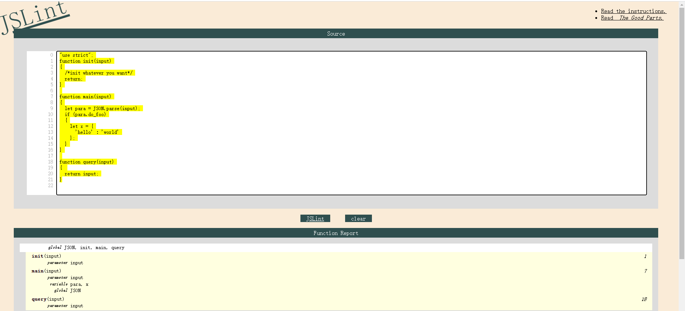
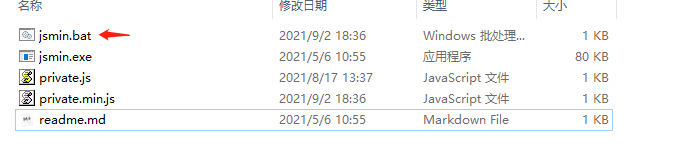

# 1. 智能合约开发整体介绍

## 1.1 Javascript合约规范

JavaScript智能合约是一段 `JavaScript` 代码，标准(ECMAScript as specified in ECMA-262)，使用Spark-V8引擎。

合约结构分为三段。合约上链部署完成后，合约文本会直接存储到合约账户结构中。 

* 合约的初始化函数是 `init`, 合约部署时自动由虚拟机引擎直接调用init进行合约账户数据的初始化。

* 合约执行的入口函数是 `main`函数，main中可实现不同的功能接口，并通过参数字符串input选择不同接口。main函数入口仅支持合约调用者以**星火交易**方式进行调用，内部功能接口可实现合约数据存储相关操作。（可实现读写功能）

* 合约查询接口是 `query`函数，query中可实现不同的查询功能接口，并通过参数字符串input选择不同接口。query函数入口仅支持合约调用者以**查询接口**进行调用，内部功能接口可用于合约账户中数据的读取，禁止进行合约数据存储相关操作。调用过程不需消耗星火令。(只读功能)

下面是一个简单的例子：

```
"use strict";
function init(input)
{
    /*init whatever you want*/
    return;
}

function main(input)
{
    let para = JSON.parse(input);
    if (para.do_foo)
    {
        let x = {
        'hello' : 'world'
        };
    }
}

function query(input)
{ 
    return input;
}
```

除此之外, 星火链`javascript`合约对`javascript`语法也做了一些限定:

* 源码开头必须添加 `"use strict;"`

* 使用` === `和 `!==`, 禁用 `== `和 `!=` 

* 使用 `+=`,` -=`, 禁用 `++` 和` --` 

### 1.1.1 星火链合约内置 API

为JavaScript智能合约的高效执行，星火链实现了部分预编译`JavaScript`指令，可通过智能合约直接进行调用。

智能合约内提供了全局对象 `Chain` 和 `Utils`, 这两个对象提供了多样的方法和变量，可以获取区块链的一些信息，也可驱动账号发起交易。

#### Chain对象


* Chain对象方法列表

    | 方法                                                      | 说明                       |
    | --------------------------------------------------------- | -------------------------- |
    | Chain.load(metadata_key)                                  | 获取合约账号的metadata信息 |
    | Chain.store(metadata_key, metadata_value)                 | 存储合约账号的metadata信息 |
    | Chain.del(metadata_key)                                   | 删除合约账号的metadata信息 |
    | Chain.getBlockHash(offset_seq)                            | 获取区块信息               |
    | Chain.tlog(topic,args...)                                 | 输出交易日志               |
    | Chain.getAccountMetadata(account_address, metadata_key)   | 获取指定账号的metadata信息 |
    | Chain.getBalance(address)                                 | 获取账号coin amount        |
    | Chain.getAccountPrivilege(account_address)                | 获取某个账号的权限信息     |
    | Chain.getContractProperty(contract_address)               | 获取合约账号属性           |
    | Chain.payCoin(address, amount[, input], [, metadata])     | 转账                       |
    | Chain.delegateCall(contractAddress, input)                | 委托调用                   |
    | Chain.delegateQuery(contractAddress, input)               | 委托查询                   |
    | Chain.contractCall(contractAddress, asset, amount, input) | 调用合约                   |


* Chain对象方法详细说明:

  `Chain.load(key);`

  读取该合约内Key对应的存储数据.

  | 参数 | 说明          |
  | ---- | ------------- |
  | key  | metadata的key |

  ```javascript
  let value = Chain.load('test');
  /*
      权限：只读
      返回：成功返回字符串，如 'values', 失败返回false
  */
  
  ```

  `Chain.store(key, metadata_value);`

  在合约内按key为索引存储数据.

  | 参数           | 说明              |
  | -------------- | ----------------- |
  | metadata_key   | metadata的key     |
  | metadata_value | metadata 的 value |

  ```javascript
  Chain.store('test', 'values');
  /*
      权限：可写
      返回：成功返回true, 失败抛异常
  */
  
  ```

  `Chain.del(key);`

  删除合约内key对应的数据

  | 参数 | 说明      |
  | ---- | --------- |
  | key  | data的key |

  ```javascript
  Chain.del('abc');
  /*
      权限：可写
      返回：成功返回true, 失败抛异常
  */
  
  ```

  `Chain.getBlockHash(offset_seq);`

  获取指定区块的Hash值

  | 参数       | 说明                                     |
  | ---------- | ---------------------------------------- |
  | offset_seq | 距离最后一个区块的偏移量，范围：[0,1024) |

  ```javascript
  let ledger = Chain.getBlockHash(4);
  /*
      权限：只读
      返回：成功返回字符串，如 'c2f6892eb934d56076a49f8b01aeb3f635df3d51aaed04ca521da3494451afb3'，失败返回 false
  */
  
  ```

  `Chain.tlog(topic,args...);`

  记录event log事件, event log会与交易一起存储在链上供查询。

  | 参数    | 说明                                                         |
  | ------- | ------------------------------------------------------------ |
  | topic   | 日志主题，必须为字符串类型,参数长度(0,128]                   |
  | args... | 最多可以包含5个参数，参数类型可以是字符串、数值或者布尔类型,每个参数长度(0,1024] |

  ```javascript
  Chain.tlog('transfer',sender +' transfer 1000',true);
  /*
      权限：可写
      返回：成功返回 true，失败抛异常
  */
  ```

  `Chain.getAccountMetadata(account_address, metadata_key);`

  获取指定账号的metadata

  | 参数            | 说明          |
  | --------------- | ------------- |
  | account_address | 账号地址      |
  | metadata_key    | metadata的key |

  ```javascript
  let value = Chain.getAccountMetadata('did:bid:efAsXt5zM2Hsq6wCYRMZBS5Q9HvG2EmK', 'abc');
  
  /*
      权限：只读
      返回：成功返回字符串，如 'values', 失败返回false
  */
  ```

  `Chain.getBalance(address);`

  查询指定账号的XHT余额

  | 参数    | 说明     |
  | ------- | -------- |
  | address | 账号地址 |

  ```
  let balance = Chain.getBalance('did:bid:efAsXt5zM2Hsq6wCYRMZBS5Q9HvG2EmK');
  /*
      权限：只读
      返回：字符串格式数字 '9999111100000'
  */
  ```

  `Chain.getAccountPrivilege(account_address);`

  获取指定账号的权限信息

  | 参数            | 说明     |
  | --------------- | -------- |
  | account_address | 账号地址 |

  ```javascript
  let privilege = Chain.getAccountPrivilege('did:bid:efAsXt5zM2Hsq6wCYRMZBS5Q9HvG2EmK');
  
  /*
      权限：只读
      返回：成功返回权限json字符串如'{"master_weight":1,"thresholds":{"tx_threshold":1}}'，失败返回 falses
  */
  ```

  `Chain.getContractProperty(contract_address);`

  获取指定账号是否为合约账号, 如果为合约账号则返回更多详细信息.

  | 参数             | 说明     |
  | ---------------- | -------- |
  | contract_address | 合约地址 |

  ```javascript
  let value = Chain.getContractProperty('did:bid:efAsXt5zM2Hsq6wCYRMZBS5Q9HvG2EmK');
  
  /*
      权限：只读
      返回：成功返回JSON对象，如 {"type":0, "length" : 416},  type 指合约类型， length 指合约代码长度，如果该账户不是合约则，length 为0.
      失败返回false
  */
  ```

  `Chain.payCoin(address, amount[, input], [, metadata]);`

  从当前账号向指定账户转账

  | 参数     | 说明                                                 |
  | -------- | ---------------------------------------------------- |
  | address  | 发送星火令的目标地址                                 |
  | amount   | 发送星火令的数量                                     |
  | input    | 可选，合约参数，如果用户未填入，默认为空字符串       |
  | metadata | 可选，转账备注，显示为十六进制字符串，需要转换为明文 |

  ```javascript
  Chain.payCoin("did:bid:efAsXt5zM2Hsq6wCYRMZBS5Q9HvG2EmK", "10000", "", "vote reward");
  /*
      权限：可写
      返回：成功返回 true，失败抛异常  
  */
  ```

  `Chain.delegateCall(contractAddress, input);`

  委托调用

  | 参数            | 说明             |
  | --------------- | ---------------- |
  | contractAddress | 被调用的合约地址 |
  | input           | 调用参数         |

  `Chain.delegateCall` 函数会触发被调用的合约`main`函数入口，并且把当前合约的执行环境赋予被调用的合约。如合约A委托调用合约B，即执行B(main入口)的代码，读写A的数据。

  ```javascript
  let ret = Chain.delegateCall('did:bid:efAsXt5zM2Hsq6wCYRMZBS5Q9HvG2EmK'，'{}');
  /*
      权限：可写
      返回：成功会返回被委托者合约main函数执行的结果，失败抛出异常
  */
  
  ```

  `Chain.delegateQuery(contractAddress, input);`

  委托查询

  | 参数            | 说明             |
  | --------------- | ---------------- |
  | contractAddress | 被调用的合约地址 |
  | input           | 调用参数         |

  `Chain.delegateQuery` 函数会触发被调用的合约`query`函数入口，且把当前合约的执行环境赋予被调用的合约。如合约A委托查询合约B，即执行B(query入口)的代码，读取A的数据。

  ```javascript
  let ret = Chain.delegateQuery('did:bid:efAsXt5zM2Hsq6wCYRMZBS5Q9HvG2EmK'，"");
  /*
      权限：只读
      返回：调用成功则返回JSON对象 {"result":"4"}，其中 result 字段的值即查询的具体结果，调用失败返回JSON对象 {"error":true} 。
  */
  
  ```

  `Chain.contractCall(contractAddress, asset, amount, input);`

  调用合约

  | 参数            | 说明                       |
  | --------------- | -------------------------- |
  | contractAddress | 被调用的合约地址           |
  | asset           | 仅支持传入true，代表星火令 |
  | amount          | 星火令数量                 |
  | input           | 调用参数                   |

  `Chain.contractCall` 函数会触发被调用的合约`main`函数入口。

  ```javascript
  let ret = Chain.contractCall('did:bid:efAsXt5zM2Hsq6wCYRMZBS5Q9HvG2EmK'，true, toBaseUnit("10"), "");
  /*
      权限：可写
      返回：如果目标账户为普通账户，则返回true，如果目标账户为合约，成功会返回被委托者合约main函数执行的结果，调用失败则抛出异常
  */
  
  ```

  `Chain.contractQuery(contractAddress, input);`

  查询合约

  | 参数            | 说明             |
  | --------------- | ---------------- |
  | contractAddress | 被调用的合约地址 |
  | input           | 调用参数         |

  `Chain.contractQuery` 会调用合约的查询接口。

  ```javascript
  let ret = Chain.contractQuery('did:bid:efAsXt5zM2Hsq6wCYRMZBS5Q9HvG2EmK'，"");
  /*
      权限：只读
      返回：调用成功则返回JSON对象 {"result":"xxx"}，其中 result 字段的值即查询的具体结果，调用失败返回JSON对象 {"error":true}。
  */
  
  ```

  `Chain.contractCreate(balance, type, code, input);`

  创建合约

  | 参数        | 说明                                   |
  | ----------- | -------------------------------------- |
  | balance     | 字符串类型，转移给被创建的合约的星火令 |
  | type        | 整型，0代表javascript                  |
  | code        | 字符串类型， 合约代码                  |
  | input：init | init函数初始化参数                     |

  `Chain.contractCreate` 创建合约。

  ```javascript
  let ret = Chain.contractCreate(toBaseUnit("10"), 0, "'use strict';function init(input){return input;} function main(input){return input;} function query(input){return input;} ", "");
  /*
      权限：可写
      返回：创建成功返回合约地址字符串，失败则抛出异常
  */
  
  ```

* Chain对象属性列表

    | 变量                     | 描述                         |
    | ------------------------ | ---------------------------- |
    | Chain.block.timestamp    | 当前区块的时间戳             |
    | Chain.block.number       | 当前区块高度                 |
    | Chain.tx.initiator       | 交易的发起者                 |
    | Chain.tx.sender          | 交易的触发者                 |
    | Chain.tx.gasPrice        | 交易的星火令价格             |
    | Chain.tx.hash            | 交易hash值                   |
    | Chain.tx.feeLimit        | 交易的限制费用               |
    | Chain.msg.initiator      | 消息的发起者                 |
    | Chain.msg.sender         | 消息的触发者                 |
    | Chain.msg.nonce          | 本次交易消息发起者的nonce值  |
    | Chain.msg.operationIndex | 触发本次合约调用的操作的序号 |
    | Chain.thisAddress        | 当前合约账号的地址           |

* Chain对象属性详细说明

    + 当前区块时间戳

        `Chain.block.timestamp`

        当前交易执行时候所在的区块时间戳。

    + 当前区块高度

        `Chain.block.number`

        当前交易执行时候所在的区块高度。

    + 交易的发起者

        `Chain.tx.initiator`

        交易最原始的发起者，即交易的费用支付者。

    + 交易的触发者

        `Chain.tx.sender`

        交易最原始的触发者，即交易里触发合约执行的操作的账户。

        例如某账号发起了一笔交易，该交易中有个操作是调用合约Y（该操作的source_address是x），那么合约Y执行过程中，sender的值就是x账号的地址。

        ```
        let bar = Chain.tx.sender;
        /*
        那么bar的值是x的账号地址。
        */
        ```

    + 交易的gasPrice

        `Chain.tx.gasPrice`

    + 交易的哈希值

        `Chain.tx.hash`

    + 交易的限制费用

        `Chain.tx.feeLimit`

    + 消息 Chain.msg

        消息是在交易里触发智能合约执行产生的信息。在触发的合约执行的过程中，交易信息不会被改变，消息会发生变化。
        
        例如在合约中调用`contractCall`，`contractQuery`的时候，消息会变化。

    + 消息的发起者

        `Chain.msg.initiator`

        本消息的原始的发起者账号。

    + 消息的触发者

        `Chain.msg.sender`

        本次消息的触发者账号。

        例如某账号发起了一笔交易，该交易中有个操作是调用合约Y（该操作的source_address是x），那么合约Y执行过程中，sender的值就是x账号的地址。

        ```
        let bar = Chain.msg.sender;
        /*
        那么bar的值是x的账号地址。
        */
        ```

    + 本次交易里的发起者的nonce值

        `Chain.msg.nonce`。即`Chain.msg.initiator`账号的 nonce值。

    + 触发本次合约调用的操作的序号

        `Chain.msg.operationIndex`

        该值等于触发本次合约的操作的序号。

        例如某账号A发起了一笔交易tx0，tx0中第0（从0开始计数）个操作是给某个合约账户转移星火令（调用合约），那么`Chain.msg.operationIndex`的值就是0。

        ```javascript
        let bar = Chain.msg.operationIndex;
        /* bar 是一个非负整数*/
        ```

    + 当前合约账号的地址

        `Chain.thisAddress`

        该值等于该合约账号的地址。

        例如账号x发起了一笔交易调用合约Y，本次执行过程中，该值就是Y合约账号的地址。

        ```java
        let bar = Chain.msg.thisAddress;
        /*
        bar的值是Y合约的账号地址。
        */
        ```

#### Utils对象

* Utils对象方法列表

    | 方法                                        | 说明                 |
    | ------------------------------------------- | -------------------- |
    | Utils.log(info)                             | 输出日志             |
    | Utils.stoI64Check(strNumber)                | 字符串数字合法性检查 |
    | Utils.int64Add(left_value, right_value)     | 64位加法             |
    | Utils.int64Sub(left_value, right_value)     | 64位减法             |
    | Utils.int64Mul(left_value, right_value)     | 64位乘法             |
    | Utils.int64Mod(left_value, right_value)     | 64位取模             |
    | Utils.int64Div(left_value, right_value)     | 64位除法             |
    | Utils.int64Compare(left_value, right_value) | 64位比较             |
    | Utils.assert(condition[, message])          | 断言                 |
    | Utils.sha256(data[, dataType])              | sha256计算           |
    | Utils.toBaseUnit(value)                     | 变换单位             |
    | Utils.addressCheck(address)                 | 地址合法性检查       |
    | Utils.toAddress(public_key)                 | 公钥转地址           |


* Utils对象方法详细说明

  `Utils.log(info);`

  输出日志

  | 参数 | 说明     |
  | ---- | -------- |
  | info | 日志内容 |

  ```javascript
  let ret = Utils.log('hello');
  /*
    权限：只读
    返回：成功无返回值，会在对应的合约执行进程里，输出一段Trace级别的日志。
    如 V8contract log[bid:did:zfadxSZ7m6pkcWNb6rnMZncyTVHSb:hello]；失败返回 false。
  */
  ```

  `Utils.stoI64Check(strNumber);`

  字符串数字合法性检查

  | 参数      | 说明           |
  | --------- | -------------- |
  | strNumber | 字符串数字参数 |

  ```javascript
  let ret = Utils.stoI64Check('12345678912345');
  /*
    权限：只读
    返回：成功返回 true，失败返回 false
  */
  
  ```

  `Utils.int64Add(left_value, right_value);`

  | 参数        | 说明 |
  | ----------- | ---- |
  | left_value  | 左值 |
  | right_value | 右值 |

  ```javascript
  let ret = Utils.int64Add('12345678912345', 1);
  /*
    权限：只读
    返回：成功返回字符串 '12345678912346', 失败抛异常
  */
  
  ```

  `Utils.int64Sub(left_value, right_value);`

  | 参数        | 说明 |
  | ----------- | ---- |
  | left_value  | 左值 |
  | right_value | 右值 |

  ```javascript
  let ret = Utils.int64Sub('12345678912345', 1);
  /*
    权限：只读
    返回：成功返回字符串 '123456789123464'，失败抛异常
  */
  
  ```

  `Utils.int64Mul(left_value, right_value);`

  | 参数        | 说明 |
  | ----------- | ---- |
  | left_value  | 左值 |
  | right_value | 右值 |

  ```javascript
  let ret = Utils.int64Mul('12345678912345', 2);
  /*
    权限：只读
    返回：成功返回字符串 '24691357824690'，失败抛异常
  */
  
  ```

  `Utils.int64Mod(left_value, right_value);`

  | 参数        | 说明 |
  | ----------- | ---- |
  | left_value  | 左值 |
  | right_value | 右值 |

  ```javascript
  let ret = Utils.int64Mod('12345678912345', 2);
  /*
    权限：只读
    返回：成功返回字符串 '1'，失败抛异常
  */
  
  ```

  `Utils.int64Div(left_value, right_value);`

  | 参数        | 说明 |
  | ----------- | ---- |
  | left_value  | 左值 |
  | right_value | 右值 |

  ```javascript
  let ret = Utils.int64Div('12345678912345', 2);
  /*
    权限：只读
    返回：成功返回 '6172839456172'，失败抛异常
  */
  
  ```

  `Utils.int64Compare(left_value, right_value);`

  | 参数        | 说明 |
  | ----------- | ---- |
  | left_value  | 左值 |
  | right_value | 右值 |

  返回值：  1：左值大于右值； 0：等于； -1 ：小于。

  ```javascript
  let ret = Utils.int64Compare('12345678912345', 2);
  /*
    权限：只读
    返回：成功返回数字 1（左值大于右值），失败抛异常
  */
  
  ```

  `Utils.assert(condition[, message]);`

  | 参数      | 说明                     |
  | --------- | ------------------------ |
  | condition | 断言变量                 |
  | message   | 可选，失败时抛出异常的消 |

  ```javascript
  Utils.assert(1===1, "Not valid");
  /*
    权限：只读
    返回：成功返回 true，失败抛异常  
  */
  ```

  `Utils.sha256(data[, dataType]);`

  | 参数           | 说明                                                         |
  | -------------- | ------------------------------------------------------------ |
  | data           | 待计算hash的原始数据，根据dataType不同，填不同格式的数据     |
  | dataType：data | data 的数据类型，整数，可选字段，默认为0。0：base16编码后的字符串，如"61626364"；1：普通原始字符串，如"abcd"；2：base64编码后的字符串,如"YWJjZA=="。如果对二进制数据hash计算，建议使用base16或者base64编码 |

  返回值:  成功会hash之后的`base16`编码后的字符串，失败会返回 false。

  ```javascript
  let ret = Utils.sha256('61626364');
  /*
    权限：只读
    功能：对
    返回：成功返回64个字节的base16格式字符串 '88d4266fd4e6338d13b845fcf289579d209c897823b9217da3e161936f031589'，失败返回false
  */
  
  ```

  `Utils.toBaseUnit(value);`

  | 参数  | 说明                                                         |
  | ----- | ------------------------------------------------------------ |
  | value | 被转换的数字，只能传入字符串，可以包含小数点，且小数点之后最多保留 8 位数字 |

  返回值: 成功会返回乘以 `10^8` 的字符串，失败会返回 false。

  ```javascript
  let ret = Utils.toBaseUnit('12345678912');
  /*
    权限：只读
    返回：成功返回字符串 '1234567891200000000'，失败抛异常
  */
  
  ```

  `Utils.addressCheck(address);`

  | 参数    | 说明             |
  | ------- | ---------------- |
  | address | 地址参数，字符串 |

  ```javascript
  let ret = Utils.addressCheck('bid:did:zfadxSio3m7C7D84GzgmtTXa9azQB');
  /*
    权限：只读
    返回：成功返回 true，失败返回 false
  */
  
  ```

  `Utils.toAddress(public_key);`

  | 参数       | 说明                     |
  | ---------- | ------------------------ |
  | public_key | 公钥，base16编码的字符串 |

  返回值：成功，返回账号地址；失败返回false。

  ```javascript
  let ret = Utils.toAddress('b0014e067cdae290c47a558cd0438e6361d11b2cf48863be1cde030fe0a41ae23eff8e1533a1');
  /*
    权限：只读
    返回：成功返回 "bid:did:zfadxSio3m7C7D84GzgmtTXa9azQB"，失败返回false
  */
  
  ```

### 1.1.2 合约开发工具

#### 检测工具

 星火链提供了针对`JavaScript`智能合约的校验工具，可用于验证星火链智能合约语法的正确性。

 星火链Spark-V8智能合约使用 `JaveScript` 语言编写，为了方便开发者更规范的，更安全的开发合约，在做合约语法检测时候，使用了 JSLint 做限制。编辑合约时候，首先需要在 `JSLint` 里检测通过，才可以被星火链系统检测为一个合法的合约。

 合约校验工具：[jslint.zip](https://github.com/caict-4iot-dev/BIF-Core-Doc/blob/feature/readthedocs/source/_static/tools/jslint.zip)



- 规则列表

  - 严格检测声明，所有的源码在开始必须要添加 `"use strict";` 字段

  - 语句块内尽量使用 `let` 声明变量

  - 使用`===` 代替 `==` 判断比较；使用 `!==` 代替 `!=` 比较

  - 语句必须以 `;` 结束

  - 语句块必须用 `{}` 包括起来，且禁止空语句块

  - `for` 的循环变量初始变量需在条件语句块之前声明，每次使用重新赋值

  - 禁用 `++` 和 `--`，使用 `+=` 和 `-=` 替代

  - 禁止使用 `eval`, `void` 关键字

  - 禁止使用 `new` 创建 `Number`, `String`, `Boolean`对象，可以使用其构造调用来获取对象

  - 禁止使用的数组关键字创建数组

  - 禁止使用 `try`, `catch` 关键字，可以使用 `throw` 手动抛出异常

    ```javascript
    "Array", "ArrayBuffer", "Float32Array", "Float64Array", 
    "Int8Array", "Int16Array", "Int32Array", "Uint8Array", 
    "Uint8ClampedArray", "Uint16Array", "Uint32Array"
    
    let color = new Array(100); //编译报错
    
    //可以使用替代 new Array(100) 语句;
    let color = ["red","black"]; 
    let arr = [1,2,3,4];
    ```

  - 禁止使用的关键字

    ```javascript
    "DataView", "decodeURI", "decodeURIComponent", "encodeURI", 
    "encodeURIComponent", "Generator","GeneratorFunction", "Intl", 
    "Promise", "Proxy", "Reflect", "System", "URIError", "WeakMap", 
    "WeakSet", "Math", "Date" 
    ```

#### 文本压缩

 合约文档写好之后，可以使用`JSMin` 工具进行压缩，注意保存原文档，压缩是不可逆的操作。

 合约压缩工具：[jsmin.zip](https://github.com/caict-4iot-dev/BIF-Core-Doc/blob/feature/readthedocs/source/_static/tools/jsmin.zip)

- 文件解压后可看到 jsmin.bat文件


- 文本编解jsmin.bat，设置待压缩文件名及压缩后文件名，示例中为private.js

```text
jsmin.exe <.\private.js >.\private.min.js
```

- 点击jsmin.bat执行bat文件，即可在配置目录下看到生成好的private.min.js



### 1.1.3 异常处理

#### 主动抛出异常

星火链`Javascript`合约禁用了`try catch`关键字, 但是可以调用`throw`来抛出异常, 当执行遇到`throw`异常时, 该交易判定为失败, 入链扣费但是交易不生效。

#### JavaScript异常

当合约运行中出现未捕获的`JavaScript`异常时，处理规定：

* 本次合约执行失败，合约中做的所有交易都不会生效

* 触发本次合约的这笔交易为失败。错误代码为`151`

- 执行交易失败

    合约中可以执行多个交易，只要有一个交易失败，就会抛出异常，导致整个交易失败

### 1.1.4 javascript合约限制

由于区块链智能合约的执行机制原因, 星火链对`javascript`智能合约也做了如下的限制:

* 堆大小限制: 30Mb
* 栈大小限制: 512Kb
* 执行计步限制: 10240
* 执行时间限制: 1s
* 合约字节限制: 256Kb
* 去除函数: Data, Random 
* 禁用关键字: 
    ```javascript
    "DataView", "decodeURI", "decodeURIComponent", "encodeURI",
    "encodeURIComponent", "Generator","GeneratorFunction", "Intl", "Promise",
    "Proxy", "Reflect", "System", "URIError", "WeakMap", "WeakSet", "Math",
    "Date", "eval", "void", "this", "try", "catch"
    ```

## 1.2 Solidity合约说明

`Solidity`智能合约使用Spark-Evm引擎，脱胎于原生以太坊EVM架构实现。在星火链合约账户中，`Solidity`编译后生成的opCode指令码会存储到合约账户中，用于合约的执行。

本目录的文档主要介绍在星火链合约平台中支持的 `Solidity` 合约的特性、语法、功能等。星火链平台支持的`solidity`语法基本与官方`solidity`基本一致，目前支持`0.4.26`版本，可以参考官方文档：<https://solidity.readthedocs.io/en/v0.4.26/>

### 1.2.1星火链Solidity合约特性

##### 星火链Solidity和以太坊solidity区别

1. **星火链bid地址支持**: 

   星火链`solidity` address表示的地址，长度为`24`字节, 以太坊`solidity`中address表示的地址是`20`字节。

1. **有效地址检查**:

   在星火链`solidity`合约内向一个未激活(没有转入转出交易)的地址转账，合约会异常终止；而以太坊对此没有限制。

1. **指令支持**

   星火链上`solidity`不支持`STATICCALL`, `CALLCODE`, `SELFDESCTRUCT`命令。

1. **链机制不同导致的语言diff**

   星火链上`solidity`不支持`EXTCODEHASH`,`COINBASE`,`DIFFICULT`指令。

1. **函数递归深度限制**

   星火链`solidity`函数调用递归深度最大为4层, 以太坊为`1024`。

### 1.2.2 星火链op支持列表

| 指令表         | 星火链是否支持 | 以太坊是否支持 |
| -------------- | -------------- | -------------- |
| CREATE2        | 否             | 是             |
| CREATE         | 是             | 是             |
| DELEGATECALL   | 是             | 是             |
| STATICCALL     | 否             | 是             |
| CALL           | 是             | 是             |
| CALLCODE       | 否             | 是             |
| RETURN         | 是             | 是             |
| REVERT         | 是             | 是             |
| SELFDESTRUCT   | 否             | 是             |
| STOP           | 是             | 是             |
| MLOAD          | 是             | 是             |
| MSTORE         | 是             | 是             |
| MSTORE8        | 是             | 是             |
| SHA3           | 是             | 是             |
| LOG0           | 是             | 是             |
| LOG1           | 是             | 是             |
| LOG2           | 是             | 是             |
| LOG3           | 是             | 是             |
| LOG4           | 是             | 是             |
| EXP            | 是             | 是             |
| ADD            | 是             | 是             |
| MUL            | 是             | 是             |
| SUB            | 是             | 是             |
| DIV            | 是             | 是             |
| SDIV           | 是             | 是             |
| MOD            | 是             | 是             |
| SMOD           | 是             | 是             |
| NOT            | 是             | 是             |
| LT             | 是             | 是             |
| GT             | 是             | 是             |
| SLT            | 是             | 是             |
| SGT            | 是             | 是             |
| EQ             | 是             | 是             |
| ISZERO         | 是             | 是             |
| AND            | 是             | 是             |
| OR             | 是             | 是             |
| XOR            | 是             | 是             |
| BYTE           | 是             | 是             |
| SHL            | 是             | 是             |
| SHR            | 是             | 是             |
| SAR            | 是             | 是             |
| ADDMOD         | 是             | 是             |
| MULMOD         | 是             | 是             |
| SIGNEXTEND     | 是             | 是             |
| ADDRESS        | 是             | 是             |
| ORIGIN         | 是             | 是             |
| BALANCE        | 是             | 是             |
| CALLER         | 是             | 是             |
| CALLVALUE      | 是             | 是             |
| CALLDATALOAD   | 是             | 是             |
| CALLDATASIZE   | 是             | 是             |
| RETURNDATASIZE | 是             | 是             |
| CODESIZE       | 是             | 是             |
| EXTCODESIZE    | 是             | 是             |
| CALLDATACOPY   | 是             | 是             |
| RETURNDATACOPY | 是             | 是             |
| EXTCODEHASH    | 否             | 是             |
| CODECOPY       | 是             | 是             |
| EXTCODECOPY    | 是             | 是             |
| GASPRICE       | 是             | 是             |
| BLOCKHASH      | 是             | 是             |
| COINBASE       | 否             | 是             |
| TIMESTAMP      | 是             | 是             |
| NUMBER         | 是             | 是             |
| DIFFICULTY     | 否             | 是             |
| GASLIMIT       | 是             | 是             |
| CHAINID        | 是             | 是             |
| SELFBALANCE    | 是             | 是             |
| POP            | 是             | 是             |
| PUSHC          | 否             | 是             |
| PUSH1/32       | 是             | 是             |
| JUMP           | 是             | 是             |
| JUMPI          | 是             | 是             |
| JUMPC          | 否             | 是             |
| JUMPCI         | 否             | 是             |
| DUP1/16        | 是             | 是             |
| SWAP1/16       | 是             | 是             |
| SLOAD          | 是             | 是             |
| SSTORE         | 是             | 是             |
| PC             | 是             | 是             |
| MSIZE          | 是             | 是             |
| GAS            | 是             | 是             |
| JUMPDEST       | 是             | 是             |
| INVALID        | 是             | 是             |

### 1.2.3 星火链Solidity合约规范

#### 数据类型

+ **星火链交易支持的数据类型**

  **基本类型：**

  `uint\<M>`：M 位的无符号整数，0 < M <= 256、M % 8 == 0。例如：`uint32`，`uint8`，`uint256`。

  `int\<M>`：以 2 的补码作为符号的 M 位整数，0 < M <= 256、M % 8 == 0。

  `uint`、`int`：uint256、int256 各自的同义词。在计算和 函数选择器 中，通常使用 `uint256` 和 `int256`。

  `bool`：等价于 uint8，取值限定为 0 或 1 。在计算和 函数选择器 中，通常使用 bool。

  `bytes\<M>`：M 字节的二进制类型，0 < M <= 32。

  `byte`：等价于bytes1。

  `bytes`：动态大小的字节序列。

  `string`：动态大小的 unicode 字符串，通常呈现为 `UTF-8` 编码。

  **一维数组：**

    type[M]\(type=uint/int/address) 有 M 个元素的定长数组，M >= 0，数组元素为给定类型。

  **二维数组：**

    type[][]\(type=uint/int)

+ **平台建议使用数据类型**

  | 数据类型             | 参考样例                   | 合约内部是否支持 | 输入参数是否支持 |
  | -------------------- | -------------------------- | ---------------- | ---------------- |
  | bool                 | bool a = true              | 是               | 是               |
  | uint                 | uint a = 1                 | 是               | 是               |
  | uint8 ~ uint256      | uint8 a = 1                | 是               | 是               |
  | int                  | int a = 1                  | 是               | 是               |
  | int8 ~ int256        | int8 a = 1                 | 是               | 是               |
  | bytes                | bytes a = “test”           | 是               | 是               |
  | bytes1 ~ bytes32     | bytes1 a = “a”             | 是               | 是               |
  | string               | string a = “test”          | 是               | 是               |
  | int[]                | int256[] a = [1,2,3,4,5]   | 是               | 是               |
  | uint[]               | uint256[] a = [1,2,3,4,5]  | 是               | 是               |
  | bytes1[] ~ bytes32[] | bytes4[] asd = new bytes4; | 是               | 否               |
  | string[]             | string[] a = [“adbc”,”dg”] | 是               | 否               |
  | enum                 | enum a {a,b,c}             | 是               | 否               |
  | struct               | struct a { string name;}   | 是               | 否               |

### 1.2.4 星火链Solidity编译器

由于指令集支持和地址表示法的区别, 星火链提供了专门的编译器来编译星火链`Solidity`合约。 本章指导开发者使用官方编译器编译星火链智能合约。

1. 镜像下载

   ```sh
   docker pull caictdevelop/bif-solidity:v0.4.26
   ```

2. 选项说明

   镜像下载之后，需要启动镜像进入容器中，可以使用`solc --help `来查看此工具支持的参数说明。

   常用选项说明：

   ```bash
   --opcodes            Opcodes of the contracts.
   --bin                Binary of the contracts in hex.
   --abi                ABI specification of the contracts.
   ```

3. 编写测试合约

   用一个最简单的测试合约做例子。

   ```S
   pragma solidity ^0.4.26;
   
   contract test{
       function testfun() public returns(string){
           return "hello world";
       }
   }
   ```

4. 编译合约

   ```shell
   # 启动镜像
   docker run -it caictdevelop/bif-solidity:v0.4.26 /bin/bash
   cd /root/solidity/build/solc
   ./solc --bin test.sol
   
   ======= test.sol:test =======
   Binary: 
   608060405234801561001057600080fd5b5061013f8061002060003960
   00f300608060405260043610610041576000357c010000000000000000
   0000000000000000000000000000000000000000900463ffffffff1680
   63031153c214610046575b600080fd5b34801561005257600080fd5b50
   61005b6100d6565b604051808060200182810382528381815181526020
   0191508051906020019080838360005b8381101561009b578082015181
   840152602081019050610080565b50505050905090810190601f168015
   6100c85780820380516001836020036101000a03191681526020019150
   5b509250505060405180910390f35b6060604080519081016040528060
   0b81526020017f68656c6c6f20776f726c640000000000000000000000
   000000000000000000008152509050905600a165627a7a723058201a4c
   9bfcbee5d683f6e46525cf17db2dd46a6ecf5c3f45cbdd148229639263
   480029
   ```

5. 部署调用

   后续的合约部署调用流程参见**快速上手**章节。