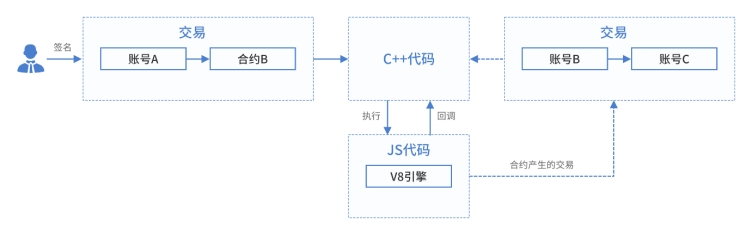
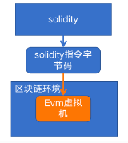

# 1.智能合约开发整体介绍

## 1.1 智能合约简介

智能合约是运行在星火链上的一组“动态代码”。可以认为它是星火链上承载具体业务场景和逻辑的软件实现，特点是以星火链为执行的输入和输出环境，可以动态地部署和使用。目前星火链已经支持使用`JavaScript`、`Solidity`进行智能合约开发，很快将支持`C++`。本章节将介绍各种语言合约的编写环境、编写、编译以及部署等相关知识。

智能合约类型根据使用的运行时类型，整体上可以分为`Solidity`和`JavaScriptVM`运行的合约二个大类。`JavaScriptVM`可将代码直接翻译成二进制机器码在物理机上执行，执行效率高，而且是一种可移植、加载高效、平台无关的字节码格式，能在平台上以接近原生的速度执行程序，这两项技术可以为`JavaScriptVM` 提供良好的基础功能支撑。`Solidtiy`合约和以太坊类似，先编译成`Solidity`字节码，然后再进行部署和调用。二种类型合约的执行原理如下图：

    JavaScriptVM合约执行流程

    EVM合约执行流程

## 1.2 智能合约的开发过程

智能合约的开发需要经过选择开发语言、开发工具、编写合逻辑代码、编译合约、部署合约和调用合约几个过程。

## 1.3 智能合约开发注意事项

1. 智能合约中不要使用带有随机性的函数，以避免在不同的机器上合约执行结果不一致，从而导致交易无法达成共识。
2. 智能合约中避免使用多线程（或者多协程），避免出现随机性，从而导致交易无法达成共识。
3. 智能合约中不要使用全局变量、静态变量，需要将合约的函数设计成无状态的，每次运行结果具有确定性，不依赖于全局变量或者静态变量，避免在不同的节点运行结果不一致，从而无法达成共识。
