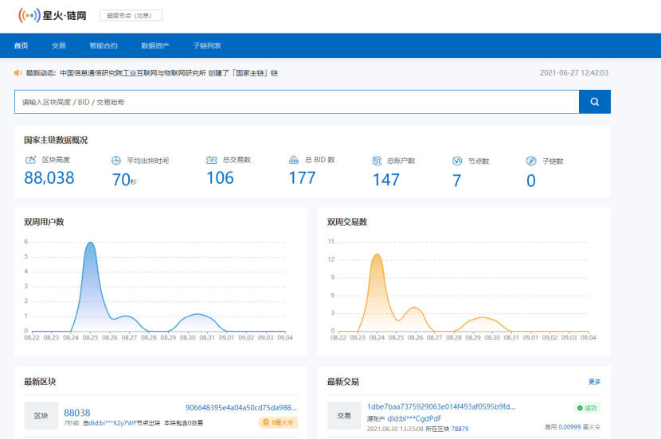
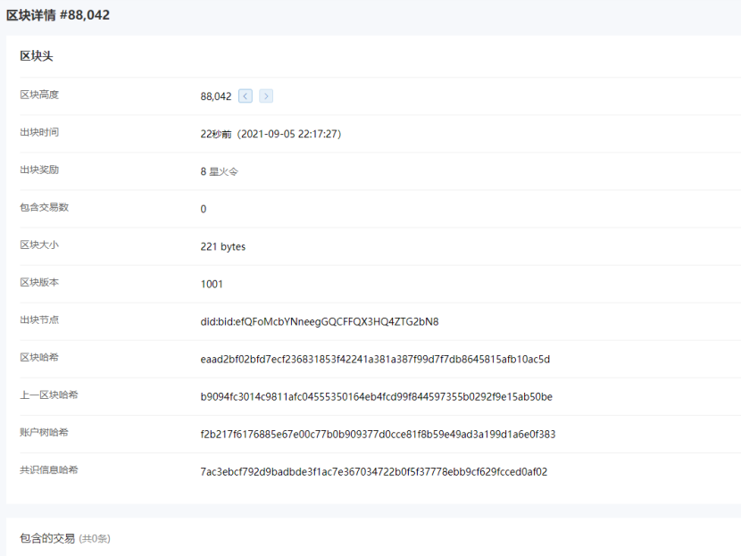
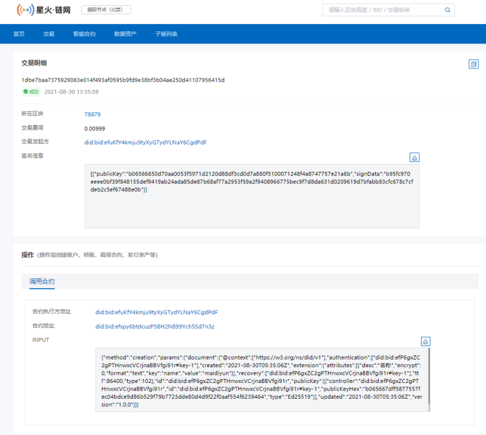
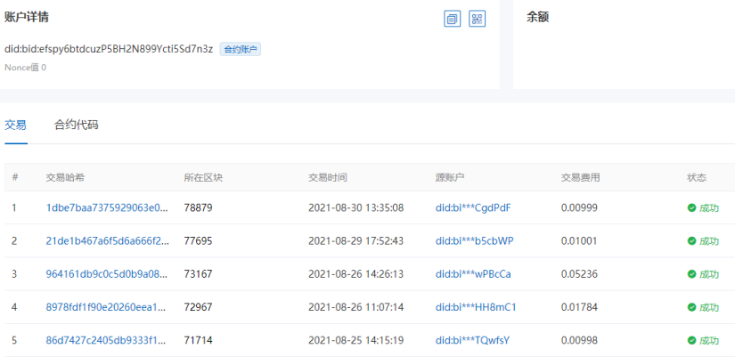
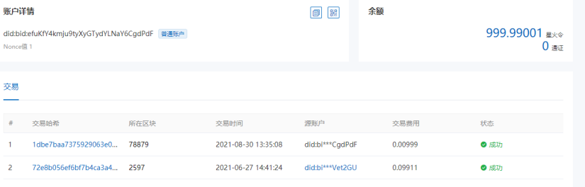
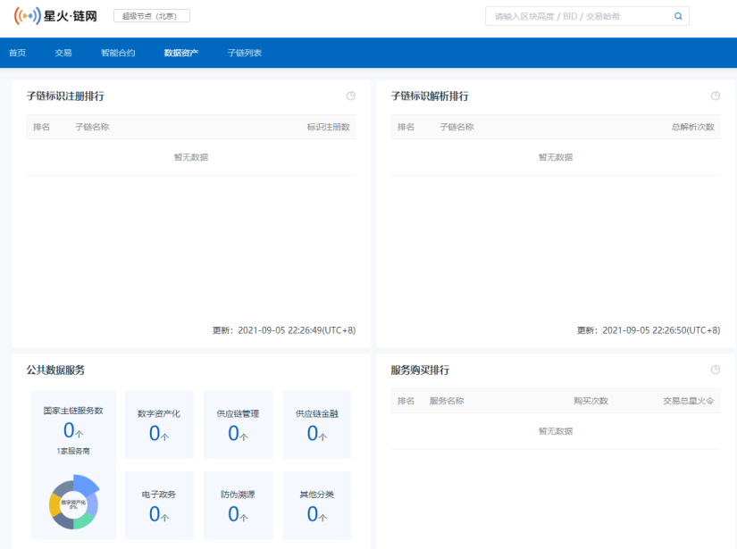

# 6.区块链浏览器使用说明

**[区块链浏览器](http://test-explorer.bitfactory.cn/)**

## 6.1产品概述
区块链浏览器是星火链上的一种数据可视化工具，用户可以通过web页面，直接在浏览器上查看星火链的节点、区块、交易信息和子链信息、标识使用信息等，用以验证交易等区块链常用操作。

## 6.2 功能模块

### 6.2.1 主链概览信息
星火链的总体性概述，可以查看主链的整体运行结构，一般包括当前的当前区块高度、交易总量、节点概况、最新（若干条）的出块信息、最新（若干条）的交易信息、用户活跃信息、接入的子链和标识使用信息等等。 

### 6.2.2 区块信息
在区块链浏览器中，区块信息展示包括区块列表和单一区块的详情，以及包含的交易概要信息。 

### 6.2.3 交易信息
包括转账交易和合约调用等。主要包含交易时间、所属区块、交易状态、交易费用、发起账户、目标账户等信息，还有的会包括调用的合约信息等。 

### 6.2.4 智能合约信息
合约信息的展示主要包括合约的名字、合约所用语言的版本以及代码内容，以及调用该合约产生的交易等。 

### 6.2.5 账户信息
汇集该账户项下的所有交易进行展示，一般包括基本信息和交易信息。

### 6.2.6 数据资产信息
可以查看星火链的子链标识注册量、解析量，公共服务使用情况，数据资源交易情况和星火令持有情况等。 

## 6.3 应用场景
区块链浏览器作为星火链的开放功能，任何人都可以从浏览器获取星火链的运行情况和子链标识、服务生态。 星火链用户可以在交易执行、合约调用后，通过区块链浏览器核验链上的记录。

