# 8.开发工具包使用说明

## 8.1环境准备

1、镜像说明

| 镜像名称            | 镜像地址                               | 镜像说明                  |
| ------------------- | -------------------------------------- | ------------------------- |
| bif-base-module     | caictdevelop/bif-base-module:1.0.0     | 包含mysql数据库/redis服务 |
| bif-cide-server     | caictdevelop/bif-cide-server:1.0.0     | 合约编辑器前后端服务      |
| bif-explorer-server | caictdevelop/bif-explorer-server:1.0.0 | 区块链浏览器前后端服务    |

**注意：**

mysql/redis服务账号密码采用druid加密，配置使用默认即可，如需明文密码可联系郭世杰(guoshijie@caict.ac.cn)。

2、导入bif-base-module镜像到服务器

```
拉取镜像
docker pull caictdevelop/bif-base-module:1.0.0
```

3、查看镜像

```
docker images
```

4、准备镜像的启动yml

bif-base-module

```
version: '2'
services:
    centos-server:
        container_name: bif-base-module
        image: 'caictdevelop/bif-base-module:1.0.0'
        restart: always
        stdin_open: true
        tty: true
        network_mode: host
```

5、执行yml文件

```
docker-compose -f docker-compose-base.yml up -d
```

6、查看容器启动情况

```
docker ps -a
```

## 8.2合约编辑器

### 8.2.1环境准备

1、导入镜像到服务器

```
拉取镜像
docker pull caictdevelop/bif-cide-server:1.0.0
```

2、查看镜像

```
docker images
```

3、准备镜像的启动yml

bif-cide-server

```
version: '2'
services:
    centos-server:
        container_name: bif-cide-server
        image: 'caictdevelop/bif-cide-server:1.0.0'
        restart: always
        stdin_open: true
        tty: true
        network_mode: host
        environment:
        # 时区
        - TZ=Asia/Shanghai
        # mysql的IP地址，账号密码采用druid加密
        - MYSQL_HOST=127.0.0.1
        # mysql的端口号,无需修改
        - MYSQL_PORT=39221
        # mysql的用户名
        - MYSQL_USER=xhapp
        # mysql的解密公钥,无需修改
        - MYSQL_PUBLIC_KEY=MFwwDQYJKoZIhvcNAQEBBQADSwAwSAJBAK6SW3PO3vjms8wSDUvXLSqyBc6N++HisGNgNym60EaIX0BP6OR8ibLm/Ja6t1TeEFJwT8BGA39a4v96iFe5I+ECAwEAAQ==
        # mysql的加密密码,无需修改
        - MYSQL_PASSWORD=caK2pbfsCR1yqSJGvZx7O+F5ian03smsFQhb/TBxnsVNbCjp86XAp5Ai8fCwbH+mgc4BzvVPQJ+yXcSyzXUOJQ==
        # redis的IP地址,账号密码采用druid加密,明文密码请联系guoshijie@caict.ac.cn
        - REDIS_HOST=127.0.0.1
        # redis的端口号,无需修改
        - REDIS_PORT=63799
        # redis的解密公钥,无需修改
        - REDIS_PUBLIC_KEY=MFwwDQYJKoZIhvcNAQEBBQADSwAwSAJBALrbVaKeq/DMUu+TE/MoL6Rcko9+D+2+6oMTRSLaL+fwEr8TiZ09U8B1CQW1uGvzn3BM2k6np8eUD3hwBmhCv+8CAwEAAQ==
        # redis的加密密码,无需修改
        - REDIS_PASSWORD=CsFAPkst3olPJMRw+Ba7jwO4EfcXvEG5Vae4+PdUpVo4AZOcUD2OuOCuUCssNWGfJVnO7sNayyhiCI2gFiBkGw==
```

4、执行yml文件

```
docker-compose -f docker-compose-cide.yml up -d
```

5、查看容器启动情况

```
docker ps -a
```

### 8.3.2使用示例

#### 1.访问合约部署地址

```
#将localhost替换成实际部署的服务器IP地址
localhost:8090
```

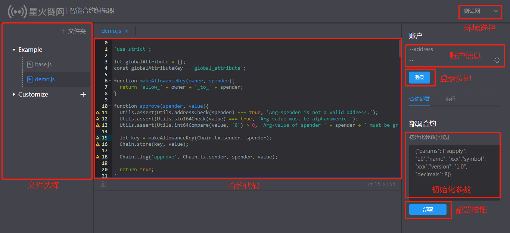

#### 2.授权登录

点击登录按钮，召唤钱包([浏览器插件钱包](https://bif-doc.readthedocs.io/zh_CN/2.0.0/bid/%E6%B5%8F%E8%A7%88%E5%99%A8%E6%8F%92%E4%BB%B6%E9%92%B1%E5%8C%85.html)使用教程)。

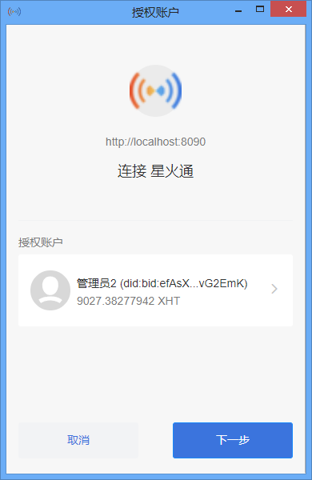

登录完成后显示账号和余额。

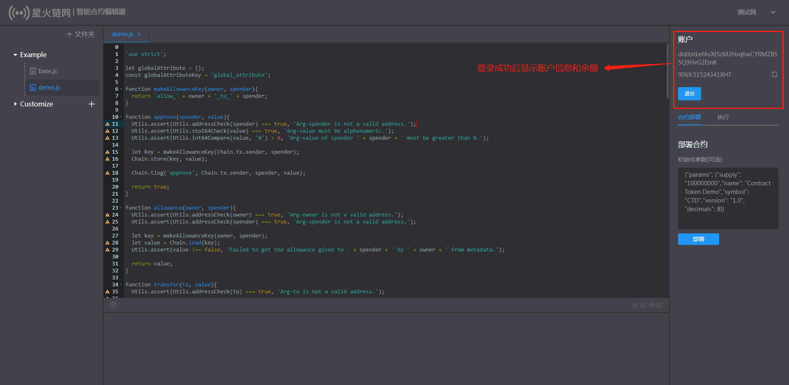

#### 3.自定义节点

合约编辑器支持增加自定义节点，通过点击右上角箭头，可以将环境切换到自定义节点上。

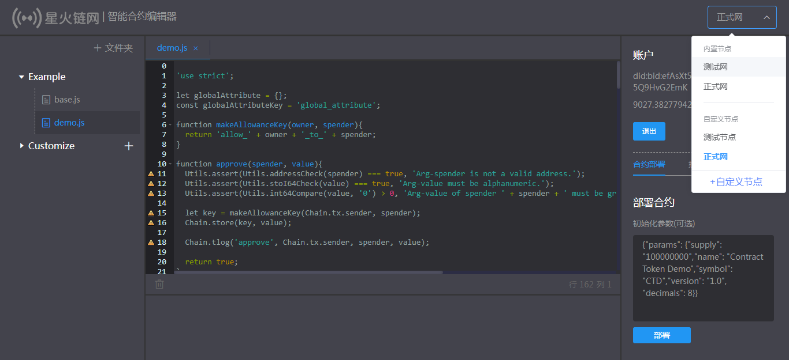

点击上图下拉框最下方+自定义节点，打开自定义节点列表页面，在这里可以看到所有自定义节点，并且可以选择删除对应的自定义节点。

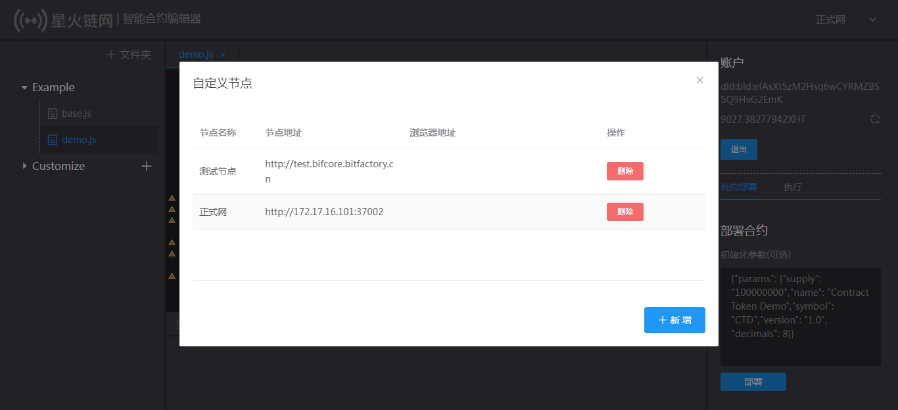

点击自定义节点列表页面的右下角新增按钮，可以打开新增自定义节点页面，点击保存时会校验节点地址是否可用，如果节点地址不可用，将无法成功保存新增的节点信息。

**备注：此处浏览器地址可以配置下方的区块链浏览器的地址（格式：http://{IP}:{端口}/tx/）**

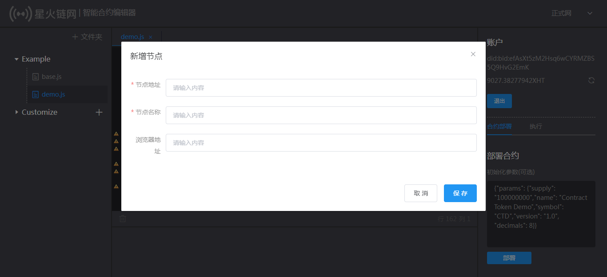

#### 4.部署合约

合约的初始化函数是 `init`, 合约部署时自动由虚拟机引擎直接调用`init`进行合约账户数据的初始化，

输入初始化参数后，点击部署按钮会召唤出钱包进行签名，点击签名后，完成合约部署。

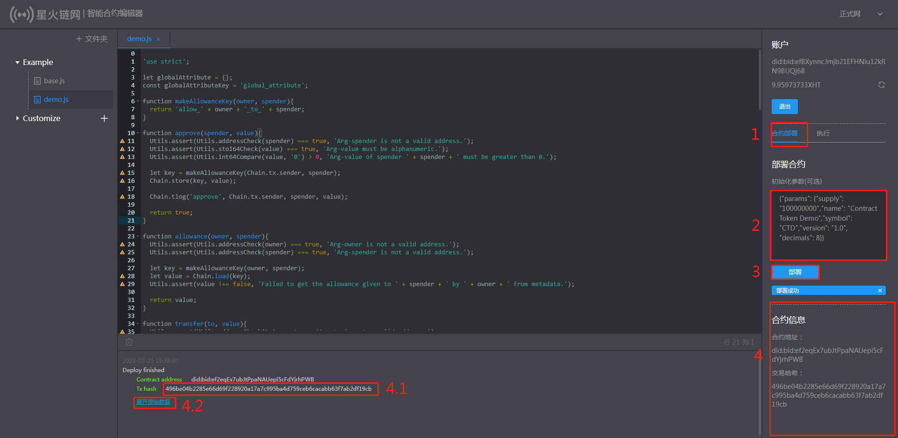

##### 4.1成功条件

1.账户处于登录状态，且钱包签名用户和当前登录用户一致；

2.账户余额充足；

3.初始化数据格式和参数名称正确；

##### 4.2操作流程

（参见图片中数字序号）

1.点击合约部署；

2.输入初始化参数；

3.点击部署按钮；

4.部署成功后展示合约信息；

​	4.1.点击交易hash可以跳转到对应的区块链浏览器查看交易详情；

​	4.2.点击展开原始数据可以查看交易详情；

##### 4.3查询合约部署交易详情

如果配置了浏览器地址，可以点击hash跳转到对应的区块链浏览器查看合约部署交易详情。

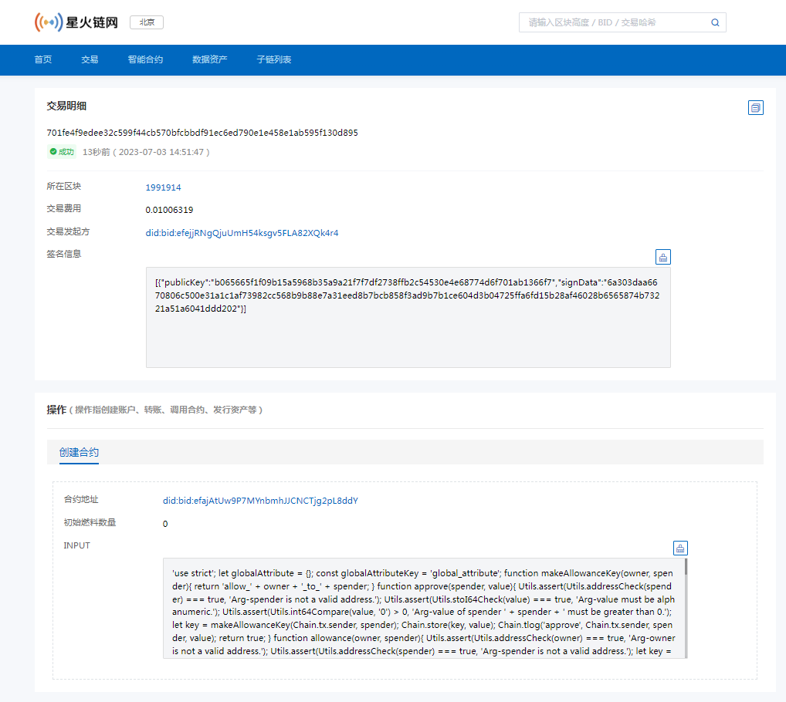

如果没有配置浏览器地址，可以通过展开原始数据按钮查看合约部署交易详情。

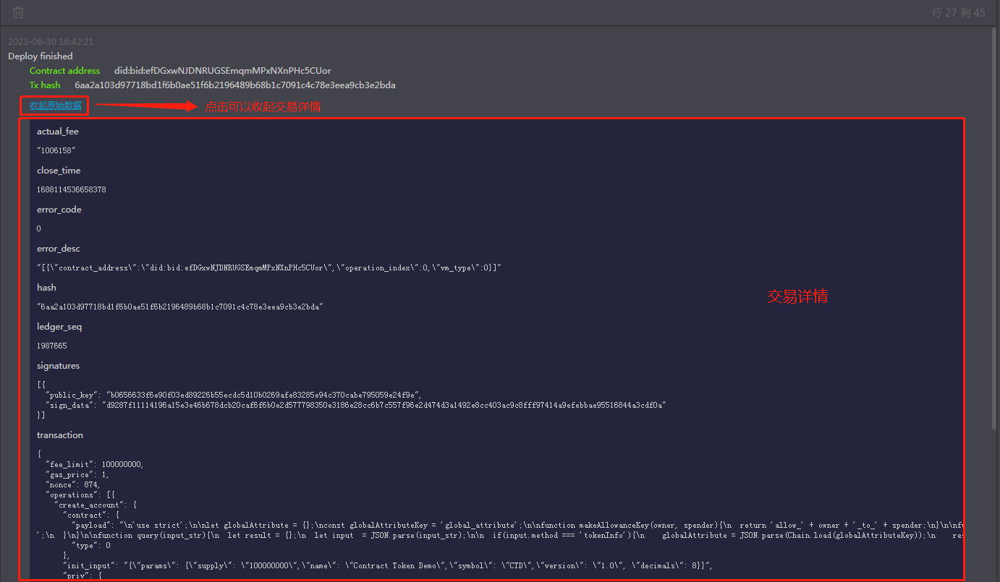

#### 5.合约调用

合约执行的入口函数是 `main`函数，`main`中可实现不同的功能接口，并通过参数字符串`input`选择不同接口。`main`函数入口仅支持合约调用者以**星火交易**方式进行调用，内部功能接口可实现合约数据存储相关操作（可实现读写功能）。

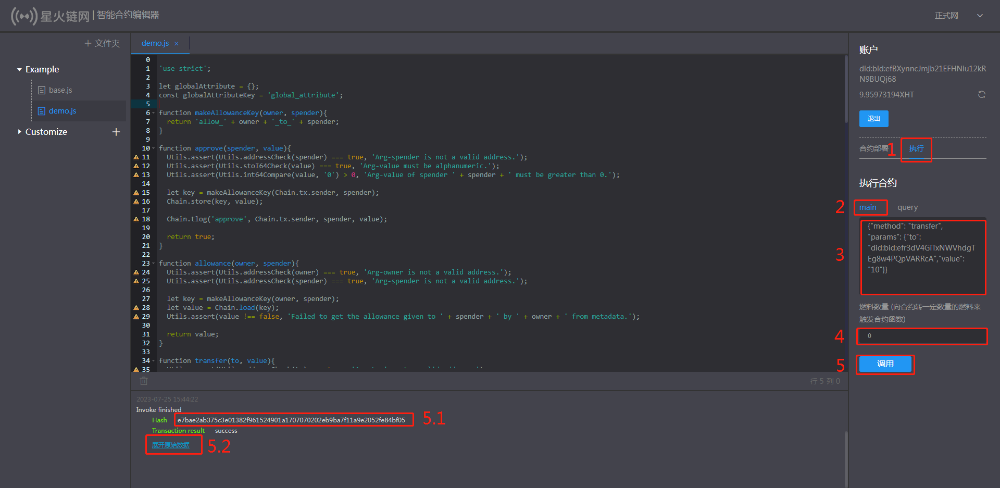

##### 5.1成功条件

1.账户处于登录状态，且钱包签名用户和当前登录用户一致；

2.账户余额充足；

3.初始化数据格式和参数名称正确；

##### 5.2操作流程

（参见图片中数字序号）

1.点击执行；

2.点击main；

3.输入初始化参数；

4.输入燃料数量；

5.点击调用按钮；

​	5.1.点击交易hash可以跳转到对应的区块链浏览器查看交易详情；

​	5.2.点击展开原始数据可以查看交易详情；

##### 5.3查询交易详情

如果配置了浏览器地址，可以点击hash跳转到对应的区块链浏览器查看合约调用交易详情。

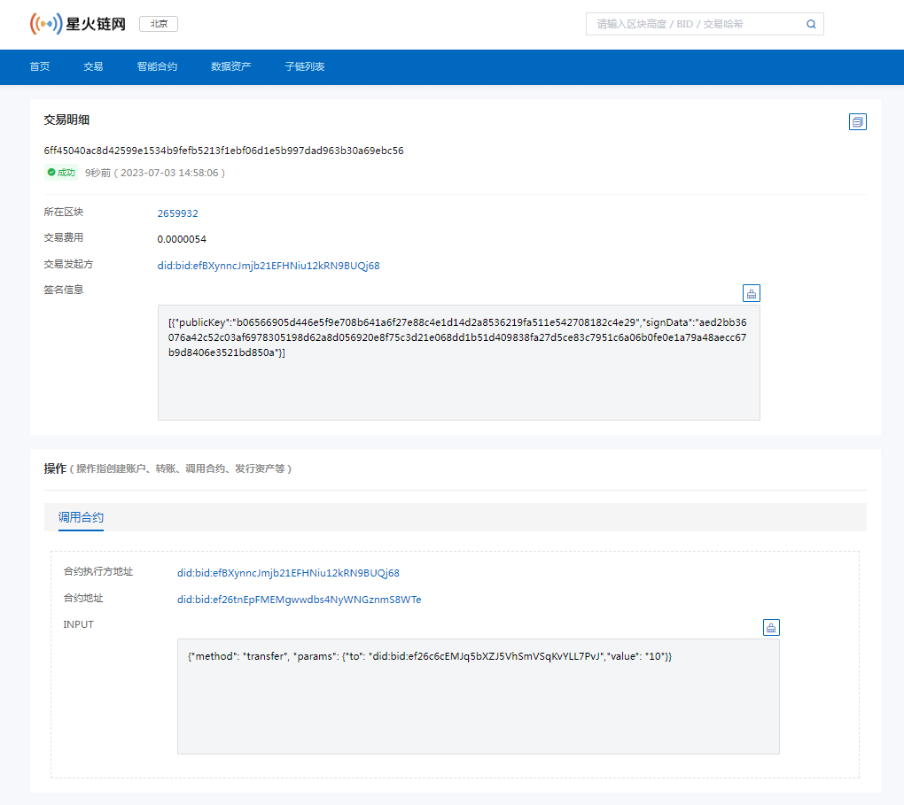

如果没有配置浏览器地址，可以通过展开原始数据按钮查看合约调用交易详情。

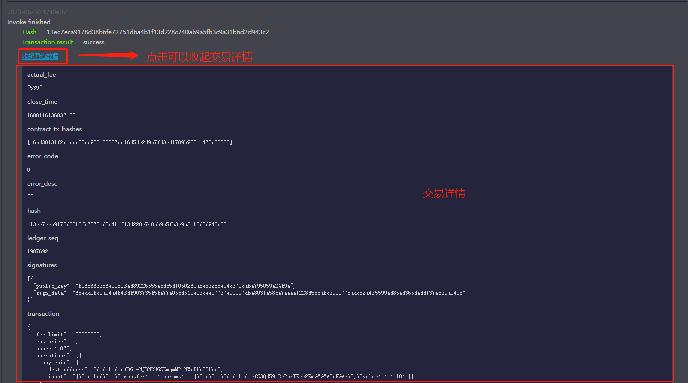

#### 6.合约查询

合约查询接口是 `query`函数，`query`中可实现不同的查询功能接口，并通过参数字符串`input`选择不同接口。`query`函数入口仅支持合约调用者以**查询接口**进行调用，内部功能接口可用于合约账户中数据的读取，禁止进行合约数据存储相关操作。调用过程不需消耗星火令(只读功能)。

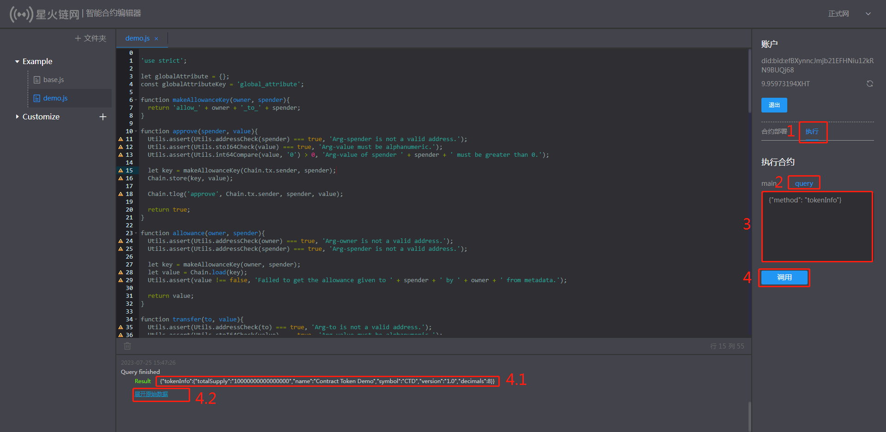

##### 6.1成功条件

1.账户处于登录状态，且钱包签名用户和当前登录用户一致；

2.初始化数据格式和参数名称正确；

##### 6.2操作流程

（参见图片中数字序号）

1.点击执行；

2.点击query；

3.输入初始化数据；

4.点击调用；

​	4.1.此处展示查询结果；

​	4.2.点击展开原始数据可以查看交易详情；

## 8.3区块链浏览器

### 8.3.1环境准备

1、导入镜像到服务器

```
拉取镜像
docker pull caictdevelop/bif-explorer-server:1.0.0
```

2、查看镜像

```
docker images
```

3、准备镜像的启动yml

bif-explorer-server

```
version: '2'
services:
    centos-server:
        container_name: bif-explorer-server
        image: 'caictdevelop/bif-explorer-server:1.0.0'
        restart: always
        stdin_open: true
        tty: true
        network_mode: host
        environment:
        # 时区
        - TZ=Asia/Shanghai
        # mysql的IP地址，账号密码采用druid加密
        - MYSQL_HOST=127.0.0.1
        # mysql的端口号,无需修改
        - MYSQL_PORT=39221
        # mysql的用户名,无需修改
        - MYSQL_USER=xhapp
        # mysql的解密公钥,无需修改
        - MYSQL_PUBLIC_KEY=MFwwDQYJKoZIhvcNAQEBBQADSwAwSAJBAK6SW3PO3vjms8wSDUvXLSqyBc6N++HisGNgNym60EaIX0BP6OR8ibLm/Ja6t1TeEFJwT8BGA39a4v96iFe5I+ECAwEAAQ==
        # mysql的加密密码,无需修改
        - MYSQL_PASSWORD=caK2pbfsCR1yqSJGvZx7O+F5ian03smsFQhb/TBxnsVNbCjp86XAp5Ai8fCwbH+mgc4BzvVPQJ+yXcSyzXUOJQ==
        # 底层链的协议
        - CHAIN_PROTOCOL=http
        # 底层链的host
        - CHAIN_HOST=127.0.0.1
        # 底层链的端口
        - CHAIN_PORT=37002
        # redis的IP地址，账号密码采用druid加密,明文密码请联系guoshijie@caict.ac.cn
        - REDIS_HOST=127.0.0.1
        # redis的端口号,无需修改
        - REDIS_PORT=63799
        # redis的解密公钥,无需修改
        - REDIS_PUBLIC_KEY=MFwwDQYJKoZIhvcNAQEBBQADSwAwSAJBALrbVaKeq/DMUu+TE/MoL6Rcko9+D+2+6oMTRSLaL+fwEr8TiZ09U8B1CQW1uGvzn3BM2k6np8eUD3hwBmhCv+8CAwEAAQ==
        # redis的加密密码,无需修改
        - REDIS_PASSWORD=CsFAPkst3olPJMRw+Ba7jwO4EfcXvEG5Vae4+PdUpVo4AZOcUD2OuOCuUCssNWGfJVnO7sNayyhiCI2gFiBkGw==
        # websocket的地址
        - BLOCKCHAIN_URL=ws://127.0.0.1:7053/websocket
```

4、执行yml文件

```
docker-compose -f docker-compose-explorer.yml up -d
```

5、查看容器启动情况

```
docker ps -a
```

### 8.4.2使用示例

#### 1.产品概述

区块链浏览器是星火链上的一种数据可视化工具，用户可以通过web页面，直接在浏览器上查看星火链的节点、区块、交易信息等，用以验证交易等区块链常用操作。

#### 2.访问区块链浏览器地址

```
#将localhost替换成实际部署的服务器IP地址
localhost:8081
```

#### 3.主链概览信息

星火链的总体性概述，可以查看主链的整体运行结构，一般包括当前的当前区块高度、交易总量、账户总量、超级节点数、最新5条出块信息、最新5条交易信息等。

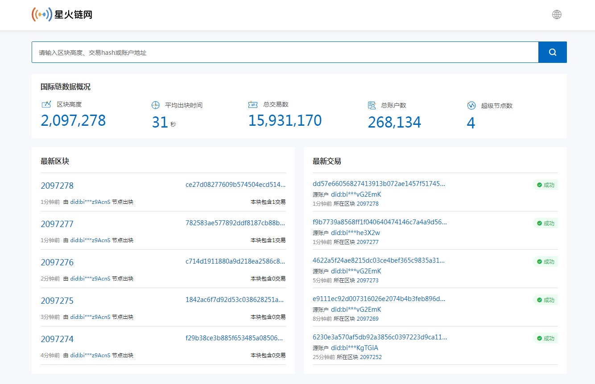

#### 4.区块信息

在区块链浏览器中，区块信息展示包括区块列表和单一区块的详情，以及包含的交易概要信息。

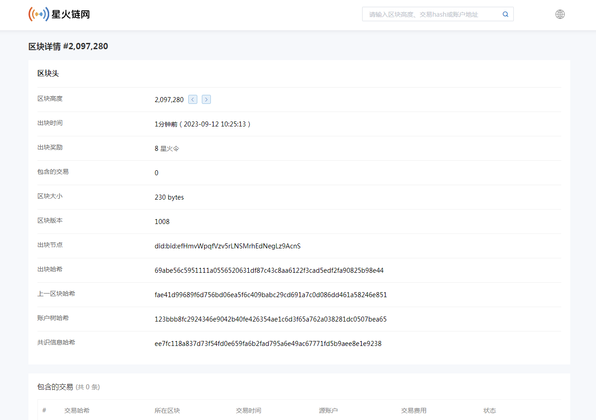

#### 5.交易信息

包括转账交易和合约调用等。主要包含交易时间、所属区块、交易状态、交易费用、发起账户、目标账户等信息，还有的会包括调用的合约信息等。

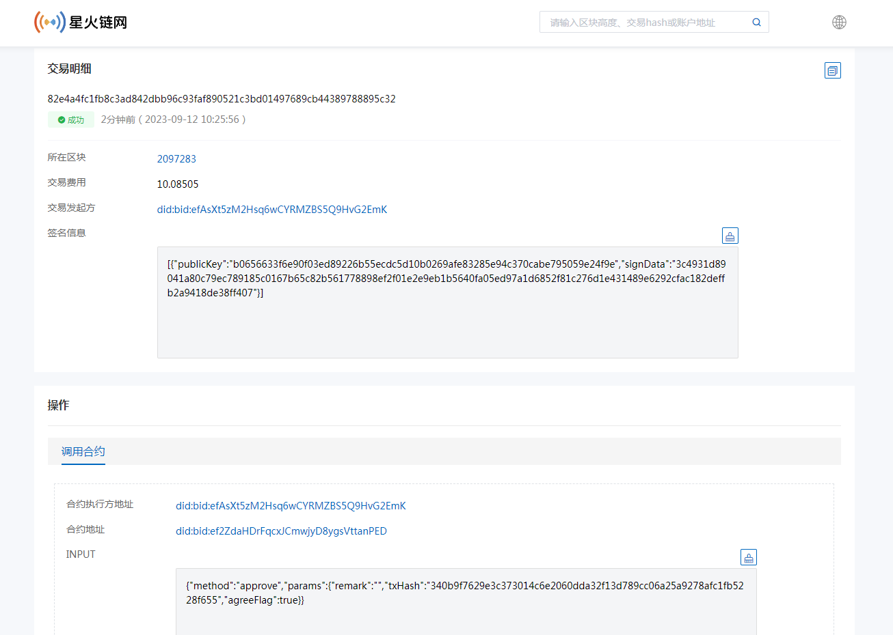

#### 6.智能合约信息

合约信息的展示主要包括账户信息、账户余额以及合约代码内容。

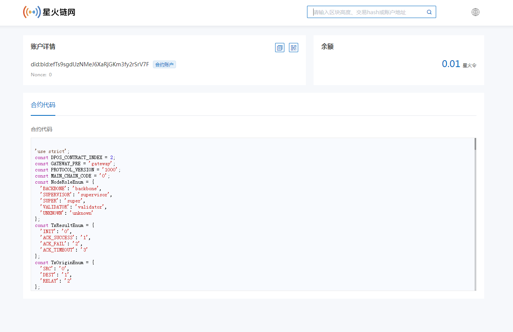

#### 7.账户信息

账户信息的展示主要包括账户信息、账户余额。

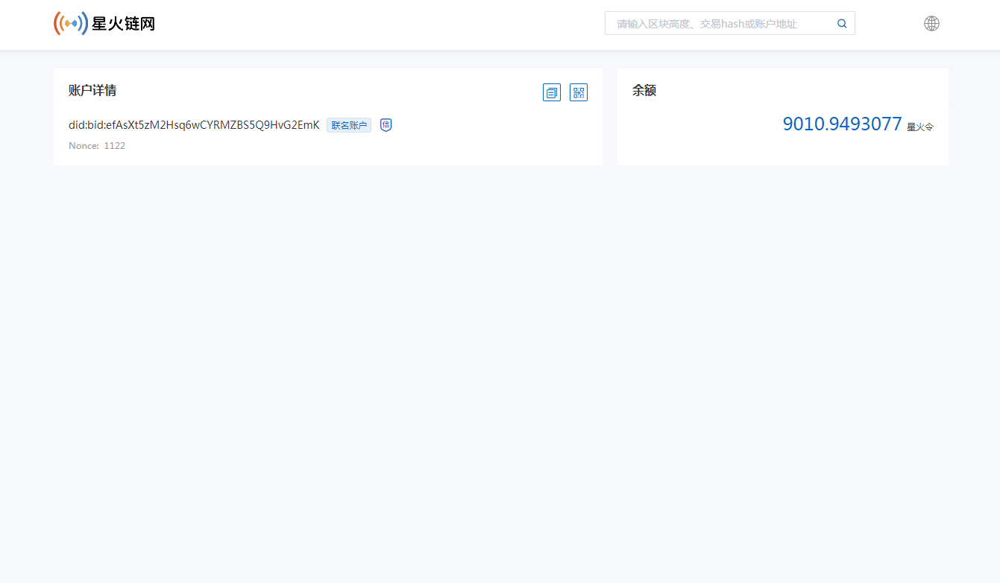