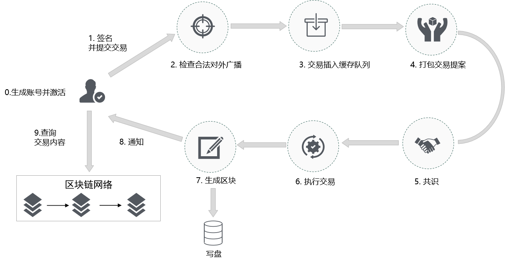

# 1.交易如何上链

## 1.1.广播交易

广播交易是指通过广播的方式发起交易。广播交易包括以下步骤：

1. [获取账户nonce值](https://bif-doc.readthedocs.io/zh_CN/2.0.0/instructions/JavaSDK%E4%BD%BF%E7%94%A8%E8%AF%B4%E6%98%8E.html#id8)
2. [构建操作](https://bif-doc.readthedocs.io/zh_CN/2.0.0/instructions/JavaSDK%E4%BD%BF%E7%94%A8%E8%AF%B4%E6%98%8E.html#id8)
3. [序列化交易](https://bif-doc.readthedocs.io/zh_CN/2.0.0/instructions/JavaSDK%E4%BD%BF%E7%94%A8%E8%AF%B4%E6%98%8E.html#id8)
4. [签名交易](https://bif-doc.readthedocs.io/zh_CN/2.0.0/instructions/JavaSDK%E4%BD%BF%E7%94%A8%E8%AF%B4%E6%98%8E.html#id8)
5. [提交交易](https://bif-doc.readthedocs.io/zh_CN/2.0.0/instructions/JavaSDK%E4%BD%BF%E7%94%A8%E8%AF%B4%E6%98%8E.html#id8)

### 操作结构

操作是指在交易在要做的事情，在构建操作之前，需要构建操作。目前操作有6种，分别是 `BIFAccountActivateOperation`、`BIFAccountSetMetadataOperation`、`BIFAccountSetPrivilegeOperation`、`BIFContractCreateOperation`、`BIFContractInvokeOperation`、`BIFGasSendOperation`

**BaseOperation**

BaseOperation是序列化接口中所有操作的基类。

| 成员变量      | 类型   | 描述                 |
| :------------ | :----- | :------------------- |
| sourceAddress | String | 选填，操作源账户地址 |
| metadata      | String | 选填，备注           |

### 操作对象

| 序号 | 操作                            | 描述                    |
| ---- | ------------------------------- | ----------------------- |
| 1    | BIFAccountActivateOperation     | 生成主链数字身份        |
| 2    | BIFAccountSetMetadataOperation  | 修改账户的metadatas信息 |
| 3    | BIFAccountSetPrivilegeOperation | 设置权限                |
| 4    | BIFContractCreateOperation      | 创建合约                |
| 5    | BIFContractInvokeOperation      | 合约调用                |
| 6    | BIFGasSendOperation             | 发起交易                |

## 1.2.数据上链过程

交易上链是指交易提交后，进入交易缓存队列（交易缓存池），发起打包交易提案并达成共识后，区块打包交易返回交易结果的过程。包括一下流程：

