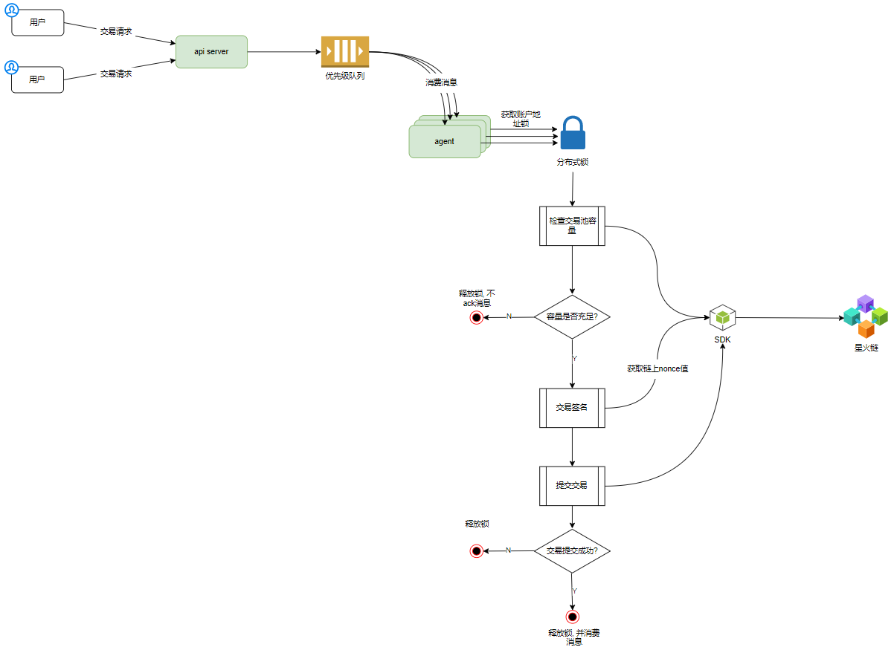
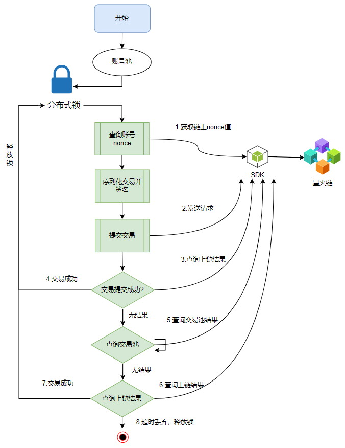
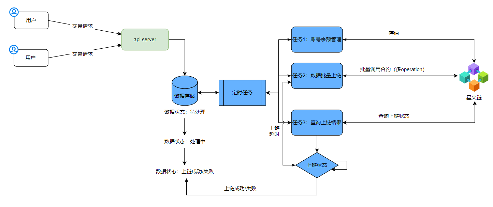
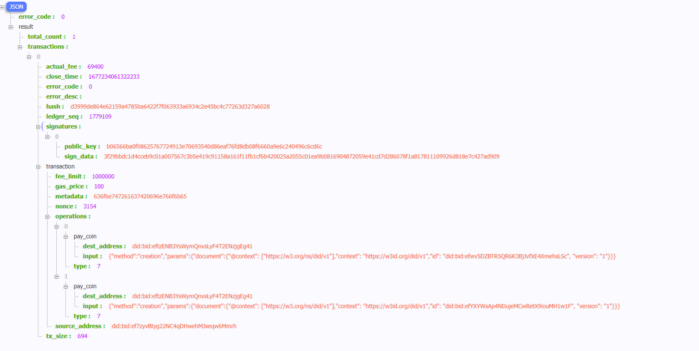

# 2.如何设计上链服务

## 2.1.代理上链

### 2.1.1.场景说明

星火链设计了和以太坊类似的账户模型，通过账户连续递增的nonce序号来防止出现重放攻击。

同一个账号下的所有交易必须具有唯一的nonce序号, 并且交易只能按照nonce从小到大按序入链, 中间不能有空，nonce值太小或者太大都将导致交易失败。

单个账号再执行交易过程中只能串行才能保证交易正常执行，无法满足多并发的场景。针对该场景我们推荐用户使用多个已激活的账号做为账号池，随机使用某一未被加锁账号进行交易，交易完成时释放该账号锁，进而实现账号交易实现异步上链，这样不仅可以保证上链交易的成功率，还能提高性能。

### 2.1.2.实现架构



### 2.1.3.账号管理实现

<p style="text-align: center;"></p>

#### 分布式锁之Redisson

本方案使用Redisson框架实现分布式锁。

#### 1. 加入jar包依赖

```java
<dependency>
   <groupId>org.redisson</groupId>
   <artifactId>redisson</artifactId>
   <version>3.11.0</version>
</dependency>
```

#### 2. 配置Redisson

```java
public class RedissonManager {
    private static Config config = new Config();
    //声明redisso对象
    private static Redisson redisson = null;
   //实例化redisson
 static{
     config.useSingleServer().setAddress("redis://127.0.0.1:6379");
   //得到redisson对象
 redisson = (Redisson) Redisson.create(config);

}

 //获取redisson对象的方法
    public static Redisson getRedisson(){
 return redisson;
    }
}
```

#### 3. 锁的获取和释放

```java
public class RedissonLock {
    //从配置类中获取redisson对象
    private static Redisson redisson = RedissonManager.getRedisson();
    private static final String LOCK_TITLE = "redisLock_";
    //加锁
    public static boolean acquire(String lockName){
 //声明key对象
 String key = LOCK_TITLE + lockName;
 //获取锁对象
 RLock mylock = redisson.getLock(key);
 //加锁，并且设置锁过期时间，防止死锁的产生
 mylock.lock(2, TimeUnit.MINUTES);
 System.err.println("======lock======"+Thread.currentThread().getName());
 //加锁成功
 return  true;
    }
    //锁的释放
    public static void release(String lockName){
 //必须是和加锁时的同一个key
 String key = LOCK_TITLE + lockName;
 //获取所对象
 RLock mylock = redisson.getLock(key);
 //释放锁（解锁）
 mylock.unlock();
 System.err.println("======unlock======"+Thread.currentThread().getName());
    }
}
```

#### 4. 模拟获取分布式锁

```java
/**
 * 获取分布式锁
 */
public class TransactionDemo {
    private static BIFSDK sdk = BIFSDK.getInstance(SampleConstant.SDK_INSTANCE_URL);
    private static Redisson redisson = RedissonManager.getRedisson();

    public static void main(String[] args) {

 //参数
 String senderAddress1="did:bid:efLrPu7LNR4YwA5M1Kfx6BYb1JP7aPKp";
 String senderPrivateKey1="priSPKteVqGoNgtKE68ZjNHAbGJsNvV9nTBkTLMYTGhVjsBY5R";

 String senderAddress2="did:bid:efBdagu8sVkJWEw5kLt1w69bxa85Kuag";
 String senderPrivateKey2="priSPKmCQMrjCcRgV3u2VsYhujf7QsG7Kr6Tgm94AbzCge46d8";
 //账号集合
 List<String> availableAccAddr = new ArrayList<String>();
 availableAccAddr.add(senderAddress1+";"+senderPrivateKey1);
 availableAccAddr.add(senderAddress2+";"+senderPrivateKey2);
 //目的地址
 String destAddress="did:bid:efnVUgqQFfYeu97ABf6sGm3WFtVXHZB2";
 Long feeLimit=1000000L;
 Long gasPrice=100L;
 //交易对象
 BIFGasSendOperation gasSendOperation= new BIFGasSendOperation();
 gasSendOperation.setAmount(1L);
 gasSendOperation.setDestAddress(destAddress);
 while (true) {
     try {
  Thread.sleep(1000);
  new transaction(availableAccAddr,feeLimit,gasPrice,0,gasSendOperation).start();
     }catch (Exception e) {
  e.printStackTrace();
  break;
     }
 }
 System.out.println("END");
    }

    static class transaction extends Thread{
 List<String> availableAccAddr;
 Long feeLimit;
 Long gasPrice;
 BIFBaseOperation operation;
 Integer domainId;
 public transaction(List<String> availableAccAddr,Long feeLimit,Long gasPrice,Integer domainId,BIFBaseOperation operation ) {
     this.availableAccAddr = availableAccAddr;
     this.feeLimit = feeLimit;
     this.gasPrice = gasPrice;
     this.domainId = domainId;
     this.operation = operation;
 }

 @Override
 public void run() {
     //随机获取交易账号
     int index = new Random().nextInt(availableAccAddr.size());
     String senderAddress=availableAccAddr.get(index).split(";")[0];
     String senderPrivateKey=availableAccAddr.get(index).split(";")[1];
     //加锁
     RedissonLock.acquire(senderAddress);
     System.out.println("线程"+ Thread.currentThread().getName() +"获得分布式锁:"+senderAddress);
     try {
  //获取账号nonce值
  Long nonce=0L;
  BIFAccountGetNonceRequest request = new BIFAccountGetNonceRequest();
  request.setAddress(senderAddress);
  RMap<Object, Object> redisHash = redisson.getMap(senderAddress);
  if(!redisHash.isEmpty()){
      //设置过期时间
      redisHash.expire(60, TimeUnit.SECONDS);
      nonce=Long.parseLong(redisHash.get("nonce").toString());
  }else{
      // 调用getNonce接口
      BIFAccountGetNonceResponse response = sdk.getBIFAccountService().getNonce(request);
      if (0 == response.getErrorCode()) {
   nonce=response.getResult().getNonce()+1;
      }
  }
  //序列化交易
  BIFTransactionSerializeRequest serializeRequest = new BIFTransactionSerializeRequest();
  serializeRequest.setSourceAddress(senderAddress);
  serializeRequest.setNonce(nonce);
  serializeRequest.setFeeLimit(feeLimit);
  serializeRequest.setGasPrice(gasPrice);
  serializeRequest.setOperation(operation);
  serializeRequest.setDomainId(domainId);
  // 调用buildBlob接口
  BIFTransactionSerializeResponse serializeResponse = sdk.getBIFTransactionService().BIFSerializable(serializeRequest);
  System.out.println("serializeResponse:"+ JsonUtils.toJSONString(serializeResponse.getResult()));
  if (!serializeResponse.getErrorCode().equals(Constant.SUCCESS)) {
      throw new SDKException(serializeResponse.getErrorCode(), serializeResponse.getErrorDesc());
  }
  String transactionBlob = serializeResponse.getResult().getTransactionBlob();
  System.out.println("transactionBlob:"+transactionBlob);
  //签名交易
  byte[] signBytes = PrivateKeyManager.sign(HexFormat.hexToByte(transactionBlob), senderPrivateKey);
  String publicKey = PrivateKeyManager.getEncPublicKey(senderPrivateKey);
  //提交交易
  BIFTransactionSubmitRequest submitRequest = new BIFTransactionSubmitRequest();
  submitRequest.setSerialization(transactionBlob);
  submitRequest.setPublicKey(publicKey);
  submitRequest.setSignData(HexFormat.byteToHex(signBytes));
  // 调用bifSubmit接口
  BIFTransactionSubmitResponse transactionSubmitResponse = sdk.getBIFTransactionService().BIFSubmit(submitRequest);
  if (transactionSubmitResponse.getErrorCode() == 0) {
      System.out.println(senderAddress+ " ,hash: "+transactionSubmitResponse.getResult().getHash());

      BIFTransactionGetInfoRequest requestHash = new BIFTransactionGetInfoRequest();
      requestHash.setHash(transactionSubmitResponse.getResult().getHash());
      BIFTransactionGetInfoResponse response = sdk.getBIFTransactionService().getTransactionInfo(requestHash);
      int num=0;
      while (response.getErrorCode() != 0) {
   try{
       Thread.sleep(1000);
       response= sdk.getBIFTransactionService().getTransactionInfo(requestHash);
       num++;
       System.out.println("num    "+num);
       if(num>=120){
    break;
       }
   }catch (Exception e) {
       e.printStackTrace();
   }
      }
      while (response.getErrorCode() != 0) {
   try{
       Thread.sleep(300000);
       BIFTransactionCacheRequest cacheRequest=new BIFTransactionCacheRequest();
       cacheRequest.setHash(transactionSubmitResponse.getResult().getHash());
       BIFTransactionCacheResponse responseTxCacheDataHash = sdk.getBIFTransactionService().getTxCacheData(cacheRequest);
       if (responseTxCacheDataHash.getErrorCode() != 0) {
    response= sdk.getBIFTransactionService().getTransactionInfo(requestHash);
    if(response.getErrorCode()!=0){
        break;
    }
       }
   }catch (Exception e) {
       e.printStackTrace();
   }
      }
      if(response.getErrorCode() == 99){ //99：nonce值过小
   // 调用getNonce接口
   BIFAccountGetNonceResponse  nonceResponse = sdk.getBIFAccountService().getNonce(request);
   if (0 == nonceResponse.getErrorCode()) {
       nonce=nonceResponse.getResult().getNonce();
   }
      }
      //更新nonce值
      nonce=nonce+1;
      redisHash.put("nonce",Long.toString(nonce));
      RedissonLock.release(senderAddress);
      System.out.println("线程"+Thread.currentThread().getName()+"释放分布式锁");
  }
     } catch (Exception e) {
  e.printStackTrace();
     }
 }
    }
}

```

## 2.2.批量上链

### 2.2.1.场景说明

星火链原生支持批量合约调用，即一笔交易可多次调用相同或者不同合约。用户处理事件过程中涉及多个合约调用、同一合约多次调用时，可使用该接口，保证事务的**一致性**，同时可减少交易次数，节省交易费用。

### 2.2.2.实现架构



### 2.2.3.批量调用合约

账号`did:bid:ef7zyvBtyg22NC4qDHwehMJxeqw6Mmrh`通过一笔交易完成`2`次合约`did:bid:eftzENB3YsWymQnvsLyF4T2ENzjgEg41`方法调用，该操作可保证事务的**一致性**，同时减少交易的次数进而节省交易费用。

```java
 // 初始化参数
 String senderAddress = "did:bid:ef7zyvBtyg22NC4qDHwehMJxeqw6Mmrh";
 String contractAddress = "did:bid:eftzENB3YsWymQnvsLyF4T2ENzjgEg41";
 String senderPrivateKey = "priSPKr2dgZTCNj1mGkDYyhyZbCQhEzjQm7aEAnfVaqGmXsW2x";
 Long amount = 0L;
 String destAddress1 = KeyPairEntity.getBidAndKeyPair().getEncAddress();
 String destAddress2 = KeyPairEntity.getBidAndKeyPair().getEncAddress();
 String input1 = "{\"method\":\"creation\",\"params\":{\"document\":{\"@context\": [\"https://w3.org/ns/did/v1\"],\"context\": \"https://w3id.org/did/v1\"," +
  "\"id\": \""+destAddress1+"\", \"version\": \"1\"}}}";
 String input2 = "{\"method\":\"creation\",\"params\":{\"document\":{\"@context\": [\"https://w3.org/ns/did/v1\"],\"context\": \"https://w3id.org/did/v1\"," +
  "\"id\": \""+destAddress2+"\", \"version\": \"1\"}}}";

 List<BIFContractInvokeOperation> operations = new ArrayList<BIFContractInvokeOperation>();
 //操作对象1
 BIFContractInvokeOperation operation1=new BIFContractInvokeOperation();
 operation1.setContractAddress(contractAddress);
 operation1.setBIFAmount(amount);
 operation1.setInput(input1);
 //操作对象2
 BIFContractInvokeOperation operation2=new BIFContractInvokeOperation();
 operation2.setContractAddress(contractAddress);
 operation2.setBIFAmount(amount);
 operation2.setInput(input2);

 operations.add(operation1);
 operations.add(operation2);

 BIFBatchContractInvokeRequest request = new BIFBatchContractInvokeRequest();
 request.setSenderAddress(senderAddress);
 request.setPrivateKey(senderPrivateKey);
 request.setOperations(operations);
 request.setRemarks("contract invoke");

 // 调用 bifContractInvoke 接口
 BIFContractInvokeResponse response = sdk.getBIFContractService().batchContractInvoke(request);
 if (response.getErrorCode() == 0) {
     System.out.println(JsonUtils.toJSONString(response.getResult()));
 } else {
     System.out.println(JsonUtils.toJSONString(response));
 }
```

#### 执行结果：

