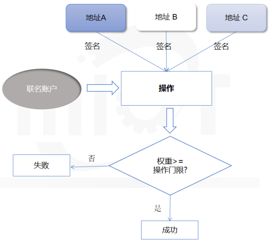
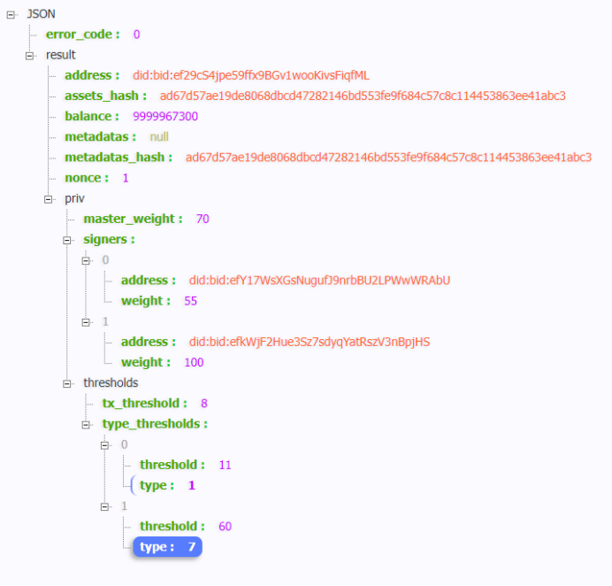
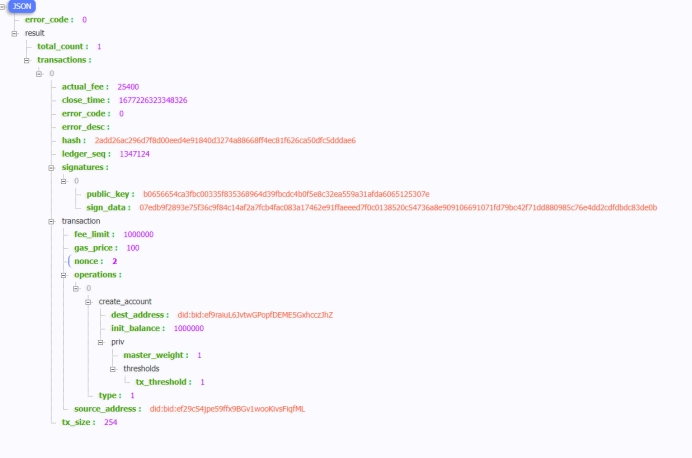
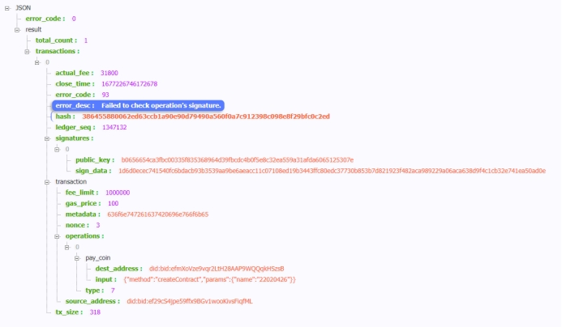

# 3.如何进行账号权限托管

星火链原生支持联名账户，即支持多个账户地址操作同一账户，同时可以控制不同地址拥有不同的权限，实现不同地址对同一账户的不同操作拥有不同的权限，达到精确的权限控制。

## 场景说明

通过设置签名者拥有的权重，设置各个操作所需要的门限，进而实现控制权的分配。账号A设置签名者权重给账号B,账号B可代替账号A签名完成交易而无需账号A签名。

该操作用于设置账户权限。包括签名者权重列表、交易门限、指定类型交易门限。

<p style="text-align: center;"></p>
<center style="font-weight:bold;">
    联名账户权限操作流程图
</center>


## 3.1 控制权分配

您在创建一个账号时，可以通过设置账户priv属性指定这个账户的控制权分配。您可以设置。下面是一个简单的例子：

```javascript
{
	"address": "did:bid:ef29cS4jpe59ffx9BGv1wooKivsFiqfML",
	"master_weight": "70", //本地址私钥拥有的权限值 70 
	"signers": [ //分配出去的限力 
		{
			"address": "did:bid:efY17WsXGsNugufJ9nrbBU2LPWwWRAbU",
			"weight": 55 //上面这个地址拥有权限值55 
		},
		{
			"address": "did:bid:efkWjF2Hue3Sz7sdyqYatRszV3nBpjHS",
			"weight": 100 //上面这个地址拥有权限值100 
		}
	  ],
	"tx_threshold": "8", //发起交易需要权限值 8 
	"type_thresholds": [{ //创建账号需要权限值 11  
			"type": 1,
			"threshold": 11
		},
		{ //调用合约需要权限值 60
			"type": 7,
			"threshold": 60
		}

	]}
```

&nbsp;&nbsp;&nbsp;&nbsp;&nbsp;&nbsp;&nbsp;&nbsp;上面是账户`did:bid:ef29cS4jpe59ffx9BGv1wooKivsFiqfML`的账户属性，可以看到，该账户分别给地址`did:bid:efY17WsXGsNugufJ9nrbBU2LPWwWRAbU`和`did:bid:efkWjF2Hue3Sz7sdyqYatRszV3nBpjHS`分配了操作权限，`did:bid:efY17WsXGsNugufJ9nrbBU2LPWwWRAbU`拥有的权限值为`55`， 创建账户交易需要的权限值是`11`，调用合约需要的权限值是`60`， 因此地址`did:bid:efY17WsXGsNugufJ9nrbBU2LPWwWRAbU`可以使用账户`did:bid:ef29cS4jpe59ffx9BGv1wooKivsFiqfML`发起创建新账户的交易，无法使用账户`did:bid:ef29cS4jpe59ffx9BGv1wooKivsFiqfML`发起调用合约的交易。

## 3.2 初始化SDK

```java
import cn.bif.api.BIFSDK;

BIFSDK sdk = BIFSDK.getInstance("http://test.bifcore.bitfactory.cn");   //星火链测试网RPC地址
```

## 3.3 设置账号权限

```java
        // 初始化参数 
        String senderAddress = "did:bid:ef29cS4jpe59ffx9BGv1wooKivsFiqfML";
        String senderPrivateKey = "priSPKtpg2sZTQJ9mXyJCkiRGXpQjC7zJaxgraESUDzwoFMSEq";
        String masterWeight = "70";
        BIFSigner[] signers = new BIFSigner[2];
        BIFSigner s1=new BIFSigner();
        s1.setAddress("did:bid:efY17WsXGsNugufJ9nrbBU2LPWwWRAbU");
        s1.setWeight(55L);
        BIFSigner s2=new BIFSigner();
        s2.setAddress("did:bid:efkWjF2Hue3Sz7sdyqYatRszV3nBpjHS");
        s2.setWeight(100L);
        signers[0]=s1;
        signers[1]=s2;
        String txThreshold = "8";
        BIFTypeThreshold[] typeThresholds = new BIFTypeThreshold[2];
        BIFTypeThreshold d1=new BIFTypeThreshold();
        d1.setThreshold(11L);
        d1.setType(1);
        BIFTypeThreshold d2=new BIFTypeThreshold();
        d2.setThreshold(60L);
        d2.setType(7);
        typeThresholds[0]=d1;
        typeThresholds[1]=d2;

        BIFAccountSetPrivilegeRequest request = new BIFAccountSetPrivilegeRequest();
        request.setSenderAddress(senderAddress);
        request.setPrivateKey(senderPrivateKey);
        request.setSigners(signers);
        request.setTxThreshold(txThreshold);
        request.setMasterWeight(masterWeight);
        request.setTypeThresholds(typeThresholds);
        request.setRemarks("set privilege");

        // 调用 setPrivilege 接口
        BIFAccountSetPrivilegeResponse response = sdk.getBIFAccountService().setPrivilege(request);
        if (response.getErrorCode() == 0) {
            System.out.println(JsonUtils.toJSONString(response.getResult()));
        } else {
            System.out.println(JsonUtils.toJSONString(response));
        }

```

## 3.4 查询账号权限

```java
        // 初始化请求参数 
        String accountAddress = "did:bid:ef29cS4jpe59ffx9BGv1wooKivsFiqfML"; 
        BIFAccountPrivRequest request = new BIFAccountPrivRequest(); 
        request.setAddress(accountAddress);       
        // 调用getAccountPriv接口 
        BIFAccountPrivResponse response = sdk.getBIFAccountService().getAccountPriv(request);
          if (response.getErrorCode() == 0) {    
           BIFAccountPrivResult result = response.getResult();
           System.out.println(JsonUtils.toJSONString(result)); 
        } else {     
           System.out.println(JsonUtils.toJSONString(response)); 
        }
```

### 3.4.1 账号详情



## 3.5. 验证权限

### 3.5.1 创建账号

使用`did:bid:efY17WsXGsNugufJ9nrbBU2LPWwWRAbU`账号私钥进行签名。

```java
   // 初始化请求参数 
   String senderAddress = "did:bid:ef29cS4jpe59ffx9BGv1wooKivsFiqfML";
   String senderPrivateKey = "priSPKj1xWRnoDPvFMxZJCp4EYvaU68NdNKFPeE5mJoVgNpyGy";
   String destAddress = "did:bid:ef9raiuL6JvtwGPopfDEME5GxhcczJhZ";
   System.out.println(destAddress);
   Long initBalance = ToBaseUnit.ToUGas("0.01");

   BIFCreateAccountRequest request = new BIFCreateAccountRequest();
      request.setSenderAddress(senderAddress);
      request.setPrivateKey(senderPrivateKey);
      request.setDestAddress(destAddress);
      request.setInitBalance(initBalance);

      // 调用 createAccount 接口
   BIFCreateAccountResponse response = sdk.getBIFAccountService().createAccount(request);
      if (response.getErrorCode() == 0) {
            System.out.println(JsonUtils.toJSONString(response.getResult()));
      } else {
            System.out.println(JsonUtils.toJSONString(response));
      }
```

#### 响应：

交易执行成功。

 

### 3.5.2 合约调用

使用`did:bid:efY17WsXGsNugufJ9nrbBU2LPWwWRAbU`账号私钥进行签名。

```java
   // 初始化请求参数 
   String senderAddress = "did:bid:ef29cS4jpe59ffx9BGv1wooKivsFiqfML";
   String contractAddress = "did:bid:efmXoVze9vqr2LtH28AAP9WQQqkHSzsB";
   String senderPrivateKey = "priSPKj1xWRnoDPvFMxZJCp4EYvaU68NdNKFPeE5mJoVgNpyGy";
   Long amount = 0L;
   String input="{\"method\":\"createContract\",\"params\":{\"name\":\"22020426\"}}";

   BIFContractInvokeRequest request = new BIFContractInvokeRequest();
      request.setSenderAddress(senderAddress);
      request.setPrivateKey(senderPrivateKey);
      request.setContractAddress(contractAddress);
      request.setBIFAmount(amount);
      request.setRemarks("contract invoke");
      request.setInput(input);
      // 调用 bifContractInvoke 接口
   BIFContractInvokeResponse response = sdk.getBIFContractService().contractInvoke(request);
      if (response.getErrorCode() == 0) {
            System.out.println(JsonUtils.toJSONString(response.getResult()));
      } else {
            System.out.println(JsonUtils.toJSONString(response));
      }
```

#### 响应：

交易失败,错误提示签名对象异常。

 

 

 