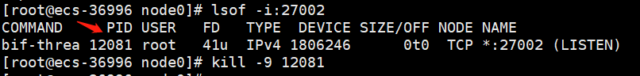
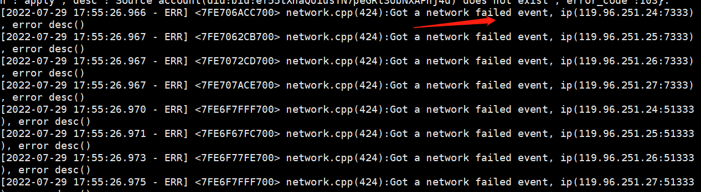
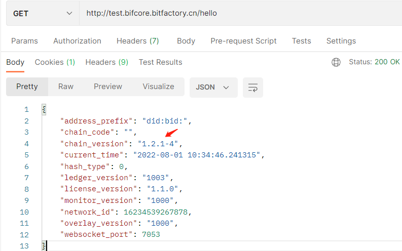
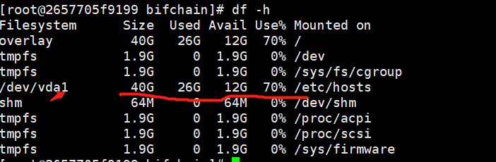
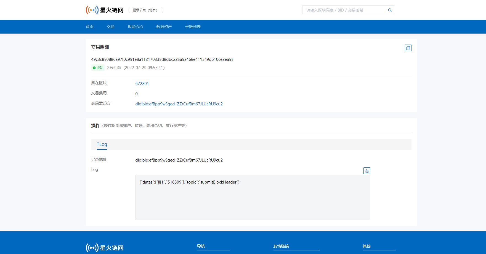

# 5.FAQ

## 5.1 星火令

### 5.1.1 星火令申领

 通过星火服务平台申请凭证获取星火令。具体申请操作参见**星火链BID体系 - 4.浏览器插件钱包**章节

**测试网访问地址**：

​	北京：[http://test-bj-baas.bitfactory.cn/](http://test-bj-baas.bitfactory.cn/)

​	重庆：[http://test-cq-baas.bitfactory.cn/](http://test-cq-baas.bitfactory.cn/)

## 5.2 节点相关

### 5.2.1 使用quicknode访问和直接使用sdk调链的区别是什么？

 `quocknode`是在本地部署了一个全节点，本地拥有全量数据，也是需要使用sdk去调用。

### 5.2.2 节点启动失败相关问题

- **启动镜像时端口被占用失败**

​    在宿主机上先执行命令：`lsof -i:27002`，根据查出的PID然后执行`kill -9 PID`确保端口可映射使用即可继续，如下图所示：



- **部署节点运行时p2p，共识等公网不通导致同步数据失败**

a.进入docker镜像容器中查看服务错误日志
	`vi ./log/bif-err.log`
	看到日志文件中有很多关于p2p的链接失败日志信息如含有`Got a network failed event` 信息。



b.通过请求`http://宿主机ip:27002/getLedger`查看部署节点的区块高度是否变化以及和测试网差别是否很大判断节点运行是否正常。

以上任一方法失败代表网络不通，及时通知运维处理公网问题。

### 5.2.3 节点运行以后服务异常问题

- **节点进程启动后被kill导致服务停止**
  - 在宿主机`docker ps`查看启动的容器ID

  - 执行`docker exec -it 容器ID/容器NAME /bin/bash`进入容器，通过上面的查看进程章节查看进程是否存在

  - 如果不存在执行`nohup ./bin/bif &`启动服务

    详细步骤截图已在上述进镜像启动服务相关章节

- **测试网节点版本升级导致版本差别数据不同步**

  查询本节点与测试网区块高度是一直不同步。

  分别请求`http://宿主机ip:27002/hello`以及[http://test.bifcore.bitfactory.cn/hello](http://test.bifcore.bitfactory.cn/hello)接口，查看节点以及测试网返回的`chain_version`。

  详细返回值格式以及操作如下图：

  

  综上所述的两点如果区块高度一直不同步并且版本不一致则此时需要进行升级节点版本，根据测试网接口返回的chain_version在宿主机重新执行第一步的拉取命令如`docker pull caictdevelop/bif-core:v1.2.1-4`重新升级部署即可(最后的`v1.2.1-4`就是拼接的上述接口返回的测试网中版本号保持一致即可，所有升级部署如最开始步骤，区别在于此处版本号不同，具体不在赘述)。

- **机器磁盘满导致服务异常**

  查看磁盘信息看/dev相关最大的盘符的`size`以及`used`字段的值如果一样并且`Use`占比`100%`,代表磁盘空间已满导致服务异常需要扩容。

  ```shell
  #执行df -h命令
  df -h
  ```

  

  根据上述查看部署节点的区块高度以及测试网高度一直差别很大并且不在同步了或者上述的问题排查后再查看`bifchain`进程已不存在了。

## 5.3 BIF-Core-SDK相关

### 5.3.1 Failed to connect to the network

连接节点失败,确认节点是否运行正常,以及配置地址是否正确。

### 5.3.2 balance(48145674) - base_reserve(0) is not enough for payment

```
Account(did:bid:efnVUgqQFfYeu97ABf6sGm3WFtVXHZB2)'s balance(48145674) - base_reserve(0) is not enough for payment (100000000)
```

账号余额不足, 参照快速上手-获取星火令章节。

### 5.3.3 Transaction nonce(4) too small

Transaction nonce(4) too small, the account(did:bid:efBdagu8sVkJWEw5kLt1w69bxa85Kuag) nonce is (5)

nonce值错误，当前`nonce`=5的基础上+1，发起下一笔交易。

### 5.3.4 Received duplicate transaction message

```sh
Received duplicate transaction message. The transaction's source address is did:bid:efnVUgqQFfYeu97ABf6sGm3WFtVXHZB2, and hash is d0cd3c87
```

相同交易处理策略,交易池中存在一笔完全相同的交易（交易hash)一致，则直接插入失败。

###  5.3.5 Drop the transaction to insert queue because of low fee

某个源账户发的交易，`nonce`相同，其它参数存在差异（计算出的tx hash不同),则会比较两笔交易的gasprice，`B < 1.1A`，则提示Drop the transaction to...

### 5.3.6 signature weight is not enough...

```
Transaction(0f3c99381b7bca967bcad2b55d396ff33b375c9aea1cda024f7b705aea1a2e5c) signature weight is not enough..
```

 权限不足或者私钥不正确。

### 5.3.7 EVMContract Execute VMException OutOfGas..

 需调整freelimt。

### 5.3.8 nodejs-sdk Number类型参数问题

为了保证数字精度，请求参数中的`Number`类型，全都按照**字符串**处理，例如: `amount = 500`，那么传递参数时候就将其更改为 `amount ='500' `字符串形式。

### 5.3.9 关于合约调用费用评估问题

目前接口评估不准确，下个版本修正。

### 5.3.10 创建合约消耗星火令过大问题

 sdk中`gasprice`默认值`100`,如果需要覆盖上笔交易，需调整设置 `>= 100*1.1`，基于许可的考虑，目前创建合约是基础创建操作消耗的星火令 + 合约消耗的星火令，使用完再申请就可以了。

## 5.4 智能合约相关

### 5.4.1 智能合约支持什么语言？

智能合约目前支持`JS`、`Solidity`。

### 5.4.2 js合约调用异常

```js
{"contract":"did:bid:efspy6btdcuzP5BH2N899Ycti5Sd7n3z","exception":"SyntaxError: Unexpected token \r in JSON at position 1457","linenum":34,"stack":"SyntaxError: Unexpected token \r in JSON at position 1457\n at JSON.parse (<anonymous>)\n at main (__enable_check_time__:83:22)"}
```

input参数格式校验，需校验JSON规范。

###  5.4.3 合约设置初始化星火令InitBalance作用

合约之间调用需要消耗星火令，`JavaScript`合约中`Chain.payCoin(address, amount[, input])`,支持合约账号余额的转账。

## 5.5 交易查询

### 访问星火网区块链浏览器

测试网：[http://test-explorer.bitfactory.cn](http://test-explorer.bitfactory.cn)

正式网：[https://explorer.bitfactory.cn](https://explorer.bitfactory.cn)

* 查询示例：

  

## 5.6 消息订阅

星火链使用`websocket`接口实现指定账户地址的交易通知，交易使用`protobuf`结构。

## 5.7 其他

### 5.7.1 插件钱包是否支持合约创建？

暂不支持

### 5.7.2 如何存储对象数据？

链上以`key-value`的键值对形式保存数据，可以使用`Chain.store(id,JSON.stringify(str))` 其中参数`str`可以是一个`json`格式的字符串。

### 5.7.3 关于账号可信认证问题

 账户没有经过可信认证的话就不能发交易，测试网现在是放开的，正式网必须通过认证才可以发交易。
