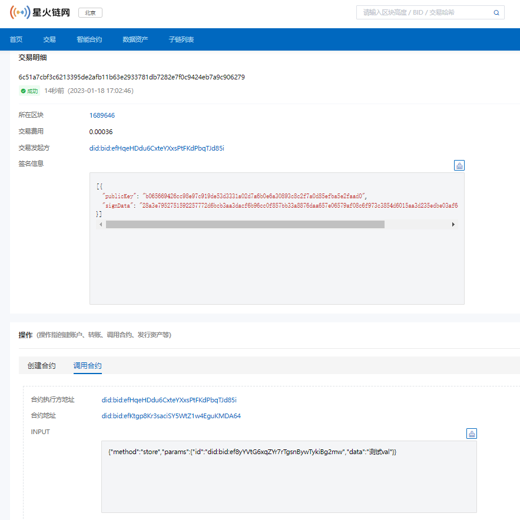

# 4.快速接入星火链

用户在**体验网**上部署、调用、 查询一个`Javascript`、`Solidity`智能合约，需要完成如下工作：

1. 获取星火令来激活账户
2. Java sdk的初始化
3. 通过体验网节点/`Quicknode`节点部署合约

## 4.1 SDK下载

请到[https://github.com/caict-4iot-dev/BIF-Core-SDK](https://github.com/caict-4iot-dev/BIF-Core-SDK)下载java版本的SDK。

### 账号创建

调用JavaSDK接口离线创建一个账户。

```java
import cn.bif.model.crypto.KeyPairEntity;
entity = KeyPairEntity.getBidAndKeyPair();                             //离线创建一个新账号
System.out.printf("BID address %s\n", entity.getEncAddress());          //账户地址, 可以公开
System.out.printf("privatekey %s\n", entity.getEncPrivateKey());      //账户私钥, 请妥善保管
```

## 4.2 获取星火令

账户需要拥有星火令才能正常使用星火链功能, 体验网星火令可以通过如下方式获取：

​    （1）通过星火插件钱包申请可信凭证获取`100`星火令

​    （2）星火可信企业可登录服务平台申请星火令

星火插件钱包下载地址：[https://bitfactory.cn/szsf.html](https://bitfactory.cn/szsf.html)

服务平台体验网地址：[http://test-bj-baas.bitfactory.cn](http://test-bj-baas.bitfactory.cn)

## 4.3 初始化SDK

通过配置星火链RPC地址连接SDK到星火链, 本次demo里链接到星火链体验网。

**注**：如果使用`quicknode`节点，RPC为`http://{host}:{port}`，`host`是主机`ip`(镜像映射到宿主机了)，port即部署时的`27002`

```java
import cn.bif.api.BIFSDK;

public static final String NODE_URL = "http://test.bifcore.bitfactory.cn";  //星火链体验网RPC地址

public staitc BIFSDK sdk = BIFSDK.getInstance(NODE_URL);
```

## 4.4 查看账户状态

```java
//构建查看账户请求
BIFAccountGetInfoRequest infoReq = new BIFAccountGetInfoRequest();
//要查看账户的地址
infoReq.setAddress(address);

//发出查询请求
BIFAccountGetInfoResponse infoRsp = sdk.getBIFAccountService().getAccount(infoReq);

if (infoRsp.getErrorCode() == 0) {
    //查询成功
    System.out.println(JsonUtils.toJSONString(infoRsp.getResult()));
} else {
    //查询失败
    System.out.println(infoRsp.getErrorDesc());
}
```

注意, 新创建的空白账户查询会失败, 需要转入星火令激活才能正常使用。


正常账户查询返回示例:

```json
{
    "address":"did:bid:efKkF5uKsopAishxkYja4ULRJhrhrJQU",    //账户地址
    "balance":10000000000,                                   //账户余额
    "nonce":0                                                //账户发出的交易计数
}
```

## 4.5 Javascript智能合约

### 4.5.1 智能合约代码

* `Javascript`智能合约代码如下:

  ```js
  "use strict";
  
  function queryById(id) {                        //合约内部函数
      let data = Chain.load(id);
      return data;
  }
  
  function query(input) {                         //合约查询入口
      input = JSON.parse(input);
      let id = input.id;
      let object = queryById(id);
      return object;
  }
  
  function main(input) {                          //合约调用入口
      input = JSON.parse(input);
      Chain.store(input.id, input.data);
  }
  
  function init(input) {                          //初始化函数
      return;
  }
  ```

  该合约实现了一个简单的存储功能, 用户可以调用main接口存储自定义`Key-Value`信息, 然后通过`query`接口查询已经存入的`Key-Value`信息。

### 4.5.2 部署合约

  合约编写完毕后, 需要将合约部署到链上, **注意这里需要账户内有足够的XHT**, 部署代码如下:

  ```java
  // 初始化参数
  String senderAddress = "did:bid:efzE8AcDgWUeNbgujA5hK3oUeuG9k19b";
  String senderPrivateKey = "priSPKiwJR7PwjN3bGPRvXRoC6Dny1H5H3kASHgTEugjtUDknW";
  //合约代码，注意转义
  String payload = "\"use strict\";function queryById(id) {    let data = Chain.load(id);    return data;}function query(input) {    input = JSON.parse(input);    let id = input.id;    let object = queryById(id);    return object;}function main(input) {    input = JSON.parse(input);    Chain.store(input.id, input.data);}function init(input) {    return;}";
  Long initBalance = ToBaseUnit.ToUGas("1");
  
  BIFContractCreateRequest request = new BIFContractCreateRequest();
  request.setSenderAddress(senderAddress);
  request.setPrivateKey(senderPrivateKey);
  request.setInitBalance(initBalance);
  request.setPayload(payload);
  request.setRemarks("create contract");
  //type，javascript合约type为0，solidity合约type为1
  request.setType(0);
  request.setFeeLimit(100060000L);
  
  // 调用contractCreate接口
  BIFContractCreateResponse response = sdk.getBIFContractService().contractCreate(request);
  if (response.getErrorCode() == 0) {
      System.out.println(JsonUtils.toJSONString(response.getResult()));
  } else {
      System.out.println(JsonUtils.toJSONString(response));
  }
  ```

  如果部署成功, 调用返回里会拿到这个交易的hash:

  ```json
  {
        "hash":"92313f8fb30b042a4d3f4d276ee2d4ce59f21994deed53e6cc6e2a2dcbe61f8f"
   }
  ```

* 交易信息和合约地址查询

  用SDK查询部署合约的交易详细信息, 可以从中获取到创建的合约地址。

  ```java
  //部署返回hash
  String hash = "92313f8fb30b042a4d3f4d276ee2d4ce59f21994deed53e6cc6e2a2dcbe61f8f";
  BIFContractGetAddressRequest request = new BIFContractGetAddressRequest();
  request.setHash(hash);
  
  // 调用接口
  BIFContractGetAddressResponse response = sdk.getBIFContractService().getContractAddress(request);
  if (response.getErrorCode() == 0) {
      System.out.println(JsonUtils.toJSONString(response.getResult()));
  } else {
      System.out.println(JsonUtils.toJSONString(response));
  }
  ```
  
  合约部署信息示例如下:
  
  ```json
  {
      "contract_address_infos":[
          {
              "contract_address":"did:bid:ef6ZAWV315UracvhKARdHz5CbQ6dULPp",
              "operation_index":0
          }
      ]
  }
  ```
  
  `did:bid:ef6ZAWV315UracvhKARdHz5CbQ6dULPp`即为刚刚创建的合约链上地址。

### 4.5.3 合约调用

合约成功部署并且获取到合约地址后, 就可以通过SDK发送交易调用合约接口, 我们存储一个`Key-Value`对到合约里:

调用合约`input`如下

```json
{
    "id":"test",
    "data": "test"
}
```

调用合约代码如下:

```java
// 初始化参数
String senderAddress = "did:bid:efzE8AcDgWUeNbgujA5hK3oUeuG9k19b";
String contractAddress = "did:bid:ef6ZAWV315UracvhKARdHz5CbQ6dULPp";
String senderPrivateKey = "priSPKiwJR7PwjN3bGPRvXRoC6Dny1H5H3kASHgTEugjtUDknW";
Long amount = 0L;
String input = "{\"id\":\"test\", \"data\": \"test\"}";
BIFContractInvokeRequest request = new BIFContractInvokeRequest();
request.setSenderAddress(senderAddress);
request.setPrivateKey(senderPrivateKey);
request.setContractAddress(contractAddress);
request.setBIFAmount(amount);
request.setRemarks("contract invoke");
request.setInput(input);

// 调用contractInvoke 接口
BIFContractInvokeResponse response = sdk.getBIFContractService().contractInvoke(request);
if (response.getErrorCode() == 0) {
    System.out.println(JsonUtils.toJSONString(response.getResult()));
} else {
    System.out.println(JsonUtils.toJSONString(response));
}
```

调用成功后，我们会得到调用交易的hash：

```json
{
    "hash":"2fcb88fcab04af78e4d06ec263d462b2aacd00d9405159725918d9ca8144ea5d"
}
```

### 4.5.4 查询合约

不同于调用合约, 查询合约为只读操作, 因此不需要发出上链交易和耗费`gas`, 这里我们查询刚刚设置的`key`, 查询`input`为:

```json
{
    "id":"test"
}
```

Java查询代码如下:

```java
// 初始化参数
String contractAddress = "did:bid:ef6ZAWV315UracvhKARdHz5CbQ6dULPp";
String callInput = "{\"id\":\"test\"}";
BIFContractCallRequest request = new BIFContractCallRequest();
request.setContractAddress(contractAddress);
request.setInput(callInput);

// 调用contractQuery接口
BIFContractCallResponse response = sdk.getBIFContractService().contractQuery(request);
if (response.getErrorCode() == 0) {
    BIFContractCallResult result = response.getResult();
    System.out.println(JsonUtils.toJSONString(result));
} else {
    System.out.println(JsonUtils.toJSONString(response));
}
```

查询的返回如下:

```json
{
    "query_rets":[
        {
            "result":
                {
                    "type":"string",
                    "value":"test"
                }
        }
    ]
}
```

## 4.6 Solidity智能合约

### 4.6.1 智能合约代码

* `Solidity`智能合约代码如下:

  ```solidity
  pragma solidity ^0.4.26;
  
  contract demo  {
  
    mapping(uint256 => string) private _datas;
  
    function queryById(uint256 id) public view returns (string) {                      
      
      return _datas[id];
    }
  
    function setById(uint256 id, string data) public {                      
      
      _datas[id] = data;
    }
  
  }
  ```

  该合约实现了一个简单的存储功能, 用户可以调用`setById`接口存储自定义`Key-Value`信息, 然后通过`queryById`接口查询已经存入的`Key-Value`信息。

### 4.6.2 部署合约

  合约编写完毕后, 需要将合约部署到链上, **注意这里需要账户内有足够的XHT**, 部署代码如下:

  `solidity`智能合约和`Javascript`智能合约的部署，区别在于：

  type的设置：0代表`Javascript`智能合约，1代表`solidity`智能合约。

  setPayload时，设置的不是`solidity`智能合约代码本身，而是对合约代码进行编译之后，得到的bytecode中的object值。可以参考**如何进行智能合约开发 - 3.Solidity合约介绍**章节。

  ```java
  // 初始化参数
  String senderAddress = "did:bid:efzE8AcDgWUeNbgujA5hK3oUeuG9k19b";
  String senderPrivateKey = "priSPKiwJR7PwjN3bGPRvXRoC6Dny1H5H3kASHgTEugjtUDknW";
  //合约代码
  String payload = "608060405234801561001057600080fd5b5061031a806100206000396000f30060806040526004361061004c576000357c0100000000000000000000000000000000000000000000000000000000900463ffffffff168063794bde4814610051578063baf8baab146100c4575b600080fd5b34801561005d57600080fd5b506100c260048036038101908080359060200190929190803590602001908201803590602001908080601f016020809104026020016040519081016040528093929190818152602001838380828437820191505050505050919291929050505061016a565b005b3480156100d057600080fd5b506100ef60048036038101908080359060200190929190505050610195565b6040518080602001828103825283818151815260200191508051906020019080838360005b8381101561012f578082015181840152602081019050610114565b50505050905090810190601f16801561015c5780820380516001836020036101000a031916815260200191505b509250505060405180910390f35b806000808481526020019081526020016000209080519060200190610190929190610249565b505050565b60606000808381526020019081526020016000208054600181600116156101000203166002900480601f01602080910402602001604051908101604052809291908181526020018280546001816001161561010002031660029004801561023d5780601f106102125761010080835404028352916020019161023d565b820191906000526020600020905b81548152906001019060200180831161022057829003601f168201915b50505050509050919050565b828054600181600116156101000203166002900490600052602060002090601f016020900481019282601f1061028a57805160ff19168380011785556102b8565b828001600101855582156102b8579182015b828111156102b757825182559160200191906001019061029c565b5b5090506102c591906102c9565b5090565b6102eb91905b808211156102e75760008160009055506001016102cf565b5090565b905600a165627a7a723058208e0076d636eb85f3b445a4b8d3f0f3e2583ada8d6501f2839586d782687926860029";
  Long initBalance = ToBaseUnit.ToUGas("1");
  
  BIFContractCreateRequest request = new BIFContractCreateRequest();
  request.setSenderAddress(senderAddress);
  request.setPrivateKey(senderPrivateKey);
  request.setInitBalance(initBalance);
  request.setPayload(payload);
  request.setRemarks("create contract");
  //type，javascript合约type为0，solidity合约type为1
  request.setType(1);
  request.setFeeLimit(100189100L);
  
  // 调用contractCreate接口
  BIFContractCreateResponse response = sdk.getBIFContractService().contractCreate(request);
  if (response.getErrorCode() == 0) {
      System.out.println(JsonUtils.toJSONString(response.getResult()));
  } else {
      System.out.println(JsonUtils.toJSONString(response));
  }
  ```

  如果部署成功, 调用返回里会拿到这个交易的hash:

  ```json
  {
      "hash":"d525a576173e2606acb33103eca5e3cc5c0106c67833a2b75d67d3164cec6b12"
  }
  ```

* 交易信息和合约地址查询

```java
//部署返回hash
String hash = "d525a576173e2606acb33103eca5e3cc5c0106c67833a2b75d67d3164cec6b12";
BIFContractGetAddressRequest request = new BIFContractGetAddressRequest();
request.setHash(hash);

BIFContractGetAddressResponse response = sdk.getBIFContractService().getContractAddress(request);
if (response.getErrorCode() == 0) {
    System.out.println(JsonUtils.toJSONString(response.getResult()));
} else {
    System.out.println(JsonUtils.toJSONString(response));
}
```

  可以查询到刚刚创建的合约链上地址: `did:bid:ef91sQXEXVfPFQXRZpgA3Rs1pTNbZndq`

### 4.6.3 合约调用

合约成功部署并且获取到合约地址后, 就可以通过SDK发送交易调用合约接口, 我们存储一个`Key-Value`对到合约里:

调用合约`input`如下

```json
{
    "id":123,
    "data": "abc"
}
```

调用合约代码如下:

```java
// 初始化参数
String senderAddress = "did:bid:efzE8AcDgWUeNbgujA5hK3oUeuG9k19b";
String contractAddress = "did:bid:ef91sQXEXVfPFQXRZpgA3Rs1pTNbZndq";
String senderPrivateKey = "priSPKiwJR7PwjN3bGPRvXRoC6Dny1H5H3kASHgTEugjtUDknW";
Long amount = 0L;
String input = "{\"function\":\"setById(uint256,string)\", \"args\":\"123,'abc'\"}";
BIFContractInvokeRequest request = new BIFContractInvokeRequest();
request.setSenderAddress(senderAddress);
request.setPrivateKey(senderPrivateKey);
request.setContractAddress(contractAddress);
request.setBIFAmount(amount);
request.setRemarks("contract invoke");
request.setInput(input);

// 调用contractInvoke 接口
BIFContractInvokeResponse response = sdk.getBIFContractService().contractInvoke(request);
if (response.getErrorCode() == 0) {
    System.out.println(JsonUtils.toJSONString(response.getResult()));
} else {
    System.out.println(JsonUtils.toJSONString(response));
}
```

调用成功后，我们会得到调用交易的hash：

```json
{
    "hash":"b7b0a8f8415ce8cf17627eb3da75f565e0e7cf9b54217121afce4fab2df52080"
}
```

### 4.6.4 查询合约

不同于调用合约, 查询合约为只读操作, 因此不需要发出上链交易和耗费`gas`, 这里我们查询刚刚设置的`key`, 查询`input`为:

```json
{
    "id":123
}
```

`Java`查询代码如下:

```java
//合约调用
String contractAddress = "did:bid:ef91sQXEXVfPFQXRZpgA3Rs1pTNbZndq";
String callInput = "{\"function\":\"queryById(uint256)\",\"args\":123,\"return\":\"returns(string)\"}";
BIFContractCallRequest request = new BIFContractCallRequest();
request.setContractAddress(contractAddress);
request.setInput(callInput);

BIFContractCallResponse response = sdk.getBIFContractService().contractQuery(request);
if (response.getErrorCode() == 0) {
    BIFContractCallResult result = response.getResult();
    System.out.println(JsonUtils.toJSONString(result));
} else {
    System.out.println(JsonUtils.toJSONString(response));
}
```

查询的返回如下:

```json
{
    "query_rets":[
        {
            "result":{
                "data":"[abc]",
                "gasused":1097
            }
        }
    ]
}
```

## 4.7 查看交易信息

每次部署或者调用合约，都会产生相关都交易信息，您可以在区块链浏览器的交易详情里查看具体信息。

体验网浏览器地址：[http://test-explorer.bitfactory.cn/](http://test-explorer.bitfactory.cn/)



**接下来**

至此我们就完成了一个链上合约从部署到操作的全过程, 有关合约的更高阶开发和星火链体系模型, 请参见后续专栏。
