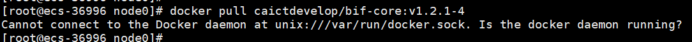
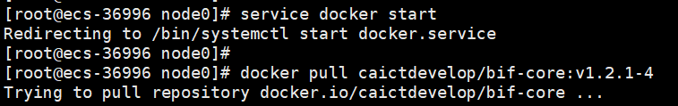
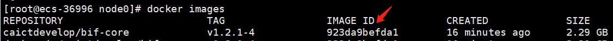
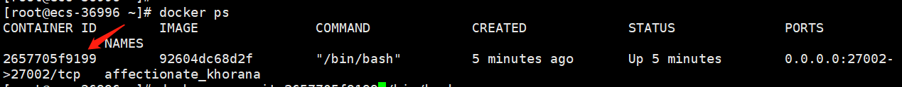
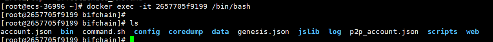
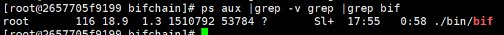

# 3.快速搭建体验节点

## 简介

为更好的服务星火生态合作伙伴，加速星火生态的开放进程，星火链网制定了主链**测试网**准入新机制，并开发了快速搭建体验节点(简称`Quicknode`)的镜像包。开发者通过Docker部署节点镜像包，即可在本地并参与维护**测试网**正常运行，而无需调用RPC接入**测试网**，实现了节点的自主可控。

<p style="text-align: center;"></p>

##  Quicknode节点部署

### 环境要求

```sh
部署最小硬件要求：
内存：8G
硬盘：100G
cpu：8核
```

### 1. 获取镜像版本号

用浏览器打开链接 [http://test.bifcore.bitfactory.cn/hello](http://test.bifcore.bitfactory.cn/hello)
返回如下结果：

```json
{
	"address_prefix": "did:bid:",
	"chain_code": "",
	"chain_version": "1.9.0-8",
	"current_time": "2022-12-19 20:37:56.105204",
	"hash_type": 0,
	"ledger_version": "1004",
	"license_version": "1.1.0",
	"monitor_version": "1000",
	"network_id": 16234539267878,
	"overlay_version": "1000",
	"websocket_port": 7053
}
```

`chain_version`字段的值即为**测试网**链节点最新版本号。

### 2. 获取镜像

```shell
#docker pull 待部署镜像(前提是确保主机有docker可用，并能上外网)
docker pull caictdevelop/bif-core:v${chain_version}
#说明：其中冒号后面代表底层链的版本号，如第一步chain_version为1.9.0-8，则这一步的命令为：
#docker pull caictdevelop/bif-core:v1.9.0-8
#获取的阿拉伯数字组成越大代表版本号相较更新的版本，版本号递增更新
```

如果新机器上没有启动过docker服务会报如下错误：


执行命令：
```sh
service docker start
```

重新拉取镜像：
  

### 3. 启动镜像，进入容器

- 执行docker images查看拉取的镜像`IMAGE ID`
  

- 启动Quicknode服务

  ```sh
  #根据拉取的镜像，启动并进入容器和启动bifchain服务 IMAGEID即上述查看的具体字段值
  #设置镜像启动后映射到宿主机的bifchain目录（此目录必须是相对目录，映射后所在宿主机路径为/var/lib/docker/volumes/bifchain/）
  
  docker run -itd -p 27002:27002 --privileged=true --volume bifchain:/usr/local/bifchain IMAGEID /bin/bash
  
  #由上述命令执行后镜像启动，其服务目录就映射到了宿主机磁盘目录了
  #在宿主机执行命令docker volume ls即可看到多了一个vlume的映射：
  docker volume ls
  DRIVER              VOLUME NAME
  local               885b5be00311b37580ed74b609fd7317a8976bb34e2da728e532b0bd8859bf7d
  local               bifchain
  
  #然后执行ll /var/lib/docker/volumes/bifchain/_data/
  #即可看到镜像服务目录/usr/local/bifchain里所有映射对应数据信息：
   ll /var/lib/docker/volumes/bifchain/_data/
  total 48
  -rw-r--r-- 1 root root  658 Aug 24 11:14 account.json
  drwxr-xr-x 2 root root 4096 Aug 24 14:28 bin
  -rw-r--r-- 1 root root 1046 Aug 24 11:14 command.sh
  drwxr-xr-x 2 root root 4096 Aug 24 14:28 config
  drwxr-xr-x 2 root root 4096 Aug 24 14:28 coredump
  drwxr-xr-x 2 root root 4096 Aug 24 14:28 data
  -rw-r--r-- 1 root root  658 Aug 24 11:14 genesis.json
  drwxr-xr-x 2 root root 4096 Aug 24 14:28 jslib
  drwxr-xr-x 2 root root 4096 Aug 24 14:28 log
  -rw-r--r-- 1 root root  658 Aug 24 11:14 p2p_account.json
  drwxr-xr-x 2 root root 4096 Aug 24 14:28 scripts
  drwxr-xr-x 3 root root 4096 Aug 24 14:28 web
  
  ```

- 查询启动的docker镜像进程信息,获取`container ID`
  

- exec进入容器系统启动`bifchain`服务

  ```sh
  # 2657705f9199 即是上述查询到的container ID
  docker exec -it 2657705f9199 /bin/bash
  ```
  

- 进入容器系统当前目录即是`bifchain`底层链目录 给可执行程序添加权限执行

  ```shell
  chmod +x bin/*
  chmod +x scripts/*
  ./scripts/bifd start
  ```
  

### 4. 查看节点进程是否启动

在镜像系统中执行上述命令后查看`bifchain`服务，如果查询不到进程，执行`exit`命令在宿主机再执行 **启动Quicknode服务**操作

```shell
ps aux |grep -v grep |grep bif
```



### 5. 查看节点同步高度

快速部署的节点会自动通过`p2p`和**测试网**其他节点链接，部署启动后先同步其他节点数据，跟据数据量和磁盘不同时间不同，同步完所有的数据大概需要几个小时，可以根据如下方式查询测试网以及部署后节点的区块高度，实时观察同步进度。

- 查询测试网节点区块高度url和结果如下：

  ```http
  http请求方式：GET
  http://test.bifcore.bitfactory.cn/getLedger
  ```

  响应报文：

  ```javascript
  {
    error_code: 0,
    result: {
      header: {
          account_tree_hash: "4c9a11f712331f5815a24dbab5fee7cff905953dee71e48549ddac00d3648372",
          close_time: 1658995885587070,
          consensus_value_hash: "dba4e31ce39a1297fd24478d5da58687a67a56275da01aa95cf6535f57d3e9a7",
          fees_hash: "e3b0c44298fc1c149afbf4c8996fb92427ae41e4649b934ca495991b7852b855",
          hash: "162beecd20a70c5dc6794e66981448466f48fc0e377a63118199cd39b52bc293",
          previous_hash: "dd5130951b1982c55d4e52ce379d882465fe322a5f6881b91016f2272acd3d06",
          seq: 1172057,   //seq即是测试网的区块高度值
          tx_count: 797679,
          validators_hash: "b8ebfb79b0aed24cd9122c4545c88b8f9c7c6c7b01d1f0f55f2d3c036064eefd",
          version: 1003
      },
      ledger_length: 227
    }
  }
  ```

- 同步查询`Quicknode`节点高度

  访问快速节点高度,`host`是主机`ip`(镜像映射到宿主机了)，`port`即部署时的`27002`

  ```http
  http请求方式：GET
  http://{host}:{port}/getLedger
  ```

  获取到响应报文，查看`seq`字段的值，高度一致即全部同步完成。
