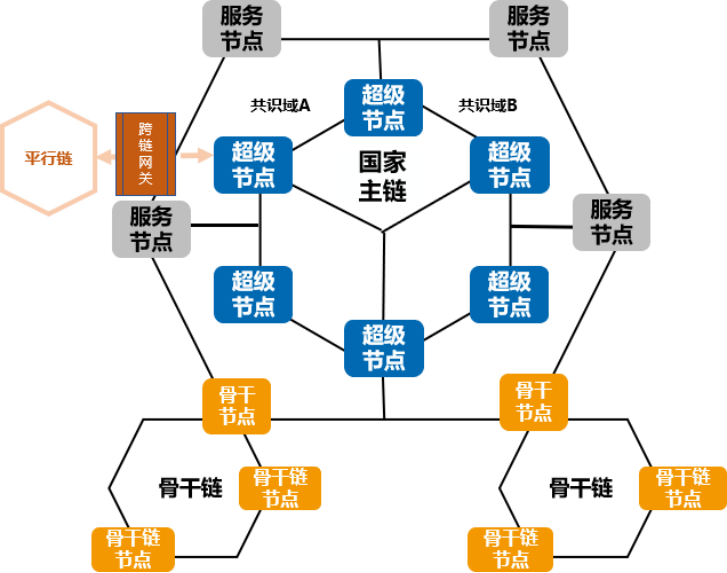
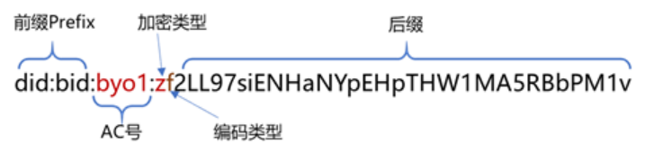

# 1.星火链技术平台介绍

## 1.1 星火链关键特性

### 星火链简介

星火链是由信通院牵头，联合多家单位共同打造的许可公有链，定位于面向全球服务的国家级区块链新型基础设施，为业务用户、DApp开发者、节点运营方等多种角色提供的开放、稳定、安全、易用、高性能区块链网络，共同促进产业生态发展。

“星火·链网”采用开放的建设模式，通过星火链向接入的区块链网络提供标识基础服务进而提供跨区块链、跨区域、跨行业的互通能力，构建新时代下智能可信的价值互联网。通过双层体系架构设计及分片技术，实现区块链的性能与规模化场景的有效平衡，促进区块链的应用成效。

星火链实现的许可公有链技术，支持同构/异构区块链接入，内置的标识管理能力通过超级节点向接入“星火·链网”的骨干节点和子链提供标识基础服务，进而提供跨链互通的基础。星火链中包含超级节点、服务节点、骨干节点。

**超级节点**

1. 定位：超级节点是星火链的构成主体，建设主体一般为地方政府，拥有星火链全量数据，负责执行星火链的共识计算，确保星火链的正常运行，并运营和维护星火链上的公共数据、标识资源、标识解等基础服务，充分发挥超级节点新型基础设施的引擎作用。
   
2. 业务：管理骨干节点接入，同时建设数字身份（基于智能标识`BID`）、多标识融合管理、可信存证、隐私计算、运行监测等基础服务能力，为保障链群高效运行和整个链群生态的稳定健康发展保驾护航。
   

**服务节点**

1. 定位：服务节点作为星火链的非共识节点，建设主体一般为行业机构，如银行、公证处等，可验证交易，但不参与链上共识，可基于星火链账本，面向骨干节点提供行业公共服务。

2. 业务：作为星火链的服务提供方，服务节点为星火链注入服务资源，增强星火链的公共服务能力，如法院可为星火链存证服务提供背书，银行可通过跨链验证骨干链上产生的供应链金融凭证为企业提供金融服务等，是星火链应用形成业务共识的核心。

**骨干节点**

1. 定位：星火链与面向特定行业或特定区域的子链，主要通过骨干节点执行跨链互操作等交互功能，从而实现星火·链网链链协同和链链互联。骨干节点作为星火链的非共识节点，可验证交易，同步星火链账本内相关数据，是骨干链、子链与星火链间的跨链网关，负责管理子链的接入，可基于骨干链提供具体的区块链行业应用。

2. 业务：管理业务子链接入；对接星火链数字身份、标识等资源供子链应用使用；提供行业、区域内的如司法存证、供应链溯源等具体应用。

**共识域**

1. 定位：服务节点基于星火链开展具体的应用服务，超级节点与服务节点组成共识域，超级节点负责共识计算，域内服务节点负责达成业务共识，面向骨干节点提供服务。

2. 业务：服务节点可以按照不同业务需求与超级节点组成不同的共识域，共识域内可设置不同业务共识策略，让不同的组织参与背书增信，让多方协作共治。

    

### 星火链服务特性

**绿色低碳**

星火链作为国家级区块链基础设施，链上业务由超级节点基于高效的共识算法，保证可靠安全的出块，从而充分发挥超级节点新型基础设施的引擎作用，让更多的参与方能“绿色低碳”的使用星火链服务。

**多方治理**

星火链超级节点在共识域管理、节点管理、账本读写等方面提供了灵活的治理规则，可根据业务需求进行设置。服务节点可根据业务需求与超级节点设置不同共识域，让更多服务节点参与业务共识，让多方协作共治；用户按周期可对超级节点进行投票，选举产生执行共识计算的超级节点，保障星火链共识计算的高效与稳定。

**智能标识**

星火链底层地址应用星火标识（`BID`），`BID`是基于`W3C DID`标准开发的新型分布式标识，任意实体可自主生成星火标识，不需要中心化注册机构就可以实现全球唯一性，具有分布式、自主管理、隐私保护和安全易用等特点，同时根据算法的不同，`BID`支持`39-57`位变长编码方式，有效适应各种业务场景，兼容各类设备。
    

**内生安全**

`BID`结合星火链可以提供一套安全强大、简单易用、符合`SSI`规范的分布式身份服务，星火链通过`BID`，基于`SSI`自主身份，能够分布式地产生和验证全局唯一的`BID`来标识各种实体（人、机构、物体等），为实体之间跨机构、跨地域的可信数字身份、数字凭证与数据交换提供基础设施，助力企业解决数字化过程中的数据孤岛难题，促进异构、异主、异地数据的共享使用，解决跨链安全可信连接和互操作，打造万物互联的智能世界。

**可信跨链**

星火链通过骨干节点实现对同构、异构链接入的支持。星火链可信跨链服务通过提供通用标准化组件和跨链通信协议，具备高通用性和易扩展性，基于跨链身份管理协议及组件实现不同子链之间的业务协作支撑，结合超级节点的节点管理能力实现高安全高可信的跨链协同治理，从而支持星火·链网内各子链在不同业务场景下的可信跨链过程。

### 星火链技术优势

**高效混合共识机制**

星火链共识算法主要分为选举星火链共识节点的委托权益证明算法（`DPoS`）共识算法和选举出块节点的星火拜占庭共识算法（`Star-BFT`）两部分：首先，用户通过委托权益证明共识算法，投票产生出星火链共识节点集合。然后，由被选出来的节点通过`Star-BFT`共识算法产生区块。`Star-BFT`算法基于区块链和商业应用需求，结合可验证随机函数（`VRF`）、实用拜占庭（`PBFT`）等算法进行创新优化，是一种不会产生链分叉且强一致性的算法，实现了用户交易秒级时间确认。

**主子链群结构**

星火链支持同构/异构链接入，从而实现星火·链网`“1+N”`主子链群结构，兼顾星火链规范管理和多子链个性化应用场景，实现同构/异构链跨链共享与交互、隐私保护和运行效率提升。

**高性能交易**

星火链支持并发交易。基于有向无环图（`DAG`）数据结构改进的高效并发技术，通过在交易池构建交易`DAG`的方式，智能识别无关联交易并构建在`DAG`的同一层级，利用计算机多核机制并发执行交易,在保证数据安全的基础上提高交易的处理速度，降低交易全流程的处理时间。

**可插拔设计**

可插拔的共识机制，支持按照业务需求和技术趋势，配置不同的共识算法，保持星火链共识机制对业务的良好适配性和技术先进性。

可插拔的智能合约引擎，提供了一套新的可插拔的区块链智能合约底层引擎，通过可插拔引擎适配器，基于隔离的容器环境，可以支持运行各种主流编程语言开发的智能合约，可以动态适配的支持`JSVM`引擎、`EVM`引擎、`WASM`引擎，可以执行`JavaScript`、`Solidity`、`C/C++`、`Go`等多种语言。

可插拔的数据库存储，账本可以支持灵活配置，支持使用多种数据库作为状态数据缓存。

**安全隐私**

星火链在隐私保护层面，具有灵活可选的多种方式，链底层支持共识域账本隔离、数据加密、零知识证明等，同时搭配可信执行环境（`TEE`）和多方安全计算（`MPC`）等技术手段，可实现数据可用不可见。星火链还支持基于星火安全芯片`BS1`的身份管理以及国密算法，提高链安全性。

**易用合约**

星火链提供给用户一体化的智能合约集成开发调试环境，支持不同语言开发的智能合约，让用户更便捷的快速构建基于智能合约的业务共识，不仅具备基本的IDE功能，还专门提供了智能合约安全检查服务，同时星火链同时支持多种智能合约语言（包括`JavaScript`/`Solidity`/`C/C++`/`Go`）及合约引擎（包括`JSVM`/`EVM`/`WASM`等），通过执行环境为智能合约执行引擎提供统一的数据访问接口等能力，提供全生命周期管理服务。另外星火链还提供了多样化的合约模板，让开发者仅填写少量参数即可快速构建安全可靠的智能合约，在执行性能、安全性、多语言支持、开发友好、应用扩展等方面提供更好的支持。 

## 1.2 星火链关键字

### BID地址生成流程描述

下图是BID地址生成流程图：

**第一步，生成原始公私钥对** 

根据加密算法类型生成原始的公私钥对。

**第二步，计算原始公钥的哈希**

根据第一步生成的原始公私钥对，对原始公钥进行哈希运算，得到一个固定长度的输出摘要（`256-bit/32-Byte`）。原始公私钥对的生成算法不同，对应的哈希算法也不同，具体如下：

1. `SM2`对应的哈希算法是`SM3`

2. `ED25519`或者`Secp256k1`对应的哈希算法是`SHA-256`

**第三步，生成编码**

根据编码类型得到要截取的哈希长度和编码算法类型，截取上一步生成的哈希，然后进行编码生成相应的字节数组。

**第四步，添加编码类型**

在上一步编码完成之后的字节数组前面添加编码类型，生成新的字节数组。

**第五步，添加加密算法类型前缀**

在上一步的字节数组前面添加加密类型，生成新的字节数组。

**第六步，添加AC号**

若生成的是星火链的`BID`，跳过这一步；若生成的为子链的`BID`,在上一步的字节数组前面添加相应的`AC号` +` ‘:’`。

**第七步，添加Prefix前缀**

`Prefix`是个固定字符串值`"did:bid:"`，上一步的结果加上此前缀后即为`BID`的最终值。

### BID私钥生成流程描述

下图是BID私钥生成流程图：

**第一步，生成原始公私钥对**

根据加密算法类型生成原始的公私钥对。此步骤没有具体列出，具体请参见`BID`地址生成流程描述中的第一步

**第二步，添加前缀地址编码类型**

在原始私钥前添加地址编码类型前缀，目前支持的地址编码类型请参见什么是`BID`标题正文中介绍的编码类型。

注意：此地址编码类型为`BID`地址编码类型，非生成私钥的最后一步`Base58`编码类型，两者并无直接相关关系。

**第三步，添加前缀加密类型**

上一步生成的结果基础上添加前缀加密类型，目前支持的加密编码类型请参见什么是`BID`标题正文中介绍的加密类型。

**第四步，添加前缀Prefix**

第三步的结果之上再次添加前缀`Prefix`。`Prefix`是三个字节`0x18`、`0x9E`、`0X99`,此固定字符串在`Base58`编码后生成固定字符串（pri）,目的是为了方便用户观察和使用。

**第五步，Base58编码** 

经过前四个步骤后，得到一个新的字符数组。对这个字符数组进行`Base58`编码后即得到最终的私钥。

### BID公钥生成流程描述

下图是BID公钥生成流程图：

**第一步，生成原始公私钥对**

根据加密算法类型生成原始的公私钥对。此步骤没有具体列出，具体请参见`BID`地址生成流程描述中的第一步

**第二步，添加前缀地址编码类型**

在原始公钥前添加地址编码类型前缀，目前支持的地址编码类型请参见什么是`BID`标题正文中介绍的编码类型。

注意：此地址编码类型为`BID`地址编码类型，非生成私钥的最后一步`Base16`编码类型，两者并无直接相关关系。

**第三步，添加前缀加密类型**

上一步生成的结果基础上添加前缀加密类型，目前支持的加密编码类型请参见什么是`BID`标题正文中介绍的加密类型。

**第四步，添加前缀Prefix**

第三步的结果之上再次添加前缀`Prefix`。`Prefix`是一个字节，值为`0xb0`,目的是为了方便用户观察和使用。

**第五步，Base16编码** 

经过前四个步骤后，得到一个新的字符数组。对这个字符数组进行`Base16`编码后即得到最终的公钥。

## 1.3 基础术语说明

| 名称                          | 说明                                                         |
| ----------------------------- | ------------------------------------------------------------ |
| 区块（`Block`）               | 区块是区块链中存储交易和交易相关的数据的单元，通常由区块头和区块体组成。 |
| 区块链（`Blockchain`）        | 使用密码技术链接将共识确认过的区块按顺序追加而形成的分布式账本。 |
| 智能合约（`SmartContract`）   | 以数字形式定义的能够自动执行条款的合约。                     |
| 交易对象 （`operation`）      | 区块链上的一条交易执行过程中，不同交易类型结构对象。         |
| 交易（`Transaction`）         | 也称为事务，区块链上的一次原子性账本数据状态变更及其过程和结果记录。 |
| 交易哈希（`TransactionHash`） | 交易上链成功后，产生的唯一哈希值。                           |
| 验证节点（`VerifyingNode`）   | 区块链网络中负责验证新的候选区块的节点。  在不同轮次中提议节点和验证节点身份可互相转换。 |
| 星火链SDK（`bif-core SDK`）   | 用于与星火链交互（发送交易，订阅等）的软件开发工具           |

## 1.4 编写语言

| 项目     | 编程语言                   | 说明                                                         |
| -------- | -------------------------- | ------------------------------------------------------------ |
| SDK      | `golang`、`java`、`nodejs` | 星火链`SDK`目前支持`golang`、`java`和`nodejs`，方便使用者与业务系统集成开发。 |
| 智能合约 | `JavaScript`、`solidity`   | 星火链智能合约目前支持`JavaScript`、`solidity`等语言，方便各个开发者选择熟悉的语言开发业务逻辑。 |