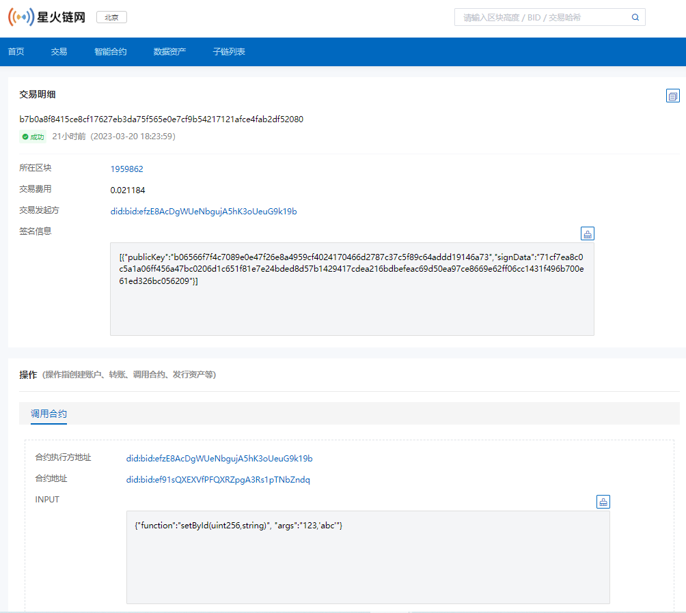

# 5.部署示例合约

通过本文，你将可以获得一个示例合约，并使用SDK完成一个简单合约的部署及调用，并在相应的区块链浏览器上查看到上链信息。

## 5.1 示例合约说明

下文以部署`JavaScript`合约为例进行讲解，如需部署其他合约，自行替换合约即可，其余流程皆类似。

## 5.2 合约源码展示

本合约为数据存储合约，主要实现三个功能，管理员数据上报、更新；通过`bid`进行链上结果查询。

```js
'use strict';

const INIT_DATA = 'managersList';

function _saveObj(key, value){
    Chain.store(key, JSON.stringify(value));
}
function _loadObj(key){
    let data = Chain.load(key);
    Utils.assert(data !== false, 'Failed to get storage data, key:' + key);
    return JSON.parse(data);
}
function _checkExisted(key, arrayList) {
    let i = 0;
    for(i=0; i < arrayList.length; i+=1){
        if(arrayList[i] === key){ return true; }
    }
    return false;
}
function checkData(params){
    Utils.assert(params.id!== undefined, '10700,The id is not existed');
}

function _verifyManager(){
    let manager_accounts = _loadObj(INIT_DATA).managers;
    Utils.assert(_checkExisted(Chain.msg.sender, manager_accounts), 'Not manager_accounts ');

}

function queryBid(params) {
   let input = params;
   let bid = input.bid;
   let data  = JSON.parse(Chain.load(bid));
   Utils.assert(data !== false, '10706,The bid data is not existed');
   return data;
}
function store(params){

    _verifyManager();
    let input = params;
    checkData(input);
    let id = input.id;
    Utils.assert(Utils.addressCheck(input.id)!==false,'10702,The bid address format is incorrect');
    let data  = JSON.parse(Chain.load(id));
    Utils.assert(data === false, '10703,The bid data is already existed');
    let dataJson = {};
    dataJson = input.data;
    Chain.store(id,JSON.stringify(dataJson));
}
function update(params){

    _verifyManager();
    let input = params;
    checkData(input);
    let id = input.id;
    Utils.assert(Utils.addressCheck(input.id)!==false,'10702,The bid address format is incorrect');
    let dataJson = {};
    dataJson = input.data;
    Chain.store(id,JSON.stringify(dataJson));
}

function init(input){
    let paramObj = JSON.parse(input).params;
    Utils.assert(paramObj.managersList !== undefined && paramObj.managersList.length > 0, 'Param obj has no managersList.');
    let initData = {
        'createTime': Chain.block.timestamp,
        'createAccount': Chain.msg.sender,
        'managers': paramObj.managersList,
        'blockHeight': Chain.block.number
    };
    _saveObj(INIT_DATA, initData);
    return;
}

function main(input_str){
    let input = JSON.parse(input_str);

    if(input.method === 'store'){
        store(input.params);
    }
    else if(input.method === 'update'){
        update(input.params);
    }
    else{
        throw '<Main interface passes an invalid operation type>';
    }
}

function query(input_str){
    let input  = JSON.parse(input_str);
    let object ={};
    if(input.method === 'queryBid'){
        object = queryBid(input.params);
    }
    else{
       	throw '<unidentified operation type>';
    }
    return JSON.stringify(object);
}

```

## 5.3 部署/调用合约

使用SDK进行部署/调用合约。

- 初始化SDK

  ```java
  import cn.bif.api.BIFSDK;
  
  BIFSDK sdk = BIFSDK.getInstance("http://test.bifcore.bitfactory.cn");   //URL为星火链测试网RPC地址
  ```

- 部署合约

  部署合约到星火链上。

  ```java
          // 初始化参数
          String senderAddress = "did:bid:efHqeHDdu6CxteYXxsPtFKdPbqTJd85i";
          String senderPrivateKey = "priSPKnpkx9TJZpZvGmdtUkJAEo2rW3cG9Bdxz2DUtjruiUxrn";
          //合约代码，
          String payload ="'use strict';\n" +
                  "\n" +
                  "const INIT_DATA = 'managersList';\n" +
                  "\n" +
                  "function _saveObj(key, value){\n" +
                  "    Chain.store(key, JSON.stringify(value));\n" +
                  "}\n" +
                  "function _loadObj(key){\n" +
                  "    let data = Chain.load(key);\n" +
                  "    Utils.assert(data !== false, 'Failed to get storage data, key:' + key);\n" +
                  "    return JSON.parse(data);\n" +
                  "}\n" +
                  "function _checkExisted(key, arrayList) {\n" +
                  "    let i = 0;\n" +
                  "    for(i=0; i < arrayList.length; i+=1){\n" +
                  "        if(arrayList[i] === key){ return true; }\n" +
                  "    }\n" +
                  "    return false;\n" +
                  "}\n" +
                  "function checkData(params){\n" +
                  "    Utils.assert(params.id!== undefined, '10700,The id is not existed');\n" +
                  "}\n" +
                  "\n" +
                  "function _verifyManager(){\n" +
                  "    let manager_accounts = _loadObj(INIT_DATA).managers;\n" +
                  "    Utils.assert(_checkExisted(Chain.msg.sender, manager_accounts), 'Not manager_accounts ');\n" +
                  "\n" +
                  "}\n" +
                  "\n" +
                  "function queryBid(params) {\n" +
                  "   let input = params;\n" +
                  "   let bid = input.bid;\n" +
                  "   let data  = JSON.parse(Chain.load(bid));\n" +
                  "   Utils.assert(data !== false, '10706,The bid data is not existed');\n" +
                  "   return data;\n" +
                  "}\n" +
                  "function store(params){\n" +
                  "\n" +
                  "    _verifyManager();\n" +
                  "    let input = params;\n" +
                  "    checkData(input);\n" +
                  "    let id = input.id;\n" +
                  "    Utils.assert(Utils.addressCheck(input.id)!==false,'10702,The bid address format is incorrect');\n" +
                  "    let data  = JSON.parse(Chain.load(id));\n" +
                  "    Utils.assert(data === false, '10703,The bid data is already existed');\n" +
                  "    let dataJson = {};\n" +
                  "    dataJson = input.data;\n" +
                  "    Chain.store(id,JSON.stringify(dataJson));\n" +
                  "}\n" +
                  "function update(params){\n" +
                  "\n" +
                  "    _verifyManager();\n" +
                  "    let input = params;\n" +
                  "    checkData(input);\n" +
                  "    let id = input.id;\n" +
                  "    Utils.assert(Utils.addressCheck(input.id)!==false,'10702,The bid address format is incorrect');\n" +
                  "    let dataJson = {};\n" +
                  "    dataJson = input.data;\n" +
                  "    Chain.store(id,JSON.stringify(dataJson));\n" +
                  "}\n" +
                  "\n" +
                  "function init(input){\n" +
                  "    let paramObj = JSON.parse(input).params;\n" +
                  "    Utils.assert(paramObj.managersList !== undefined && paramObj.managersList.length > 0, 'Param obj has no managersList.');\n" +
                  "    let initData = {\n" +
                  "        'createTime': Chain.block.timestamp,\n" +
                  "        'createAccount': Chain.msg.sender,\n" +
                  "        'managers': paramObj.managersList,\n" +
                  "        'blockHeight': Chain.block.number\n" +
                  "    };\n" +
                  "    _saveObj(INIT_DATA, initData);\n" +
                  "    return;\n" +
                  "}\n" +
                  "\n" +
                  "function main(input_str){\n" +
                  "    let input = JSON.parse(input_str);\n" +
                  "\n" +
                  "    if(input.method === 'store'){\n" +
                  "        store(input.params);\n" +
                  "    }\n" +
                  "    else if(input.method === 'update'){\n" +
                  "        update(input.params);\n" +
                  "    }\n" +
                  "    else{\n" +
                  "        throw '<Main interface passes an invalid operation type>';\n" +
                  "    }\n" +
                  "}\n" +
                  "\n" +
                  "function query(input_str){\n" +
                  "    let input  = JSON.parse(input_str);\n" +
                  "    let object ={};\n" +
                  "    if(input.method === 'queryBid'){\n" +
                  "        object = queryBid(input.params);\n" +
                  "    }\n" +
                  "    else{\n" +
                  "       \tthrow '<unidentified operation type>';\n" +
                  "    }\n" +
                  "    return JSON.stringify(object);\n" +
                  "}";
          //合约初始化金额
          Long initBalance = ToBaseUnit.ToUGas("0.01");
          //初始化参数
          String input = "{\"params\":{\"managersList\":[\"did:bid:efHqeHDdu6CxteYXxsPtFKdPbqTJd85i\"]}}";
          BIFContractCreateRequest request = new BIFContractCreateRequest();
          request.setSenderAddress(senderAddress);
          request.setPrivateKey(senderPrivateKey);
          request.setInitBalance(initBalance);
          request.setPayload(payload);
          request.setRemarks("create contract");
          request.setType(0);
          request.setGasPrice(10L);
          request.setFeeLimit(111549500L);
          request.setInitInput(input);
  
          // 调用bifContractCreate接口
          BIFContractCreateResponse response = sdk.getBIFContractService().contractCreate(request);
          if (response.getErrorCode() == 0) {
              System.out.println(JsonUtils.toJSONString(response.getResult()));
          } else {
              System.out.println(JsonUtils.toJSONString(response));
          }
  ```

  返回交易hash: `f4c73d491029aaae288dddbac5d8b56c9465f135dfdc4073b5865d7b42c46e20`

- 获取合约地址

  提供部署合约的交易哈希, 返回合约地址。

  ```java
          String hash = "f4c73d491029aaae288dddbac5d8b56c9465f135dfdc4073b5865d7b42c46e20";
          BIFContractGetAddressRequest request = new BIFContractGetAddressRequest();
          request.setHash(hash);
  
          // Call getAddress
          BIFContractGetAddressResponse response = sdk.getBIFContractService().getContractAddress(request);
          if (response.getErrorCode() == 0) {
              System.out.println(JsonUtils.toJSONString(response.getResult()));
          } else {
              System.out.println(JsonUtils.toJSONString(response));
          }
  ```

  返回合约地址：`did:bid:efKtgp8Kr3saciSY5WtZ1w4EguKMDA64`

- 合约调用

  在链上发出交易调用合约可写接口。

  ```java
          String senderAddress = "did:bid:efHqeHDdu6CxteYXxsPtFKdPbqTJd85i";
          String senderPrivateKey = "priSPKnpkx9TJZpZvGmdtUkJAEo2rW3cG9Bdxz2DUtjruiUxrn";
          String contractAddress = "did:bid:efKtgp8Kr3saciSY5WtZ1w4EguKMDA64";
          Long amount = 0L;
          //数据存储
          String  input = "{\"method\":\"store\",\"params\":{\"id\":\"did:bid:ef8yYVtG6xqZYr7rTgsnBywTykiBg2mw\",\"data\":\"测试val\"}}";
          //数据更新
          // String  input = "{\"method\":\"update\",\"params\":{\"id\":\"did:bid:ef8yYVtG6xqZYr7rTgsnBywTykiBg2mw\",\"data\":\"测试val2\"}}";
          BIFContractInvokeRequest request = new BIFContractInvokeRequest();
          request.setSenderAddress(senderAddress);
          request.setPrivateKey(senderPrivateKey);
          request.setContractAddress(contractAddress);
          request.setBIFAmount(amount);
          request.setRemarks("contract invoke");
          request.setDomainId(0);
          request.setInput(input);
  
          // 调用 bifContractInvoke 接口
          BIFContractInvokeResponse response = sdk.getBIFContractService().contractInvoke(request);
          if (response.getErrorCode() == 0) {
              System.out.println(JsonUtils.toJSONString(response.getResult()));
          } else {
              System.out.println(JsonUtils.toJSONString(response));
          }
  ```

- 合约查询

  调用合约`Query`接口, 查询合约数据。

  ```java
          //合约地址
          String contractAddress = "did:bid:efKtgp8Kr3saciSY5WtZ1w4EguKMDA64";
          String input  = "{\"method\":\"queryBid\",\"params\":{\"bid\":\"did:bid:ef8yYVtG6xqZYr7rTgsnBywTykiBg2mw\"}}";
          // Init request
          BIFContractCallRequest request = new BIFContractCallRequest();
          request.setContractAddress(contractAddress);
          request.setInput(input);
  
          // Call contractQuery
          BIFContractCallResponse response = sdk.getBIFContractService().contractQuery(request);
          if (response.getErrorCode() == 0) {
              BIFContractCallResult result = response.getResult();
              System.out.println(JsonUtils.toJSONString(result));
          } else {
              System.out.println(JsonUtils.toJSONString(response));
          }
  ```

## 5.4 查看交易信息

每次部署或者调用合约，都会产生相关都交易信息，您可以在区块链浏览器的交易详情里查看具体信息。

测试网浏览器地址：[http://test-explorer.bitfactory.cn/](http://test-explorer.bitfactory.cn/)

