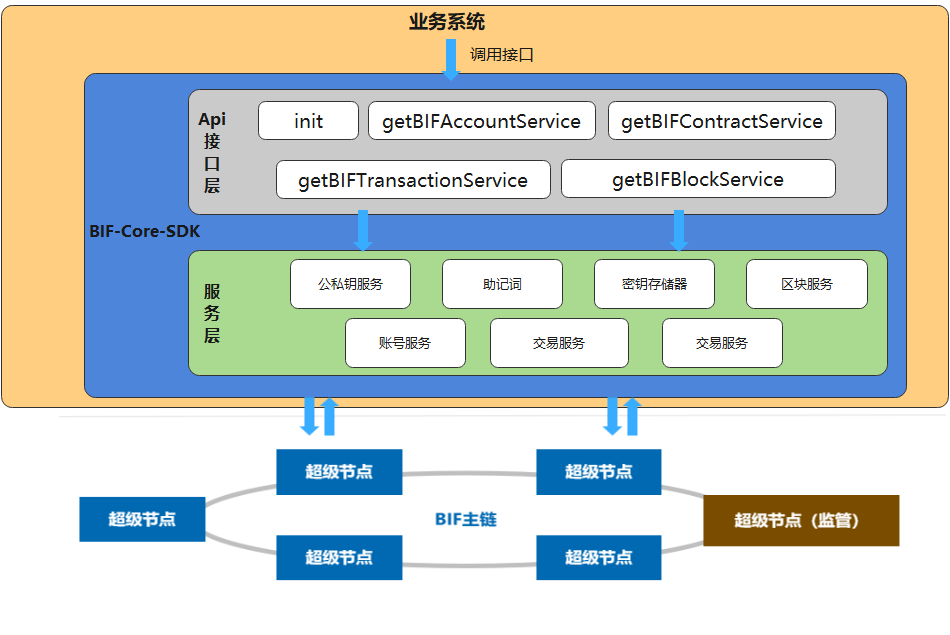

# BIF-Core-SDK

| 名称                                                         | 开发语言 |
| ------------------------------------------------------------ | -------- |
| [BIF-Core-SDK](https://github.com/caict-4iot-dev/BIF-Core-SDK) | JAVA     |
| [BIF-Core_SDK-JS](https://github.com/caict-4iot-dev/BIF-Core_SDK-JS) | Nodejs   |
| [BIF-Core-SDK-Go](https://github.com/caict-4iot-dev/BIF-Core-SDK-Go) | Go       |

## 简介

BIF-Core-SDK通过API调用的方式提供了星火链网-底层区块链平台公私钥对生成、星火链网-底层区块链平台私钥签名公钥验签、账号服务、区块服务、交易服务等接口，同时还提供了接口使用示例说明，开发者可以调用该SDK方便快捷的生成星火链网主链的快速接入。中国信通院秉持开源开放的理念，将星火“BID-Core-SDK”面向社区和公众完全开源，助力全行业伙伴提升数据价值流通的效率，实现数据价值转化。

​                                                                                   **图1 BIF-Core-SDK 逻辑架构图**