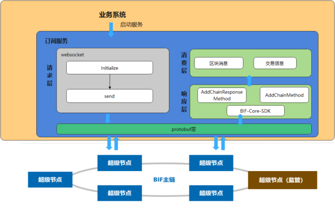

# 订阅服务

**GitHub地址：[https://github.com/caict-4iot-dev/bif-core-subscribe-tool](https://github.com/caict-4iot-dev/bif-core-subscribe-tool)**


## 简介

订阅服务提供了星火链网-底层区块链平台区块、交易订阅功能，同时还提供了使用示例说明。中国信通院秉持开源开放的理念，将星火订阅服务面向社区和公众完全开源，助力全行业伙伴提升数据价值流通的效率，实现数据价值转化。



<center>图1 订阅服务逻辑架构图</center>

## 方法说明
### AddChainResponseMethod

> 接口说明

```
该接口用于接收响应消息。
```

> 调用方法

```
BlockChainAdapter AddChainResponseMethod(Overlay.ChainMessageType.CHAIN_HELLO_VALUE,new BlockChainAdapterProc() {public void ChainMethod (byte[] msg, int length) {}});
```

> 请求参数

| 序号 | 类型                                       | 说明             |
| ---- | ------------------------------------------ | ---------------- |
| 1    | Overlay.ChainMessageType.CHAIN_HELLO_VALUE | hello数据类型    |
| 2    | BlockChainAdapterProc(){}                  | 定义消息处理方法 |

> 示例

```
//接收hello响应消息
BlockChainAdapter.AddChainResponseMethod(Overlay.ChainMessageType.CHAIN_HELLO_VALUE, new BlockChainAdapterProc() {
            public void ChainMethod (byte[] msg, int length) {
                OnChainHello(msg, length);
            }
        });
```

### AddChainMethod

> 接口说明

```
该接口用于接收请求消息，请求消息是区块链实时推送的消息。
```

> 调用方法

```
BlockChainAdapter AddChainMethod(Overlay.ChainMessageType.CHAIN_TX_ENV_STORE_VALUE,,new BlockChainAdapterProc() {public void ChainMethod (byte[] msg, int length) {}});
```

> 请求参数

| 序号 | 类型                                                         | 说明              |
| ---- | ------------------------------------------------------------ | ----------------- |
| 1    | Overlay.ChainMessageType.CHAIN_TX_ENV_STORE_VALUE/CHAIN_LEDGER_TXS_VALUE | 交易/区块数据类型 |
| 2    | BlockChainAdapterProc(){}                                    | 定义消息处理方法  |

> 示例

```
 //接收区块链实时推送的消息-交易信息
        BlockChainAdapter.AddChainMethod(Overlay.ChainMessageType.CHAIN_TX_ENV_STORE_VALUE, new BlockChainAdapterProc() {
            public void ChainMethod (byte[] msg, int length) {
                OnChainTxEnvStore(msg, length);
            }
        });

 //接收区块链实时推送的消息-区块信息
        BlockChainAdapter.AddChainMethod(Overlay.ChainMessageType.CHAIN_LEDGER_TXS_VALUE, new BlockChainAdapterProc() {
            public void ChainMethod (byte[] msg, int length) {
                OnChainLedgerTxs(msg, length);
            }
        });
```

### Send

> 接口说明

```
该接口订阅指定账号交易信息。
```

> 调用方法

```
BlockChainAdapter Send(Overlay.ChainMessageType.CHAIN_SUBSCRIBE_TX.getNumber(), tx.build().toByteArray()));
```

> 请求参数

| 序号 | 类型                                                    | 说明              |
| ---- | ------------------------------------------------------- | ----------------- |
| 1    | Overlay.ChainMessageType.CHAIN_SUBSCRIBE_TX.getNumber() | 交易/区块数据类型 |

> 示例

```
//订阅指定账号交易信息
String srcAddress="";
Overlay.ChainSubscribeTx.Builder tx=Overlay.ChainSubscribeTx.newBuilder();
  tx.addAddress(srcAddress);
if (!BlockChainAdapter.Send(Overlay.ChainMessageType.CHAIN_SUBSCRIBE_TX.getNumber(),  tx.build().toByteArray())) {
            System.out.println("send tx failed");
  }
```


## 订阅示例

​	该示例主要实现功能为订阅**did:bid:efHmvWpqfVzv5rLNSMrhEdNegLz9AcnS**账号交易信息。

> 示例

```

    private static chain_test chainTest;
    /**
     * BIF-Core-SDK
     */
    String httpUrl = "http://172.19.6.22:37002";
    BIFSDK sdk = BIFSDK.getInstance(httpUrl);
    /**
     * 订阅服务
     */
    String webSocketUrl = "ws://172.19.6.22:810";
    boolean isConnected = false;
    /**
     * 订阅账号
     */
    String srcAddress = "did:bid:efHmvWpqfVzv5rLNSMrhEdNegLz9AcnS";

    /**
     * 消息适配器
     */
    private BlockChainAdapter chain_message_one_;
    public static void main(String[] argv) {

        chainTest = new chain_test();
        chainTest.Initialize();
        System.out.println("*****************start chain_message successfully******************");
        //chainTest.Stop();
    }
    public void Stop() {
        chain_message_one_.Stop();
    }

    /**
     * 订阅初始化
     */
    public void Initialize() {
        chain_message_one_ = new BlockChainAdapter(webSocketUrl);
        //接收hello响应消息
        chain_message_one_.AddChainResponseMethod(Overlay.ChainMessageType.CHAIN_HELLO_VALUE, new BlockChainAdapterProc() {
            public void ChainMethod (byte[] msg, int length) {
                OnChainHello(msg, length);
            }
        });
        //接收区块链实时推送的消息-交易信息
        chain_message_one_.AddChainMethod(Overlay.ChainMessageType.CHAIN_TX_ENV_STORE_VALUE, new BlockChainAdapterProc() {
            public void ChainMethod (byte[] msg, int length) {
                OnChainTxEnvStore(msg, length);
            }
        });
        //接收区块链实时推送的消息-区块信息
        chain_message_one_.AddChainMethod(Overlay.ChainMessageType.CHAIN_LEDGER_TXS_VALUE, new BlockChainAdapterProc() {
            public void ChainMethod (byte[] msg, int length) {
                OnChainLedgerTxs(msg, length);
            }
        });

        try {
            Thread.sleep(3000);
        } catch (InterruptedException e) {
            e.printStackTrace();
        }
        //发送hello请求
        Overlay.ChainHello.Builder chain_hello = Overlay.ChainHello.newBuilder();
        chain_hello.setTimestamp(System.currentTimeMillis());
        if (!chain_message_one_.Send(Overlay.ChainMessageType.CHAIN_HELLO.getNumber(), chain_hello.build().toByteArray())) {
            System.out.println("send hello failed");
        }
        //订阅指定账号交易信息
        Overlay.ChainSubscribeTx.Builder tx=Overlay.ChainSubscribeTx.newBuilder();
        tx.addAddress(srcAddress);
        if (!chain_message_one_.Send(Overlay.ChainMessageType.CHAIN_SUBSCRIBE_TX.getNumber(), tx.build().toByteArray())) {
            System.out.println("send tx failed");
        }
    }
     //hello消息处理
    private void OnChainHello(byte[] msg, int length) {
        try {
            Overlay.ChainStatus chain_status = Overlay.ChainStatus.parseFrom(msg);
            System.out.println("chain_status "+chain_status);
            isConnected = true;
        } catch (Exception e) {
            System.out.println(e.getMessage());
            e.printStackTrace();
        }
    }
 
    //交易消息处理
    private void OnChainTxEnvStore(byte[] msg, int length) {
        try {
            Chain.TransactionEnvStore  envStore = Chain.TransactionEnvStore.parseFrom(msg);
            System.out.println("OnChainTxEnvStore hash:" + ToHex.bytesToHex(envStore.getHash().toByteArray()));
        } catch (Exception e) {
            e.printStackTrace();
        }
    }
   
   //区块消息处理
    private void OnChainLedgerTxs(byte[] msg, int length) {
        try {
            Overlay.LedgerTxs envStore = Overlay.LedgerTxs.parseFrom(msg);
            System.out.println("header size:" + envStore.getLedgerLength());
        } catch (Exception e) {
            e.printStackTrace();
        }
    }
```


